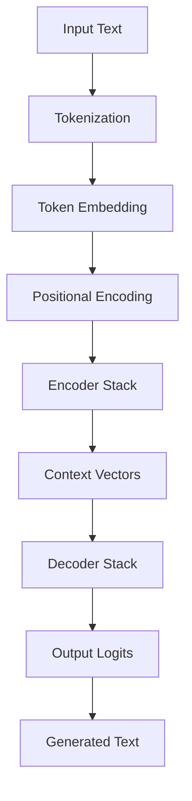

# 🚀 Transformer from Scratch

<div align="center">

[](https://pytorch.org/)
[](https://pytorch-lightning.readthedocs.io/)
[](https://www.python.org/)
[](https://opensource.org/licenses/MIT)

**A complete, production-ready implementation of the Transformer architecture from "Attention Is All You Need"**

*Built with PyTorch Lightning for scalable training and inference*

</div>

---

## ✨ What Makes This Special

🎯 **Complete Implementation** - Every component from the original paper, meticulously crafted  
⚡ **Lightning Fast** - PyTorch Lightning integration for distributed training  
🧠 **Production Ready** - Proper error handling, logging, and checkpointing  
🔧 **Modular Design** - Each component is independently testable and reusable  
📚 **Educational** - Clean, well-documented code perfect for learning  
🎨 **Modern Stack** - Uses GPT-2 tokenizer and state-of-the-art practices  

---

## 🏗️ Architecture Deep Dive

### Core Components

| Component | Description | Key Features |
|-----------|-------------|--------------|
| **🔤 TokenEmbedding** | Converts tokens to dense vectors | Scaling, padding handling, vocabulary mapping |
| **📍 PositionalEmbedding** | Adds position information | Sinusoidal & learned encodings, flexible max positions |
| **🎯 MultiHeadSelfAttention** | The heart of Transformers | Causal masking, cross-attention, scaled dot-product |
| **🧠 PositionwiseFeedForward** | Non-linear transformations | GELU activation, configurable dimensions |
| **➕ AddNorm** | Residual connections + normalization | Layer normalization, dropout, gradient flow |
| **📥 Encoder** | Processes input sequences | Stacked layers, self-attention, context building |
| **📤 Decoder** | Generates output sequences | Masked attention, cross-attention, autoregressive |

### Data Flow



---

## 🚀 Quick Start

### 1. Installation

```bash
# Clone the repository
git clone https://github.com/yourusername/transformer-from-scratch.git
cd transformer-from-scratch

# Install dependencies
pip install torch pytorch-lightning transformers pandas
```

### 2. Training

```bash
# Train on the synthetic dataset
python Trainer.py
```

**Training Features:**
- 🎯 **Automatic checkpointing** - Best model saved automatically
- 📊 **Real-time monitoring** - Loss tracking and validation metrics
- 🔄 **GPU acceleration** - GPU support
- 📈 **Progress tracking** - Detailed logging and progress bars

### 3. Inference

```bash
# Generate text completions
python Inference.py
```

**Inference Features:**
- 🎲 **Greedy decoding** - Deterministic text generation
- ⚡ **Fast inference** - Optimized for production use
- 🎯 **Flexible input** - Handle variable length sequences
- 🔧 **Easy integration** - Simple API for your applications

---

## 📊 Dataset & Task

**Synthetic Text Completion Dataset**
- 📝 **1,000 examples** of text completion pairs
- 🎯 **Task**: Complete partial sentences with meaningful continuations
- 📏 **Format**: `"partial sentence..." → "completion text"`
- 🔄 **Train/Val Split**: 80/20 automatic split

**Example:**
```
Input:  "The rise of renewable energy is changing global markets and Experts predict this shift will redefine economies"
Output: "reducing dependence on fossil fuels and lowering emissions."
```

---

## ⚙️ Configuration

### Model Architecture

| Parameter | Default | Description |
|-----------|---------|-------------|
| `d_model` | 256 | Model dimension (embedding size) |
| `num_heads` | 4-8 | Number of attention heads |
| `num_encoder_layers` | 2-6 | Encoder stack depth |
| `num_decoder_layers` | 2-6 | Decoder stack depth |
| `d_ff` | 128-1024 | Feed-forward dimension |
| `dropout` | 0.1 | Dropout rate |
| `max_positions` | 32-512 | Maximum sequence length |

### Training Configuration

| Parameter | Value | Description |
|-----------|-------|-------------|
| `batch_size` | 4 | Training batch size |
| `learning_rate` | 1e-3 | Adam optimizer learning rate |
| `max_epochs` | 100 | Maximum training epochs |
| `gradient_clip` | 1.0 | Gradient clipping threshold |
| `checkpoint_monitor` | val_loss_epoch | Model selection metric |

---

## 📁 Project Structure

```
transformer-from-scratch/
├── 🧠 Core Components
│   ├── Embedding.py              # Token & positional embeddings
│   ├── MultiHeadSelfAttention.py # Multi-head attention mechanism
│   ├── FFN.py                    # Position-wise feed-forward
│   └── AddNorm.py                # Residual connections + normalization
├── 🏗️ Architecture
│   ├── Encoder.py                # Encoder stack implementation
│   ├── Decoder.py                # Decoder stack implementation
│   └── Seq2SeqModel.py           # Complete model with Lightning
├── 🚀 Training & Inference
│   ├── Trainer.py                # Training pipeline
│   └── Inference.py              # Inference utilities
├── 📊 Data
│   └── synthetic_text_completion.csv  # Training dataset
└── 📁 Checkpoints
    └── BestModel.ckpt            # Saved model weights
```

---

## 🎯 Use Cases

### Perfect For:
- 📚 **Learning** - Understanding Transformer architecture
- 🔬 **Research** - Experimenting with attention mechanisms
- 🚀 **Prototyping** - Quick seq2seq model development

### Applications:
- 📝 **Text Completion** - Auto-complete sentences
- 📄 **Summarization** - Generate concise summaries
- 🔄 **Translation** - Sequence-to-sequence translation
- 💬 **Chatbots** - Conversational AI systems

---


## 🤝 Contributing

We welcome contributions! Here's how you can help:

1. 🍴 **Fork** the repository
2. 🌟 **Create** a feature branch (`git checkout -b feature/AmazingFeature`)
3. 💾 **Commit** your changes (`git commit -m 'Add AmazingFeature'`)
4. 📤 **Push** to the branch (`git push origin feature/AmazingFeature`)
5. 🔄 **Open** a Pull Request

### Areas for Contribution:
- 🚀 **Performance optimizations**
- 🧪 **Additional attention mechanisms**
- 📊 **More datasets and tasks**
- 📚 **Documentation improvements**
- 🐛 **Bug fixes and testing**

---

## 📚 References & Learning

### Papers
1. **Vaswani, A., et al.** (2017). "Attention is all you need." *NeurIPS 2017*
2. **Devlin, J., et al.** (2018). "BERT: Pre-training of Deep Bidirectional Transformers." *NAACL 2019*

### Resources
- 📖 [The Illustrated Transformer](https://jalammar.github.io/illustrated-transformer/)
- ⚡ [PyTorch Lightning Documentation](https://pytorch-lightning.readthedocs.io/)
- 🎓 [Attention Mechanism Explained](https://distill.pub/2016/augmented-rnns/)
- 🔥 [Transformer from Scratch](https://www.youtube.com/watch?v=ISNdQcPhsts)

---

## 📜 License

This project is licensed under the MIT License - see the [LICENSE](LICENSE) file for details.

---

<div align="center">

**⭐ Star this repository if you found it helpful!**

Made with ❤️ and lots of ☕

[Report Bug](https://github.com/yourusername/transformer-from-scratch/issues) · [Request Feature](https://github.com/yourusername/transformer-from-scratch/issues) · [Documentation](https://github.com/yourusername/transformer-from-scratch/wiki)

</div>