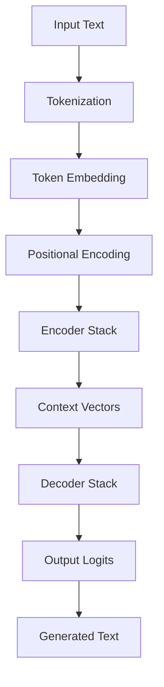

# 🚀 Transformer from Scratch

<div align="center">

[](https://pytorch.org/)
[](https://pytorch-lightning.readthedocs.io/)
[](https://www.python.org/)
[](https://opensource.org/licenses/MIT)

**A complete, production-ready implementation of the Transformer architecture from "Attention Is All You Need"**

*Built with PyTorch Lightning for scalable training and inference*

</div>

---

## ✨ What Makes This Special

🎯 **Complete Implementation** - Every component from the original paper, meticulously crafted  
⚡ **Lightning Fast** - PyTorch Lightning integration for distributed training  
🧠 **Production Ready** - Proper error handling, logging, and checkpointing  
🔧 **Modular Design** - Each component is independently testable and reusable  
🧪 **Independent Testing** - Run each module separately for debugging and learning  
📚 **Educational** - Clean, well-documented code perfect for learning  
🎨 **Modern Stack** - Uses GPT-2 tokenizer and state-of-the-art practices  
🚀 **Multiple Architectures** - CrossAttention, DecoderOnly, and MoE implementations  
📊 **Comprehensive Metrics** - BLEU, ROUGE, METEOR, and BERTScore evaluation  
🎛️ **Advanced Features** - Mixture of Experts with Top-K routing and sparse computation  

---

## 🏗️ Architecture Deep Dive

### Core Components

| Component | Description | Key Features |
|-----------|-------------|--------------|
| **🔤 TokenEmbedding** | Converts tokens to dense vectors | Scaling, padding handling, vocabulary mapping |
| **📍 PositionalEmbedding** | Adds position information | Sinusoidal & learned encodings, flexible max positions |
| **🎯 MultiHeadSelfAttention** | The heart of Transformers | Causal masking, cross-attention, scaled dot-product |
| **🧠 PositionwiseFeedForward** | Non-linear transformations | GELU activation, configurable dimensions |
| **➕ AddNorm** | Residual connections + normalization | Layer normalization, dropout, gradient flow |
| **📥 Encoder** | Processes input sequences | Stacked layers, self-attention, context building |
| **📤 Decoder** | Generates output sequences | Masked attention, cross-attention, autoregressive |
| **🎛️ MoE Components** | Mixture of Experts implementation | Top-K routing, sparse computation, expert specialization |
| **🔀 TopKRouter** | Expert selection mechanism | Dynamic routing, load balancing, efficient computation |

### Model Architectures

| Architecture | Description | Use Cases | Key Features |
|--------------|-------------|-----------|--------------|
| **🔄 CrossAttentionSeq2Seq** | Full encoder-decoder with cross-attention | Translation, summarization | Bidirectional encoding, cross-attention |
| **📝 DecoderOnly** | GPT-style autoregressive model | Text generation, completion | Causal masking, next-token prediction |
| **🎛️ DecoderOnlyMoE** | Decoder-only with Mixture of Experts | Large-scale text generation | Sparse activation, expert routing |

### Data Flow



---

## 🚀 Quick Start

### 1. Installation

```bash
# Clone the repository
git clone https://github.com/yourusername/transformer-from-scratch.git
cd transformer-from-scratch

# Install dependencies
pip install torch pytorch-lightning transformers pandas numpy sacrebleu rouge_score bert_score nltk
```

### 2. Training

Choose from multiple model architectures:

#### CrossAttention Seq2Seq Model
```bash
# Train encoder-decoder with cross-attention
python Trainer.py
```

#### Decoder-Only Model (GPT-style)
```bash
# Train decoder-only autoregressive model
python DecoderOnlyTrainer.py
```

#### Decoder-Only with Mixture of Experts
```bash
# Train MoE model with expert routing
python DecoderMoETrainer.py
```

**Training Features:**
- 🎯 **Automatic checkpointing** - Best model saved automatically
- 📊 **Real-time monitoring** - Loss tracking and validation metrics
- 🔄 **GPU acceleration** - GPU support
- 📈 **Progress tracking** - Detailed logging and progress bars
- 🎛️ **MoE Support** - Sparse computation with expert routing
- 📊 **Comprehensive Metrics** - BLEU, ROUGE, METEOR, BERTScore evaluation

### 3. Inference

Choose the appropriate inference script for your model:

#### CrossAttention Seq2Seq Model
```bash
# Generate text completions with encoder-decoder
python Inference.py
```

#### Decoder-Only Model
```bash
# Generate text with decoder-only model
python DecoderOnlyInference.py
```

#### Decoder-Only with MoE
```bash
# Generate text with MoE model
python DecoderMoEInference.py
```

**Inference Features:**
- 🎲 **Greedy decoding** - Deterministic text generation
- ⚡ **Fast inference** - Optimized for production use
- 🎯 **Flexible input** - Handle variable length sequences
- 🔧 **Easy integration** - Simple API for your applications
- 🎛️ **MoE Support** - Efficient expert routing during inference
- 📊 **Multiple Models** - Support for different architectures

### 4. Independent Module Testing

Each component can be run independently for testing and experimentation:

```bash
# Test individual components
python Embedding.py              # Test token & positional embeddings
python MultiHeadSelfAttention.py # Test attention mechanism
python FFN.py                    # Test feed-forward network
python AddNorm.py                # Test residual connections & normalization
python Encoder.py                # Test encoder stack
python Decoder.py                # Test decoder stack
python Seq2SeqModel.py           # Test complete model
```

**Independent Testing Features:**
- 🧪 **Component isolation** - Test each part separately
- 🔍 **Debugging friendly** - Easy to identify issues in specific components
- 📚 **Learning focused** - Understand each component's behavior individually
- ⚡ **Quick validation** - Fast testing without full training pipeline

---

## 📊 Evaluation Metrics

The codebase includes comprehensive evaluation metrics for assessing model performance:

### Automatic Metrics

| Metric | Description | Range | Use Case |
|--------|-------------|-------|----------|
| **🎯 BLEU** | N-gram overlap with reference | 0-100 | Translation quality, text similarity |
| **📝 ROUGE-1** | Unigram overlap | 0-1 | Content coverage, summarization |
| **📝 ROUGE-2** | Bigram overlap | 0-1 | Phrase-level similarity |
| **📝 ROUGE-L** | Longest common subsequence | 0-1 | Structural similarity |
| **☄️ METEOR** | Semantic similarity with synonyms | 0-1 | Meaning preservation |
| **🧠 BERTScore** | Contextual embedding similarity | 0-1 | Semantic understanding |

### Implementation Features

- **📊 Real-time Tracking** - Metrics computed during validation
- **📈 Progress Monitoring** - All metrics logged to PyTorch Lightning
- **🔄 Automatic Evaluation** - No manual intervention required
- **⚡ Efficient Computation** - Optimized for large-scale evaluation
- **📋 Comprehensive Coverage** - Multiple evaluation perspectives

### Usage

All metrics are automatically computed during training validation steps and logged to the progress bar and tensorboard logs.

---

## 📊 Dataset & Task

**Versatile Text Completion Dataset**
- 📝 **2,000 examples** of diverse text completion pairs
- 🎯 **Task**: Complete partial sentences with meaningful continuations
- 📏 **Format**: `"partial sentence..." → "completion text"`
- 🔄 **Train/Val Split**: 80/20 automatic split
- 🌍 **Diverse Topics**: Covers multiple domains and contexts

**Example:**
```
Input:  "The rise of renewable energy is changing global markets and Experts predict this shift will redefine economies"
Output: "reducing dependence on fossil fuels and lowering emissions."
```

**Dataset Features:**
- 📚 **Educational Content** - Science, technology, and general knowledge
- 🔄 **Multiple Formats** - Various sentence structures and completion types
- 🎯 **Quality Controlled** - Curated for meaningful learning objectives
- 📊 **Balanced Distribution** - Even representation across different topics

---

## ⚙️ Configuration

### Model Architecture

| Parameter | Default | Description |
|-----------|---------|-------------|
| `d_model` | 256 | Model dimension (embedding size) |
| `num_heads` | 4-8 | Number of attention heads |
| `num_encoder_layers` | 2-6 | Encoder stack depth |
| `num_decoder_layers` | 2-6 | Decoder stack depth |
| `d_ff` | 128-1024 | Feed-forward dimension |
| `dropout` | 0.1 | Dropout rate |
| `max_positions` | 32-512 | Maximum sequence length |
| `use_sinusoidal_pos` | True | Use sinusoidal positional encoding |

### MoE Configuration (DecoderOnlyMoE)

| Parameter | Default | Description |
|-----------|---------|-------------|
| `num_experts` | 4 | Number of expert networks |
| `top_k` | 2 | Number of experts to activate per token |
| `expert_capacity` | Auto | Maximum tokens per expert |

### Training Configuration

| Parameter | Value | Description |
|-----------|-------|-------------|
| `batch_size` | 4 | Training batch size |
| `learning_rate` | 1e-3 | Adam optimizer learning rate |
| `max_epochs` | 100 | Maximum training epochs |
| `gradient_clip` | 1.0 | Gradient clipping threshold |
| `checkpoint_monitor` | val_loss_epoch | Model selection metric |

---

## 📁 Project Structure

```
transformer-from-scratch/
├── 🧠 Core Components
│   ├── Embedding.py              # Token & positional embeddings
│   ├── MultiHeadSelfAttention.py # Multi-head attention mechanism
│   ├── FFN.py                    # Position-wise feed-forward
│   └── AddNorm.py                # Residual connections + normalization
├── 🏗️ Architecture Models
│   ├── Encoder.py                # Encoder stack implementation
│   ├── Decoder.py                # Decoder stack implementation
│   ├── CrossAttentionSeq2SeqModel.py  # Full encoder-decoder model
│   ├── DecoderOnlySeq2SeqModel.py     # GPT-style decoder-only model
│   └── DecoderMoE.py             # Decoder-only with Mixture of Experts
├── 🚀 Training Scripts
│   ├── Trainer.py                # CrossAttention training pipeline
│   ├── DecoderOnlyTrainer.py     # Decoder-only training pipeline
│   └── DecoderMoETrainer.py      # MoE training pipeline
├── 🎯 Inference Scripts
│   ├── Inference.py              # CrossAttention inference
│   ├── DecoderOnlyInference.py   # Decoder-only inference
│   └── DecoderMoEInference.py    # MoE inference
├── 📊 Data
│   ├── versatile_dataset_2000.csv     # Main training dataset
│   └── synthetic_text_completion.csv  # Legacy dataset
├── 📁 Checkpoints
│   ├── Seq2SeqCheckpoints/       # CrossAttention model checkpoints
│   ├── DecoderOnlyCheckpoints/   # Decoder-only model checkpoints
│   └── DecoderMoECheckpoints/    # MoE model checkpoints
└── 📈 Logs
    └── lightning_logs/           # Training logs and metrics
```

---

## 🎯 Use Cases

### Perfect For:
- 📚 **Learning** - Understanding Transformer architecture
- 🔬 **Research** - Experimenting with attention mechanisms
- 🚀 **Prototyping** - Quick seq2seq model development
- 🧪 **Component Testing** - Debug and validate individual modules

### Applications:

#### CrossAttention Seq2Seq Model
- 📄 **Summarization** - Generate concise summaries
- 🔄 **Translation** - Sequence-to-sequence translation
- 📝 **Question Answering** - Context-aware responses
- 📊 **Data-to-Text** - Convert structured data to natural language

#### Decoder-Only Models
- 📝 **Text Completion** - Auto-complete sentences
- 💬 **Chatbots** - Conversational AI systems
- 🎨 **Creative Writing** - Story and content generation
- 🔍 **Code Generation** - Programming assistance

#### MoE Models
- 🚀 **Large-Scale Generation** - Efficient text generation at scale
- 🎯 **Specialized Tasks** - Expert routing for domain-specific content
- ⚡ **Resource Optimization** - Sparse computation for better efficiency
- 🧠 **Multi-Domain Learning** - Handle diverse topics with specialized experts

---

## 🎛️ Mixture of Experts (MoE) Implementation

### Key Features

The MoE implementation includes several advanced features for efficient sparse computation:

#### Expert Architecture
- **🔧 ExpertMLP** - Individual expert networks with GELU activation
- **🎯 TopKRouter** - Intelligent routing mechanism for expert selection
- **⚡ Sparse Computation** - Only activate selected experts per token
- **📊 Load Balancing** - Automatic expert capacity management

#### Routing Strategy
- **🎲 Softmax Gating** - Probabilistic expert selection
- **🔝 Top-K Selection** - Activate only the most relevant experts
- **📈 Dynamic Routing** - Adaptive expert selection based on input
- **⚖️ Load Balancing** - Prevent expert overloading

#### Performance Optimizations
- **🚀 Sparse Activation** - Reduce computational overhead
- **💾 Memory Efficient** - Only store active expert outputs
- **🔄 Batch Processing** - Efficient parallel expert computation
- **📊 Gradient Flow** - Proper backpropagation through routing

### Usage Example

```python
# Initialize MoE model
model = DecoderOnlyMoEModel(
    vocab_size=vocab_size,
    d_model=256,
    num_experts=4,      # Number of expert networks
    top_k=2,           # Activate top 2 experts per token
    num_layers=6,
    tokenizer=tokenizer
)

# Training automatically handles expert routing
trainer.fit(model, train_loader, val_loader)
```

---

## 🤝 Contributing

We welcome contributions! Here's how you can help:

1. 🍴 **Fork** the repository
2. 🌟 **Create** a feature branch (`git checkout -b feature/AmazingFeature`)
3. 💾 **Commit** your changes (`git commit -m 'Add AmazingFeature'`)
4. 📤 **Push** to the branch (`git push origin feature/AmazingFeature`)
5. 🔄 **Open** a Pull Request

### Areas for Contribution:
- 🚀 **Performance optimizations**
- 🧪 **Additional attention mechanisms**
- 📊 **More datasets and tasks**
- 📚 **Documentation improvements**
- 🐛 **Bug fixes and testing**

---

## 📚 References & Learning

### Papers
1. **Vaswani, A., et al.** (2017). "Attention is all you need." *NeurIPS 2017*
2. **Devlin, J., et al.** (2018). "BERT: Pre-training of Deep Bidirectional Transformers." *NAACL 2019*

### Resources
- 📖 [The Illustrated Transformer](https://jalammar.github.io/illustrated-transformer/)
- ⚡ [PyTorch Lightning Documentation](https://pytorch-lightning.readthedocs.io/)
- 🎓 [Attention Mechanism Explained](https://distill.pub/2016/augmented-rnns/)
- 🔥 [Transformer from Scratch](https://www.youtube.com/watch?v=ISNdQcPhsts)

---

<div align="center">

**⭐ Star this repository if you found it helpful!**

Made with ❤️ and lots of ☕

[Report Bug](https://github.com/yourusername/transformer-from-scratch/issues) · [Request Feature](https://github.com/yourusername/transformer-from-scratch/issues) · [Documentation](https://github.com/yourusername/transformer-from-scratch/wiki)

</div>