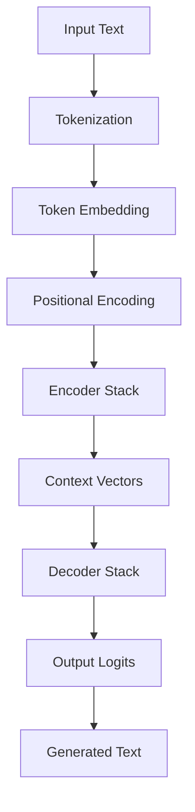

# 🚀 Transformer from Scratch

<div align="center">

[](https://pytorch.org/)
[](https://pytorch-lightning.readthedocs.io/)
[](https://www.python.org/)
[](https://opensource.org/licenses/MIT)

**A complete, production-ready implementation of the Transformer architecture from "Attention Is All You Need"**

*Built with PyTorch Lightning for scalable training and inference*

</div>

---

## ✨ What Makes This Special

🎯 **Complete Implementation** - Every component from the original paper, meticulously crafted
⚡ **Lightning Fast** - PyTorch Lightning integration for distributed training
🧠 **Production Ready** - Proper error handling, logging, and checkpointing
🔧 **Modular Design** - Each component is independently testable and reusable
🧪 **Independent Testing** - Run each module separately for debugging and learning
📚 **Educational** - Clean, well-documented code perfect for learning
🎨 **Modern Stack** - Uses GPT-2 tokenizer and state-of-the-art practices
🚀 **Multiple Architectures** - CrossAttention, DecoderOnly, MoE, GQA, MQA, and MLA
📊 **Comprehensive Metrics** - BLEU, ROUGE, METEOR, and BERTScore evaluation
🎛️ **Advanced Features** - Mixture of Experts, Group Query Attention, Multi-Query Attention, Multi-Head Latent Attention

---

## 🏗️ Architecture Deep Dive

### Core Components

| Component | Location | Description | Key Features |
|-----------|----------|-------------|--------------|
| **🔤 TokenEmbedding** | `core/Embedding.py` | Converts tokens to dense vectors | Scaling, padding handling, vocabulary mapping |
| **📍 PositionalEmbedding** | `core/Embedding.py` | Adds position information | Sinusoidal & learned encodings, flexible max positions |
| **🎯 MultiHeadSelfAttention** | `core/attention/MultiHeadSelfAttention.py` | Standard multi-head attention | Causal masking, cross-attention, scaled dot-product |
| **🔀 GroupQueryAttention** | `core/attention/GroupQueryAttention.py` | GQA — grouped KV heads | Tunable KV sharing, reduced KV cache |
| **⚡ MultiQueryAttention** | `core/attention/MultiQueryAttention.py` | MQA — single shared KV head | Maximum KV cache reduction |
| **🧬 MultiHeadLatentAttention** | `core/attention/MultiHeadLatentAttention.py` | MLA — compressed latent KV | Low-rank KV compression (DeepSeek-V2) |
| **🧠 PositionwiseFeedForward** | `core/FFN.py` | Non-linear transformations | GELU activation, configurable dimensions |
| **➕ AddNorm** | `core/AddNorm.py` | Residual connections + normalization | Layer normalization, dropout, gradient flow |

### Model Architectures

| Architecture | Location | Attention | Key Features |
|--------------|----------|-----------|--------------|
| **🔄 CrossAttentionSeq2Seq** | `models/CrossAttentionSeq2SeqModel.py` | MHA | Full encoder-decoder, cross-attention |
| **📝 DecoderOnly** | `models/DecoderOnlySeq2SeqModel.py` | MHA | GPT-style, causal masking |
| **🎛️ DecoderOnlyMoE** | `models/DecoderMoE.py` | MHA | Sparse MoE routing, expert specialization |
| **🔀 DecoderOnlyGQA** | `models/DecoderOnlyGQAModel.py` | GQA | Grouped KV heads (LLaMA 2, Mistral) |
| **⚡ DecoderOnlyMQA** | `models/DecoderOnlyMQAModel.py` | MQA | Single KV head, fastest inference |
| **🧬 DecoderOnlyMLA** | `models/DecoderOnlyMLAModel.py` | MLA | Compressed KV cache (DeepSeek-V2) |

### Attention Mechanism Comparison

| Mechanism | KV Heads | KV Cache Size | Params (d=256, h=8) | Used In |
|-----------|----------|---------------|---------------------|---------|
| **MHA** | `num_heads` (8) | 100% | 263K | GPT, BERT, T5 |
| **GQA** | `num_kv_heads` (2) | 25% | 164K | LLaMA 2 70B, Mistral |
| **MQA** | 1 | 12.5% | 148K | PaLM, Falcon |
| **MLA** | Compressed | `d_compress/d_model` | 149K | DeepSeek-V2 |

### Data Flow


```mermaid
graph TD
    A[Input Text] --> B[Tokenization]
    B --> C[Token Embedding]
    C --> D[Positional Encoding]
    D --> E[Encoder Stack]
    E --> F[Context Vectors]
    F --> G[Decoder Stack]
    G --> H[Output Logits]
    H --> I[Generated Text]
```

---

## 🚀 Quick Start

### 1. Installation

```bash
# Clone the repository
git clone https://github.com/yourusername/transformer-from-scratch.git
cd transformer-from-scratch

# Install dependencies
pip install -r requirements.txt
```

### 2. Training

All training scripts are in `TrainerScripts/`. Run from the **project root**:

#### CrossAttention Seq2Seq Model
```bash
python TrainerScripts/Trainer.py
```

#### Decoder-Only Model (GPT-style)
```bash
python TrainerScripts/DecoderOnlyTrainer.py
```

#### Decoder-Only with Mixture of Experts
```bash
python TrainerScripts/DecoderMoETrainer.py
```

#### Decoder-Only with GQA / MQA / MLA
```bash
python TrainerScripts/DecoderOnlyGQATrainer.py
python TrainerScripts/DecoderOnlyMQATrainer.py
python TrainerScripts/DecoderOnlyMLATrainer.py
```

#### GSM8K Math Reasoning
```bash
python TrainerScripts/GSM8KTrainer.py
```

**Training Features:**
- 🎯 **Automatic checkpointing** - Best model saved automatically
- 📊 **Real-time monitoring** - Loss tracking and validation metrics
- 🔄 **GPU acceleration** - GPU support
- 📈 **Progress tracking** - Detailed logging and progress bars
- 📊 **Comprehensive Metrics** - BLEU, ROUGE, METEOR, BERTScore evaluation

### 3. Inference

#### CrossAttention Seq2Seq Model
```bash
python TrainerScripts/Inference.py
```

#### Decoder-Only Model
```bash
python TrainerScripts/DecoderOnlyInference.py
```

#### Decoder-Only with MoE / GQA / MQA / MLA
```bash
python TrainerScripts/DecoderMoEInference.py
python TrainerScripts/DecoderOnlyGQAInference.py
python TrainerScripts/DecoderOnlyMQAInference.py
python TrainerScripts/DecoderOnlyMLAInference.py
```

#### GSM8K Math Reasoning
```bash
python TrainerScripts/GSM8KInference.py
```

**Inference Features:**
- 🎲 **Greedy decoding** - Deterministic text generation
- ⚡ **Fast inference** - Optimized for production use
- 🎯 **Flexible input** - Handle variable length sequences
- 🔧 **Easy integration** - Simple API for your applications

### 4. Independent Module Testing

Each core component can be run independently for testing and experimentation:

```bash
# Test individual components
python core/Embedding.py                              # Token & positional embeddings
python core/attention/MultiHeadSelfAttention.py       # Standard multi-head attention
python core/attention/GroupQueryAttention.py           # Group Query Attention
python core/attention/MultiQueryAttention.py          # Multi-Query Attention
python core/attention/MultiHeadLatentAttention.py     # Multi-Head Latent Attention
python core/FFN.py                                    # Feed-forward network
python core/AddNorm.py                                # Residual connections & normalization

# Test model architectures
python models/Encoder.py                              # Encoder stack
python models/Decoder.py                              # Decoder stack
```

---

## 📊 Evaluation Metrics

The codebase includes comprehensive evaluation metrics for assessing model performance:

### Automatic Metrics

| Metric | Description | Range | Use Case |
|--------|-------------|-------|----------|
| **🎯 BLEU** | N-gram overlap with reference | 0-100 | Translation quality, text similarity |
| **📝 ROUGE-1** | Unigram overlap | 0-1 | Content coverage, summarization |
| **📝 ROUGE-2** | Bigram overlap | 0-1 | Phrase-level similarity |
| **📝 ROUGE-L** | Longest common subsequence | 0-1 | Structural similarity |
| **☄️ METEOR** | Semantic similarity with synonyms | 0-1 | Meaning preservation |
| **🧠 BERTScore** | Contextual embedding similarity | 0-1 | Semantic understanding |

All metrics are automatically computed during training validation steps and logged to the progress bar and TensorBoard logs.

---

## 📊 Dataset & Task

**Versatile Text Completion Dataset**
- 📝 **2,000 examples** of diverse text completion pairs
- 🎯 **Task**: Complete partial sentences with meaningful continuations
- 📏 **Format**: `"partial sentence..." → "completion text"`
- 🔄 **Train/Val Split**: 80/20 automatic split
- 🌍 **Diverse Topics**: Covers multiple domains and contexts

**GSM8K Math Reasoning**
- 🧮 **7,473 training** + **1,319 test** grade school math problems
- 🎯 **Task**: Solve multi-step arithmetic word problems
- 📏 **Format**: `"Question: ..." → "Answer: step-by-step solution"`

---

## ⚙️ Configuration

### Model Architecture

| Parameter | Default | Description |
|-----------|---------|-------------|
| `d_model` | 256 | Model dimension (embedding size) |
| `num_heads` | 4-8 | Number of attention heads |
| `num_encoder_layers` | 2-6 | Encoder stack depth |
| `num_decoder_layers` | 2-6 | Decoder stack depth |
| `d_ff` | 128-1024 | Feed-forward dimension |
| `dropout` | 0.1 | Dropout rate |
| `max_positions` | 32-512 | Maximum sequence length |
| `use_sinusoidal_pos` | True | Use sinusoidal positional encoding |

### Attention Variant Configuration

| Parameter | Applies To | Default | Description |
|-----------|-----------|---------|-------------|
| `num_kv_heads` | GQA | 2 | Number of key/value heads |
| `d_compress` | MLA | 64 | Latent compression dimension |
| `num_experts` | MoE | 4 | Number of expert networks |
| `top_k` | MoE | 2 | Experts to activate per token |

### Training Configuration

| Parameter | Value | Description |
|-----------|-------|-------------|
| `batch_size` | 4 | Training batch size |
| `learning_rate` | 1e-3 | Adam optimizer learning rate |
| `max_epochs` | 100 | Maximum training epochs |
| `gradient_clip` | 1.0 | Gradient clipping threshold |
| `checkpoint_monitor` | val_loss_epoch | Model selection metric |

---

## 📁 Project Structure

```
transformer-from-scratch/
├── core/                                    # 🧠 Reusable Building Blocks
│   ├── Embedding.py                         #   Token & positional embeddings
│   ├── AddNorm.py                           #   Residual connections + normalization
│   ├── FFN.py                               #   Position-wise feed-forward network
│   └── attention/                           #   Attention Mechanisms
│       ├── MultiHeadSelfAttention.py        #     Standard multi-head attention (MHA)
│       ├── GroupQueryAttention.py            #     Group Query Attention (GQA)
│       ├── MultiQueryAttention.py           #     Multi-Query Attention (MQA)
│       └── MultiHeadLatentAttention.py      #     Multi-Head Latent Attention (MLA)
│
├── models/                                  # 🏗️ Complete Model Architectures
│   ├── Encoder.py                           #   Encoder stack
│   ├── Decoder.py                           #   Decoder stack (with cross-attention)
│   ├── CrossAttentionSeq2SeqModel.py        #   Full encoder-decoder Seq2Seq
│   ├── DecoderOnlySeq2SeqModel.py           #   GPT-style decoder-only (MHA)
│   ├── DecoderMoE.py                        #   Decoder-only with Mixture of Experts
│   ├── DecoderOnlyGQAModel.py               #   Decoder-only with GQA
│   ├── DecoderOnlyMQAModel.py               #   Decoder-only with MQA
│   └── DecoderOnlyMLAModel.py               #   Decoder-only with MLA
│
├── TrainerScripts/                          # 🚀 Training & Inference Scripts
│   ├── Trainer.py                           #   CrossAttention Seq2Seq training
│   ├── Inference.py                         #   CrossAttention Seq2Seq inference
│   ├── DecoderOnlyTrainer.py                #   Decoder-only training
│   ├── DecoderOnlyInference.py              #   Decoder-only inference
│   ├── DecoderMoETrainer.py                 #   MoE training
│   ├── DecoderMoEInference.py               #   MoE inference
│   ├── DecoderOnlyGQATrainer.py             #   GQA training
│   ├── DecoderOnlyGQAInference.py           #   GQA inference
│   ├── DecoderOnlyMQATrainer.py             #   MQA training
│   ├── DecoderOnlyMQAInference.py           #   MQA inference
│   ├── DecoderOnlyMLATrainer.py             #   MLA training
│   ├── DecoderOnlyMLAInference.py           #   MLA inference
│   ├── GSM8KTrainer.py                      #   GSM8K math reasoning training
│   └── GSM8KInference.py                    #   GSM8K math reasoning inference
│
├── data/                                    # 📊 Datasets
│   ├── versatile_dataset_2000.csv           #   Main text completion dataset
│   └── synthetic_text_completion.csv        #   Legacy dataset
│
├── checkpoints/                             # 💾 Model Checkpoints
│   ├── Seq2SeqCheckpoints/                  #   CrossAttention model
│   ├── DecoderOnlyCheckpoints/              #   Decoder-only model
│   ├── DecoderMoECheckpoints/               #   MoE model
│   ├── GQACheckpoints/                      #   GQA model
│   ├── MQACheckpoints/                      #   MQA model
│   ├── MLACheckpoints/                      #   MLA model
│   └── GSM8KCheckpoints/                    #   GSM8K model
│
├── docs/                                    # 📚 Documentation (38 files)
│   ├── Embedding.md, AddNorm.md, FFN.md     #   Core component docs
│   ├── MultiHeadSelfAttention.md            #   Attention mechanism docs
│   ├── GroupQueryAttention.md               #   GQA docs
│   ├── MultiQueryAttention.md               #   MQA docs
│   ├── MultiHeadLatentAttention.md          #   MLA docs
│   ├── DecoderOnlySeq2SeqModel.md           #   Model architecture docs
│   ├── DecoderOnly{GQA,MQA,MLA}Model.md    #   Variant model docs
│   └── ...                                  #   Trainer & inference docs
│
├── README.md
└── requirements.txt
```

---

## 🎯 Use Cases

### Perfect For:
- 📚 **Learning** - Understanding Transformer architecture and its variants
- 🔬 **Research** - Experimenting with attention mechanisms (MHA, GQA, MQA, MLA)
- 🚀 **Prototyping** - Quick seq2seq model development
- 🧪 **Component Testing** - Debug and validate individual modules

### Applications:

#### CrossAttention Seq2Seq Model
- 📄 **Summarization** - Generate concise summaries
- 🔄 **Translation** - Sequence-to-sequence translation
- 📝 **Question Answering** - Context-aware responses

#### Decoder-Only Models (MHA / GQA / MQA / MLA / MoE)
- 📝 **Text Completion** - Auto-complete sentences
- 💬 **Chatbots** - Conversational AI systems
- 🎨 **Creative Writing** - Story and content generation
- 🧮 **Math Reasoning** - GSM8K grade school math problems

---

## 🎛️ Mixture of Experts (MoE) Implementation

### Key Features

- **🔧 ExpertMLP** - Individual expert networks with GELU activation
- **🎯 TopKRouter** - Intelligent routing mechanism for expert selection
- **⚡ Sparse Computation** - Only activate selected experts per token
- **📊 Load Balancing** - Automatic expert capacity management

### Usage Example

```python
from models.DecoderMoE import DecoderOnlyMoEModel

model = DecoderOnlyMoEModel(
    vocab_size=vocab_size,
    d_model=256,
    num_experts=4,      # Number of expert networks
    top_k=2,            # Activate top 2 experts per token
    num_layers=6,
    tokenizer=tokenizer
)

trainer.fit(model, train_loader, val_loader)
```

---

## 🤝 Contributing

We welcome contributions! Here's how you can help:

1. 🍴 **Fork** the repository
2. 🌟 **Create** a feature branch (`git checkout -b feature/AmazingFeature`)
3. 💾 **Commit** your changes (`git commit -m 'Add AmazingFeature'`)
4. 📤 **Push** to the branch (`git push origin feature/AmazingFeature`)
5. 🔄 **Open** a Pull Request

### Areas for Contribution:
- 🚀 **Performance optimizations**
- 🧪 **Additional attention mechanisms**
- 📊 **More datasets and tasks**
- 📚 **Documentation improvements**
- 🐛 **Bug fixes and testing**

---

## 📚 References & Learning

### Papers
1. **Vaswani, A., et al.** (2017). "Attention is all you need." *NeurIPS 2017*
2. **Shazeer, N.** (2019). "Fast Transformer Decoding: One Write-Head is All You Need." *arXiv*
3. **Ainslie, J., et al.** (2023). "GQA: Training Generalized Multi-Query Transformer Models from Multi-Head Checkpoints." *EMNLP 2023*
4. **DeepSeek-AI** (2024). "DeepSeek-V2: A Strong, Economical, and Efficient Mixture-of-Experts Language Model." *arXiv*

### Resources
- 📖 [The Illustrated Transformer](https://jalammar.github.io/illustrated-transformer/)
- ⚡ [PyTorch Lightning Documentation](https://pytorch-lightning.readthedocs.io/)
- 🎓 [Attention Mechanism Explained](https://distill.pub/2016/augmented-rnns/)
- 🔥 [Transformer from Scratch](https://www.youtube.com/watch?v=ISNdQcPhsts)

---

<div align="center">

**⭐ Star this repository if you found it helpful!**

Made with ❤️ and lots of ☕

[Report Bug](https://github.com/yourusername/transformer-from-scratch/issues) · [Request Feature](https://github.com/yourusername/transformer-from-scratch/issues) · [Documentation](https://github.com/yourusername/transformer-from-scratch/wiki)

</div>
