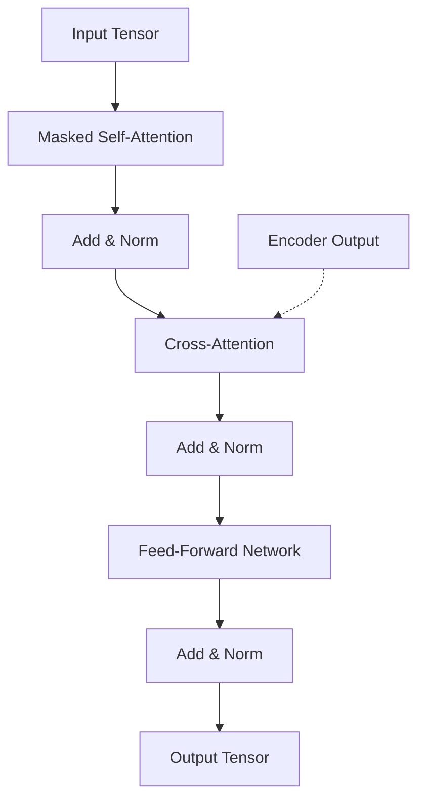

# Decoder.py

## Overview

The `Decoder.py` module implements the **Transformer Decoder**, which is responsible for generating target sequences auto-regressively. It processes target input tokens and attends to the Encoder's output to generate the next token in the sequence.

## Architecture

### Decoder Block

Each `DecoderBlock` consists of three sub-layers, each followed by an **Add & Norm** operation:
1.  **Masked Multi-Head Self-Attention**: Attends to previous tokens in the target sequence (causal masking).
2.  **Cross-Attention**: Attends to the Encoder's output (using query from Decoder, key/value from Encoder).
3.  **Position-wise Feed-Forward Network (FFN)**: Processes each position independently.

### Mermaid Diagram: Decoder Block



### Decoder Stack

The `Decoder` class consists of:
1.  **Token Embedding**: Converts token IDs to vectors.
2.  **Positional Encoding**: Adds positional information (sinusoidal).
3.  **Stack of Decoder Blocks**: `num_layers` of `DecoderBlock`.
4.  **Final Layer Norm**: Normalizes the final output.

## Class Definitions

Inherits from `pl.LightningModule`.

### 1. `DecoderBlock`

#### `__init__` Parameters:
-   `d_model`, `num_heads`, `d_ff`, `dropout`.

#### `forward` Arguments:
-   `x`: Input tensor from previous layer.
-   `enc_out`: Output from the Encoder (for Cross-Attention).
-   `tgt_mask`: Mask for Self-Attention (usually causal mask).
-   `memory_mask`: Mask for Cross-Attention (source padding mask).

#### Returns:
-   `x`: Processed tensor.
-   `self_attn`: Attention weights from Masked Self-Attention.
-   `cross_attn`: Attention weights from Cross-Attention.

---

### 2. `Decoder`

#### `__init__` Parameters:
-   `vocab_size`: Size of the target vocabulary.
-   `d_model`, `max_positions`, `num_layers`, `num_heads`, `d_ff`, `dropout`, `pad_token_id`, `use_sinusoidal_pos`.

#### `forward` Arguments:
-   `input_ids`: Target token IDs. Shape: `(Batch, Seq_Len)`.
-   `enc_out`: Encoder output. Shape: `(Batch, Src_Seq_Len, d_model)`.
-   `tgt_mask`: Causal mask for target sequence.
-   `memory_mask`: Padding mask for source sequence.

#### Logic:
1.  **Embed**: Get token embeddings and add positional encodings.
    ```python
    x = self.embedding(input_ids, tgt_mask)
    ```
2.  **Layer Stack**: Pass through `num_layers` of `DecoderBlock`. Collect attention maps for visualization.
3.  **Normalize**: Apply final Layer Normalization.
    ```python
    x = self.norm(x)
    ```

#### Returns:
-   `x`: Final representation. Shape: `(Batch, Seq_Len, d_model)`.
-   `self_attn_maps`: List of self-attention weights from each layer.
-   `cross_attn_maps`: List of cross-attention weights from each layer.

## Example Usage

```python
import torch
from Decoder import Decoder

# 1. Setup
vocab_size = 1000
d_model = 256
batch_size = 2
tgt_seq_len = 10
src_seq_len = 12

# 2. Initialize Decoder
decoder = Decoder(
    vocab_size=vocab_size,
    d_model=d_model,
    num_layers=2,
    num_heads=4
)

# 3. Simulate Inputs
tgt_ids = torch.randint(0, vocab_size, (batch_size, tgt_seq_len))
enc_out = torch.randn(batch_size, src_seq_len, d_model) # From Encoder

# 4. Create Masks (Simplified)
# Causal mask for target
tgt_mask = torch.tril(torch.ones(tgt_seq_len, tgt_seq_len)).unsqueeze(0).unsqueeze(0) 

# 5. Forward Pass
output, self_attns, cross_attns = decoder(
    input_ids=tgt_ids,
    enc_out=enc_out,
    tgt_mask=tgt_mask
)

print("Decoder Output:", output.shape) 
# Expected: torch.Size([2, 10, 256])
```
