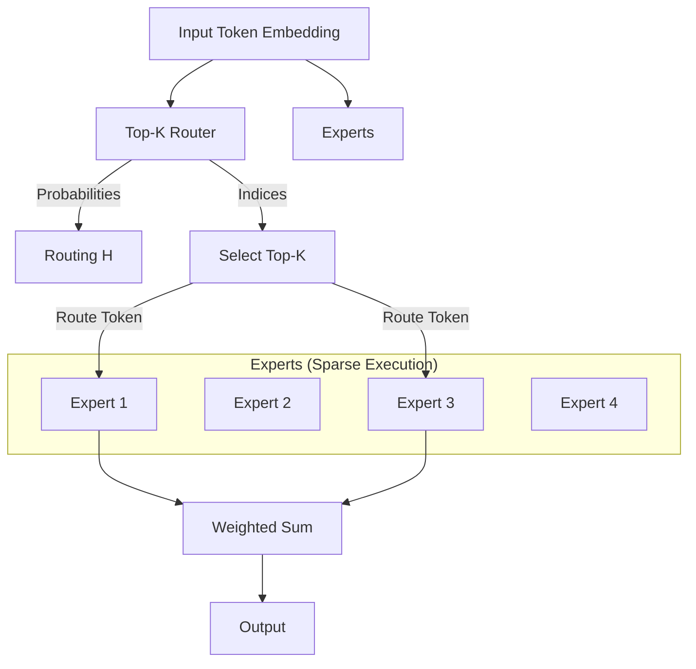

# DecoderMoE.py

## Overview

The `DecoderMoE.py` module implements a **Decoder-Only Transformer** enhanced with **Mixture of Experts (MoE)** layers. This architecture replaces the standard dense Feed-Forward Network (FFN) with a sparse MoE layer, allowing the model to scale parameters significantly while maintaining efficient inference cost by only activating a subset of "experts" for each token.

## Architecture

### Mixture of Experts (MoE) Layer

The core innovation is the `MoEFeedForward` layer, which consists of:
1.  **Multiple Experts**: Independent MLPs (Feed-Forward Networks).
2.  **Gating Network (Router)**: Routes each token to the top-$k$ most relevant experts.
3.  **Weighted Sum**: Combines the outputs of the selected experts based on the routing probabilities.

### Mermaid Diagram: MoE Routing



## Class Definitions

### 1. `ExpertMLP`

A standard Feed-Forward Network acting as a single expert.
-   **Structure**: `Linear` -> `GELU` -> `Dropout` -> `Linear` -> `Dropout`.

### 2. `TopKRouter`

Determines which experts handle which tokens.
-   **Input**: Token embeddings `(B, L, d_model)`.
-   **Output**: 
    -   `probs`: Full probability distribution over experts.
    -   `topk_probs`: Probabilities of selected experts (normalized).
    -   `topk_indices`: Indices of selected experts.

### 3. `MoEFeedForward`

Orchestrates the sparse computation.
-   **Logic**:
    1.  **Routing**: Get top-$k$ experts for each token.
    2.  **Scatter**: Organize inputs for efficient processing.
    3.  **Expert Compute**: Process tokens only with their assigned experts.
    4.  **Gather & Weight**: Combine expert outputs using the gating probabilities.

### 4. `DecoderBlockMoE`

A Transformer block where the standard FFN is replaced by `MoEFeedForward`.
-   **Layers**:
    1.  Masked Multi-Head Self-Attention + AddNorm.
    2.  MoE Feed-Forward + AddNorm.

### 5. `DecoderOnlyMoEModel`

The complete PyTorch Lightning module.
-   **Embedding**: Token + Positional.
-   **Layers**: Stack of `DecoderBlockMoE`.
-   **Head**: Final LayerNorm + Linear Classifier.
-   **Loss**: Cross Entropy.
-   **Metrics**: BLEU, ROUGE, METEOR, BERTScore.

## Key Logic: Top-K Routing

The routing mechanism ensures sparsity:

```python
# 1. Compute logits for all experts
logits = self.linear(x)

# 2. Get probabilities
probs = F.softmax(logits, dim=-1)

# 3. Select Top-K
topk_probs, topk_indices = torch.topk(probs, k=self.top_k, dim=-1)

# 4. Normalize Top-K probabilities
topk_probs = topk_probs / topk_probs.sum(dim=-1, keepdim=True)
```

## Example Usage

```python
import torch
from DecoderMoE import DecoderOnlyMoEModel

# 1. Configuration
vocab_size = 1000
d_model = 256
num_experts = 4
top_k = 2

# 2. Initialize Model
model = DecoderOnlyMoEModel(
    vocab_size=vocab_size,
    tokenizer=None, # Pass actual tokenizer for validation
    d_model=d_model,
    num_layers=2,
    num_heads=4,
    num_experts=num_experts,
    top_k=top_k
)

# 3. Dummy Input
input_ids = torch.randint(0, vocab_size, (2, 10)) # (Batch, Seq)

# 4. Forward Pass
logits, attn_maps = model(input_ids)

print("Logits shape:", logits.shape) 
# Expected: torch.Size([2, 10, vocab_size])
```
