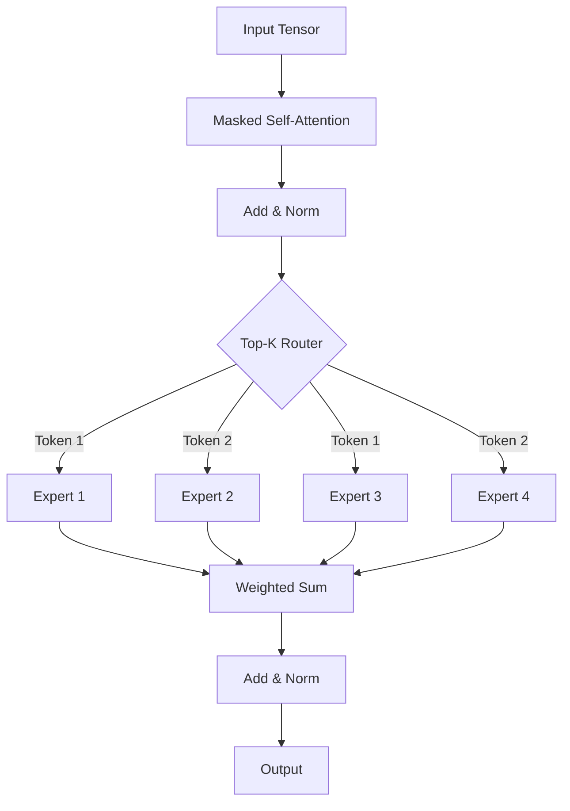

# DecoderMoE.py Module Documentation

## 1. Overview

The `DecoderMoE` module implements a **Decoder-Only Transformer** equipped with **Mixture of Experts (MoE)** layers. Unlike a standard Transformer that uses a dense Feed-Forward Network (FFN) for every token, this model sparsely routes each token to a subset of "expert" networks. This allows for scaling up the generation of model parameters without a proportional increase in computational cost per inference.

### Key Concepts
-   **Sparse Activation**: Only a fraction of the network is active for any given token.
-   **Gating / Routing**: A learned mechanism decides which experts process which tokens.
-   **Decoder-Only**: Similar to GPT, it uses masked self-attention and is suitable for generative tasks.

## 2. Modules Involved

-   **torch**, **torch.nn**, **torch.nn.functional**: PyTorch core.
-   **pytorch_lightning**: Training framework.
-   **Metrics**: `sacrebleu`, `rouge_score`, `nltk`, `bert_score`, Perplexity.

### Dependencies
-   `Embedding` (TokenEmbeddingModule)
-   `MultiHeadSelfAttention` (MHSA)
-   `AddNorm`
-   **No Dependency on FFN**: This module defines its own replacement called `MoEFeedForward`.

## 3. Architecture

The architecture mimics a standard GPT Decoder, but replaces the `PositionwiseFeedForward` block with `MoEFeedForward`.

### MoE Feed-Forward Layer Logic
1.  **Router**: Projects input to $E$ logits (one per expert).
2.  **Top-K Selection**: Selects the $K$ experts with the highest probabilities.
3.  **Dispatch**: Tokens are sent to their selected experts.
4.  **Expert Computation**: Each `ExpertMLP` processes its assigned tokens.
5.  **Weighted Sum**: Outputs from experts are combined using the router probabilities.

### Architecture Diagram



## 4. Class Definitions

### `class ExpertMLP(nn.Module)`
A SwiGLU gated FFN: `Swish(x @ W_gate) * (x @ W_1)`, then project down.
-   Acts as a single "brain" in the MoE layer.

### `class TopKRouter(nn.Module)`
Decides which experts to use.
-   **Forward**: returns `probs` (all), `topk_probs` (sum-normalized), and `topk_indices`.

### `class MoEFeedForward(nn.Module)`
The core MoE layer.
-   **Parameters**: `num_experts` (Total available), `top_k` (Active per token).
-   **Logic**: 
    -   Routes inputs.
    -   Performs sparse computation (using loops and masking to only compute active paths).
    -   Recombines outputs.

### `class DecoderBlockMoE(nn.Module)`
A Decoder block using `MoEFeedForward`.
-   Structure: `AddNorm(x, MHSA(x))` -> `AddNorm(x, MoE(x))`.

### `class DecoderOnlyMoEModel(pl.LightningModule)`
The full functioning model containing the stack of `DecoderBlockMoE`.

## 5. Step-by-Step Logic (MoE Layer)

1.  **Routing**: 
    -   Input `x` `(Batch, Seq, Dim)`.
    -   Router produces logits `(Batch, Seq, Num_Experts)`.
    -   Softmax -> `probs`.
    -   Top-K -> `topk_indices` and `topk_probs`.

2.  **Scatter Setup**:
    -   Flatten batch and sequence: `N = B * L`.
    -   Create a sparse probability matrix `topk_probs_full` `(N, Num_Experts)`.

3.  **Expert Execution Loop**:
    -   For each expert $e$ from $0$ to $E-1$:
        -   Find indices in the batch where Expert $e$ was selected.
        -   Gather those specific tokens.
        -   Run `ExpertMLP[e]`.
        -   Scatter results back to a temporary buffer.
    -   Stack results: `(N, Dim, Num_Experts)`.
    *Note: This implementation uses a Python loop, which is simple but maybe slower than optimized CUDA kernels.*

4.  **Combination**:
    -   Multiply stacked outputs by `topk_probs_full`.
    -   Sum over the expert dimension.
    -   Reshape back to `(Batch, Seq, Dim)`.

## 6. Dry Run Trace

**Scenario**:
-   `Batch`=1, `Seq`=2. Input `x` `[T1, T2]`.
-   `Experts`=3 (`E0`, `E1`, `E2`), `TopK`=2.
-   `d_model`=4.

**Trace**:

1.  **Input**: `x` shape `(1, 2, 4)`.
2.  **Router**:
    -   Logits for T1: `[10, 5, 0]` -> Probs `[High, Med, Low]`. Top-2: `E0, E1`.
    -   Logits for T2: `[0, 10, 5]` -> Probs `[Low, High, Med]`. Top-2: `E1, E2`.
3.  **Execution**:
    -   **Loop E0**: Selected by T1. Process T1. Output `O_T1_E0`.
    -   **Loop E1**: Selected by T1 AND T2. Process T1, T2. Output `O_T1_E1`, `O_T2_E1`.
    -   **Loop E2**: Selected by T2. Process T2. Output `O_T2_E2`.
4.  **Stacking**:
    -   T1 Vector: `[O_T1_E0, O_T1_E1, 0]` (E2 was not selected).
    -   T2 Vector: `[0, O_T2_E1, O_T2_E2]` (E0 was not selected).
5.  **Weighted Sum**:
    -   T1 Final = $P_{T1,E0} \cdot O_{T1,E0} + P_{T1,E1} \cdot O_{T1,E1}$.
    -   T2 Final = $P_{T2,E1} \cdot O_{T2,E1} + P_{T2,E2} \cdot O_{T2,E2}$.
6.  **Output**: Shape `(1, 2, 4)`.

## 7. Configuration Example

```python
import torch
from DecoderMoE import DecoderOnlyMoEModel

# Config
model = DecoderOnlyMoEModel(
    vocab_size=100,
    d_model=16,
    num_layers=2,
    num_heads=4,
    num_experts=4,
    top_k=2
)

# Input
input_ids = torch.randint(0, 100, (1, 10))

# Forward
logits, attn_maps = model(input_ids)
print("Logits Shape:", logits.shape) 
# Expected: torch.Size([1, 10, 100])
```
