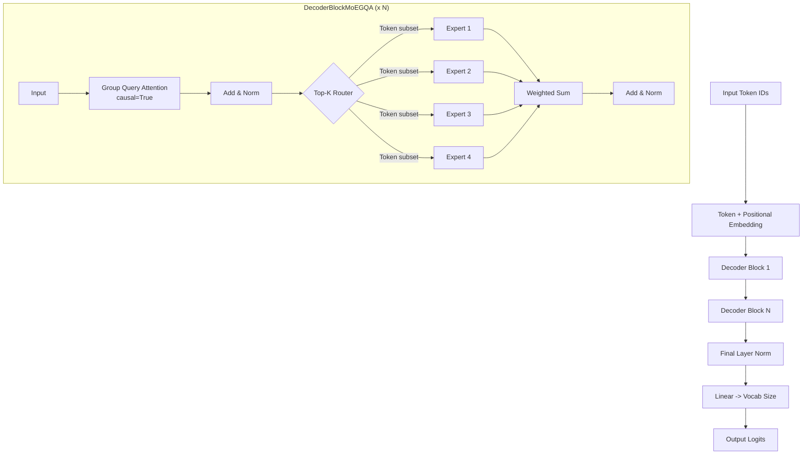

# DecoderMoEGQA.py Module Documentation

## 1. Overview

The `DecoderMoEGQA` module implements a **Decoder-Only Transformer** that combines **Mixture of Experts (MoE)** feed-forward layers with **Group Query Attention (GQA)**. This hybrid architecture pairs the memory-efficient KV sharing of GQA with the sparse, high-capacity computation of MoE — achieving both reduced KV cache size and increased model capacity without proportional compute cost.

### Key Concepts
-   **GQA Attention**: Multiple query heads share fewer KV heads, reducing KV cache and projection parameters.
-   **MoE FFN**: Each token is routed to a subset of expert MLPs via a learned Top-K router.
-   **Hybrid Benefit**: GQA reduces attention memory, MoE scales FFN capacity sparsely.

## 2. Modules Involved

-   **torch**, **torch.nn**, **torch.nn.functional**: PyTorch core.
-   **pytorch_lightning**: Training framework.
-   **Metrics**: `sacrebleu`, `rouge_score`, `nltk`, `bert_score`, Perplexity.

### Dependencies
-   `Embedding.py` -> `TokenEmbeddingModule`: Token and positional embeddings.
-   `GroupQueryAttention.py` -> `GroupQueryAttention`: GQA (`causal=True`).
-   `AddNorm.py` -> `AddNorm`: Residual connection + normalization.
-   **No dependency on FFN.py**: Uses its own `MoEFeedForward` with `ExpertMLP` (SwiGLU).

## 3. Architecture



### Key Differences from Other Models
| Feature | DecoderMoE | DecoderOnlyGQA | **DecoderMoEGQA** |
|---------|-----------|---------------|-------------------|
| Attention | MHA | GQA | **GQA** |
| FFN | MoE | Standard SwiGLU | **MoE** |
| KV cache | Full | Reduced | **Reduced** |
| FFN capacity | Sparse high | Dense | **Sparse high** |

## 4. Class Definitions

### `class ExpertMLP(nn.Module)`
SwiGLU gated FFN: `SiLU(x @ W_gate) * (x @ W_data)`, then project down.

### `class TopKRouter(nn.Module)`
Routes tokens to top-k experts. Returns full probs, top-k probs (normalized), and indices.

### `class MoEFeedForward(nn.Module)`
Sparse MoE layer — routes tokens, computes expert outputs only for selected tokens, recombines with weighted sum.

### `class DecoderBlockMoEGQA(nn.Module)`
A decoder block with GQA attention + MoE FFN.
-   `self.mhsa`: `GroupQueryAttention(causal=True)` with `num_kv_heads` shared KV heads.
-   `self.addnorm1`: After GQA.
-   `self.moef`: `MoEFeedForward` with `num_experts` and `top_k`.
-   `self.addnorm2`: After MoE.

### `class DecoderOnlyMoEGQAModel(pl.LightningModule)`
The complete model: Embedding -> N x DecoderBlockMoEGQA -> LayerNorm -> Linear.

## 5. Step-by-Step Logic (Forward Pass)

1.  **Embedding**: `input_ids (B, L)` -> `TokenEmbeddingModule` -> `x (B, L, d_model)`.
2.  **Decoder Blocks** (repeated N times):
    -   **GQA**: Q with `num_heads`, K/V with `num_kv_heads`, expand via `repeat_interleave`.
    -   **Add & Norm**: Residual + LayerNorm.
    -   **MoE**: Router selects top-k experts per token, sparse compute, weighted sum.
    -   **Add & Norm**: Residual + LayerNorm.
3.  **Final Norm**: LayerNorm.
4.  **Classifier**: Linear -> logits `(B, L, vocab_size)`.

## 6. Dry Run Trace

**Scenario**: `Batch=1`, `Seq=2`, `d_model=8`, `num_heads=4`, `num_kv_heads=2`, `num_experts=4`, `top_k=2`.

| Step | Shape | Description |
|------|-------|-------------|
| Embed | `(1, 2, 8)` | Token + positional embedding |
| Q projection | `(1, 2, 8)` | Full `num_heads * d_k` |
| K, V projection | `(1, 2, 4)` | Only `num_kv_heads * d_k` |
| K, V expanded | `(1, 4, 2, 2)` | `repeat_interleave` to match query heads |
| GQA output | `(1, 2, 8)` | Attention-weighted values |
| AddNorm1 | `(1, 2, 8)` | Residual + LayerNorm |
| Router | `(1, 2, 4)` | Probs for 4 experts, top-2 selected |
| Expert compute | `(2, 8)` each | Only 2 of 4 experts process each token |
| Weighted sum | `(1, 2, 8)` | Combine expert outputs |
| AddNorm2 | `(1, 2, 8)` | Residual + LayerNorm |

## 7. Code Example

```python
import torch
from models.DecoderMoEGQA import DecoderOnlyMoEGQAModel
from core.Embedding import get_tokenizer

tokenizer = get_tokenizer("gpt2", add_pad_token_if_missing=True)

model = DecoderOnlyMoEGQAModel(
    vocab_size=len(tokenizer), tokenizer=tokenizer,
    d_model=256, num_layers=4, num_heads=8,
    num_kv_heads=2, num_experts=4, top_k=2
)

input_ids = torch.randint(0, len(tokenizer), (1, 10))
logits, attn_maps = model(input_ids)
print("Logits:", logits.shape)  # (1, 10, vocab_size)
```
