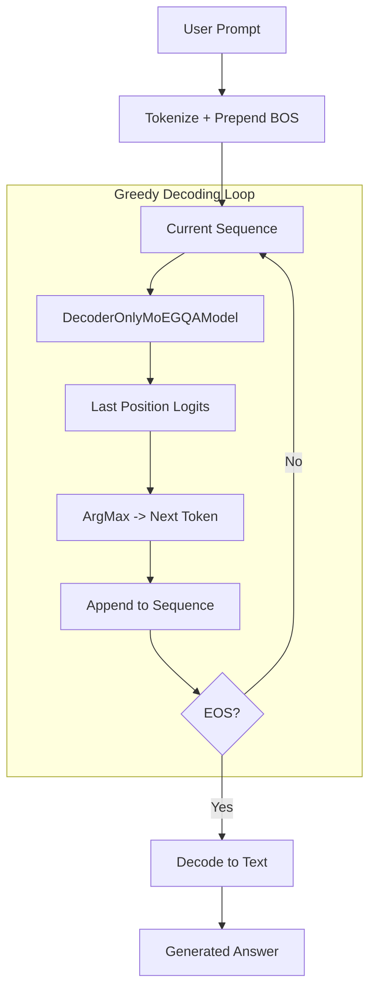

# DecoderMoEGQAInference.py Module Documentation

## 1. Overview

This script performs **text generation (inference)** using a trained `DecoderOnlyMoEGQAModel`. It loads the latest PL checkpoint and uses **greedy decoding** to generate answers from GSM8K-style prompts.

## 2. Dependencies
-   `DecoderMoEGQA.py` -> `DecoderOnlyMoEGQAModel`
-   `Embedding.py` -> `get_tokenizer`

## 3. Architecture



## 4. Functions

### `greedy_decode(model, tokenizer, prompt, max_len, device, bos_token_id, eos_token_id)`
Greedy (argmax) decoding loop. Stops on EOS or `max_len`.

### `load_latest_checkpoint(checkpoint_dir, vocab_size, tokenizer)`
Finds the most recent `.ckpt` file via `glob` + `os.path.getmtime`, loads via `load_from_checkpoint`.

## 5. Usage

```bash
python PLTrainerScripts/DecoderMoEGQAInference.py
```

Requires a trained checkpoint in `checkpoints/DecoderMoEGQACheckpoints/`.
