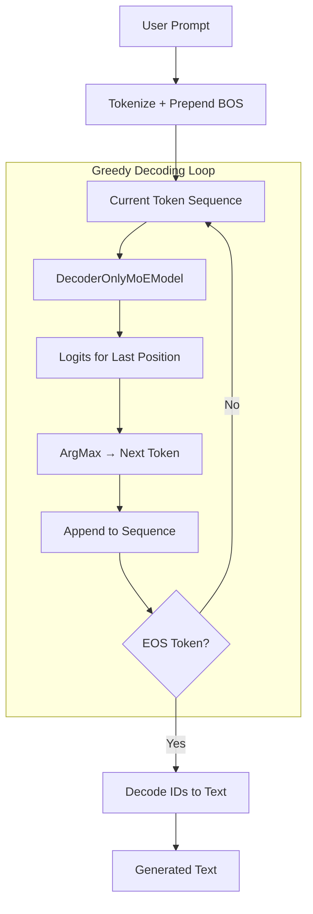

# DecoderMoEInference.py Module Documentation

## 1. Overview

This script performs **text generation (inference)** using a trained `DecoderOnlyMoEModel`. It loads the latest checkpoint from disk and uses **greedy decoding** to generate text token-by-token from a given prompt.

## 2. Modules Involved

-   **os, glob**: Filesystem utilities for finding checkpoint files.
-   **torch**: Core PyTorch library.

### Dependencies
-   `DecoderMoE.py` → `DecoderOnlyMoEModel`: The model class being loaded and used.
-   `Embedding.py` → `get_tokenizer`: Provides the tokenizer for encoding/decoding text.

## 3. Architecture



## 4. Function Definitions

### `greedy_decode(model, tokenizer, prompt, max_len, device, bos_token_id, eos_token_id)`

Generates text from a prompt using greedy (argmax) selection.

-   **Parameters**:
    -   `model`: A trained `DecoderOnlyMoEModel`.
    -   `tokenizer`: Tokenizer (GPT-2 based).
    -   `prompt` (str): The starting text.
    -   `max_len` (int): Maximum total sequence length (default: 256).
    -   `device`: `'cuda'` or `'cpu'`.
    -   `bos_token_id`, `eos_token_id`: Special token IDs.

### `load_latest_checkpoint(checkpoint_dir, vocab_size, tokenizer)`

Finds the most recent `.ckpt` file in the given directory and loads the model.

-   Uses `glob` to find all `.ckpt` files.
-   Selects the one with the latest modification time via `os.path.getmtime`.
-   Loads via `DecoderOnlyMoEModel.load_from_checkpoint(...)`.

## 5. Step-by-Step Logic (greedy_decode)

1.  **Preparation**:
    -   Set model to `eval()` mode (disables dropout).
    -   Resolve `bos_token_id` and `eos_token_id` from the tokenizer if not provided.

2.  **Tokenize Prompt**:
    -   Tokenize the input string; truncate to `max_len - 1` to leave room for BOS.
    -   Prepend `[BOS]` token if not already present.
    -   Result: `input_ids` tensor of shape `(1, prompt_len)`.

3.  **Decoding Loop** (runs up to `max_len - prompt_len` iterations):
    -   Pass `input_ids` through the model → get `logits` `(1, current_len, vocab_size)`.
    -   Take `logits[:, -1, :]` (last position only) → shape `(1, vocab_size)`.
    -   `argmax` → `next_token` (the single most likely token ID).
    -   Concatenate `next_token` to `input_ids` → sequence grows by 1.
    -   If `next_token == eos_token_id`, break out of the loop.

4.  **Decode**:
    -   Convert the full `input_ids` tensor to a list of integers.
    -   Use `tokenizer.decode(...)` with `skip_special_tokens=True`.
    -   Return the generated string.

## 6. Dry Run Trace

**Scenario**: Prompt = `"Question: Janet's ducks lay 16 eggs per day. She eats three for breakfast every morning. How many does she have left?\nAnswer:"`, `max_len` = 256, `vocab_size` = 50257.

| Step | input_ids | Model Output (last pos argmax) | Action |
|------|-----------|-------------------------------|--------|
| Init | `[BOS, 24361, 25, ...]` | — | Tokenized GSM8K-style prompt + BOS |
| Iter 1 | `[BOS, 24361, 25, ...]` | Token 37 | Append → `[..., 37]` |
| Iter 2 | `[..., 37]` | Token 83 | Append → `[..., 83]` |
| Iter 3 | `[..., 83]` | Token 2 (EOS) | Append → `[..., 2]`, **STOP** |
| Decode | `[BOS, 24361, 25, ..., 2]` | — | `"Question: Janet's ducks...\nAnswer: She has 13 left."` |

## 7. Usage

```bash
python DecoderMoEInference.py
```

Requires a trained checkpoint in `DecoderMoECheckpoints/`.
