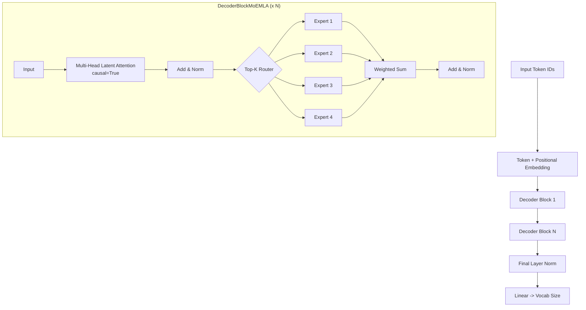

# DecoderMoEMLA.py Module Documentation

## 1. Overview

The `DecoderMoEMLA` module implements a **Decoder-Only Transformer** that combines **Mixture of Experts (MoE)** feed-forward layers with **Multi-Head Latent Attention (MLA)**. This hybrid architecture pairs MLA's compressed latent KV cache (DeepSeek-V2 style) with the sparse, high-capacity MoE FFN — achieving both dramatic KV cache reduction and increased model capacity.

### Key Concepts
-   **MLA Attention**: Compresses K and V into a low-rank latent representation before projecting to full dimensions — ~8x smaller KV cache.
-   **MoE FFN**: Each token is routed to top-k experts via a learned router.
-   **Hybrid Benefit**: MLA minimizes KV cache memory, MoE scales FFN capacity sparsely.

## 2. Dependencies
-   `Embedding.py` -> `TokenEmbeddingModule`
-   `MultiHeadLatentAttention.py` -> `MultiHeadLatentAttention` (`causal=True`)
-   `AddNorm.py` -> `AddNorm`
-   **No dependency on FFN.py**: Uses its own `MoEFeedForward`.

## 3. Architecture



### Key Differences from Other Models
| Feature | DecoderMoE | DecoderOnlyMLA | **DecoderMoEMLA** |
|---------|-----------|---------------|-------------------|
| Attention | MHA | MLA | **MLA** |
| FFN | MoE | Standard SwiGLU | **MoE** |
| KV cache | Full | ~8x smaller | **~8x smaller** |
| FFN capacity | Sparse high | Dense | **Sparse high** |

## 4. Class Definitions

### `class DecoderBlockMoEMLA(nn.Module)`
-   `self.mhsa`: `MultiHeadLatentAttention(causal=True)` with `d_compress` latent dimension.
-   `self.addnorm1`: After MLA.
-   `self.moef`: `MoEFeedForward` with `num_experts` and `top_k`.
-   `self.addnorm2`: After MoE.

### `class DecoderOnlyMoEMLAModel(pl.LightningModule)`
Complete model: Embedding -> N x DecoderBlockMoEMLA -> LayerNorm -> Linear.

## 5. MLA Attention Path

1.  **Down-project Q**: `x -> W_dq -> c_q (d_compress)` -> RMSNorm -> `W_uq -> Q (num_heads * d_k)`.
2.  **Down-project KV**: `x -> W_dkv -> c_kv (d_compress)` -> RMSNorm -> `W_uk -> K`, `W_uv -> V`.
3.  **Cache**: Only `c_kv` needs to be cached (d_compress << d_model).
4.  **Standard attention**: Scaled dot-product with causal mask.

## 6. Code Example

```python
import torch
from models.DecoderMoEMLA import DecoderOnlyMoEMLAModel
from core.Embedding import get_tokenizer

tokenizer = get_tokenizer("gpt2", add_pad_token_if_missing=True)

model = DecoderOnlyMoEMLAModel(
    vocab_size=len(tokenizer), tokenizer=tokenizer,
    d_model=256, num_layers=4, num_heads=8,
    d_compress=64, num_experts=4, top_k=2
)

input_ids = torch.randint(0, len(tokenizer), (1, 10))
logits, attn_maps = model(input_ids)
print("Logits:", logits.shape)  # (1, 10, vocab_size)
```
