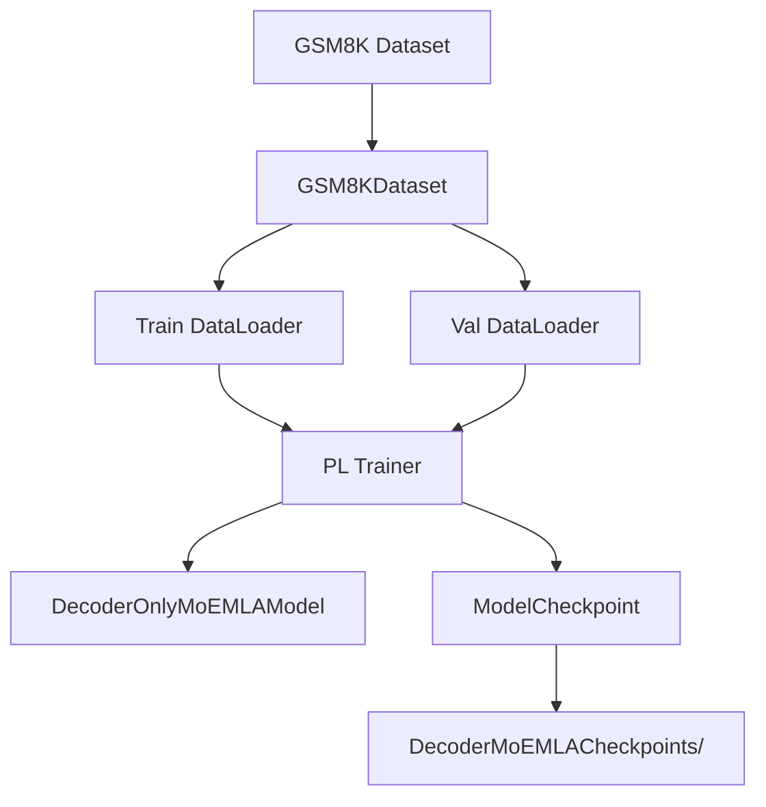

# DecoderMoEMLATrainer.py Module Documentation

## 1. Overview

This script trains the `DecoderOnlyMoEMLAModel` (MoE + MLA) on GSM8K using **PyTorch Lightning**. It is the PL equivalent of `HFTrainerScripts/MoEMLATrainer.py`.

## 2. Dependencies
-   `DecoderMoEMLA.py` -> `DecoderOnlyMoEMLAModel`
-   `Embedding.py` -> `get_tokenizer`
-   `config.py` -> Centralized hyperparameters

## 3. Architecture



## 4. Configuration

| Parameter | Value | Source |
|-----------|-------|--------|
| d_model | 512 | `config.D_MODEL` |
| num_heads | 8 | `config.NUM_HEADS` |
| d_compress | 64 | `config.D_COMPRESS` |
| num_layers | 6 | `config.NUM_LAYERS` |
| d_ff | 2048 | `config.D_FF` |
| num_experts | 4 | `config.NUM_EXPERTS` |
| top_k | 2 | `config.TOP_K` |
| max_epochs | 100 | `config.MAX_EPOCHS` |

## 5. Usage

```bash
python PLTrainerScripts/DecoderMoEMLATrainer.py
```
