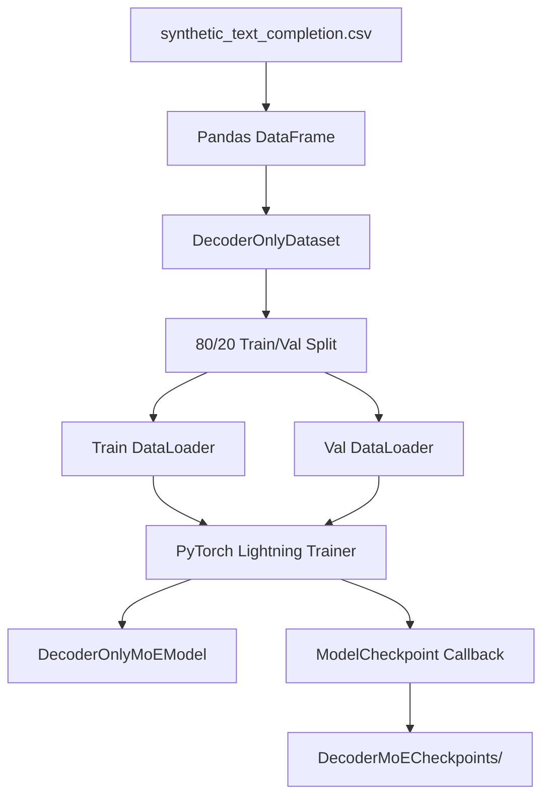

# DecoderMoETrainer.py Module Documentation

## 1. Overview

This script orchestrates the **training pipeline** for the `DecoderOnlyMoEModel`. It reads data from a CSV file, creates a custom PyTorch `Dataset`, sets up data loaders, initializes the MoE model, and runs training using PyTorch Lightning's `Trainer`.

## 2. Modules Involved

-   **torch**: Tensor operations and data utilities.
-   **torch.utils.data**: `Dataset`, `DataLoader`, `random_split`.
-   **pytorch_lightning**: `Trainer`, `ModelCheckpoint`, `seed_everything`.
-   **pandas**: Reading CSV data.

### Dependencies
-   `Embedding.py` → `get_tokenizer`: Provides the GPT-2 tokenizer.
-   `DecoderMoE.py` → `DecoderOnlyMoEModel`: The model being trained.

## 3. Architecture



## 4. Class: `DecoderOnlyDataset`

A custom `Dataset` for decoder-only (causal LM) training.

### `__getitem__` Logic

1.  **Read row**: Get `text` and `completion` from the DataFrame.
2.  **Combine**: `full_text = text + " " + completion`.
3.  **Tokenize**: Using the tokenizer with padding to `max_length`.
4.  **Create labels**:
    -   Copy of `input_ids`.
    -   Set padding positions to `-100` (ignored by `CrossEntropyLoss`).
5.  **Return**: `{"input_ids": ..., "labels": ...}`.

## 5. Step-by-Step Training Flow

1.  **Seed**: `pl.seed_everything(42)` for reproducibility.
2.  **Load Data**: Read CSV into a DataFrame.
3.  **Create Dataset**: Wrap DataFrame in `DecoderOnlyDataset`.
4.  **Split**: 80% train, 20% validation using `random_split`.
5.  **Create DataLoaders**: `batch_size=4` (train), `batch_size=2` (val).
6.  **Initialize Model**:
    -   `d_model=256`, `num_layers=2`, `num_heads=4`, `d_ff=128`.
    -   `num_experts=4`, `top_k=2`.
7.  **Checkpoint Callback**: Saves best model based on `val_loss_epoch`.
8.  **Train**: `trainer.fit(model, train_loader, val_loader)`.

## 6. Dry Run Trace (Single Batch)

**Input CSV Row**: `text="AI is"`, `completion="transforming industries"`.

| Step | Operation | Result |
|------|-----------|--------|
| 1 | Combine | `"AI is transforming industries"` |
| 2 | Tokenize (max_len=32) | `[15, 22, 47, 83, 0, 0, ...]` (padded) |
| 3 | Create Labels | `[15, 22, 47, 83, -100, -100, ...]` |
| 4 | Forward Pass | Logits `(1, 32, vocab_size)` |
| 5 | Loss | CrossEntropy(logits, labels), ignoring -100 |
| 6 | Backward | Gradients computed |
| 7 | Optimizer Step | Weights updated |

## 7. Configuration

| Parameter | Value |
|-----------|-------|
| d_model | 256 |
| num_layers | 2 |
| num_heads | 4 |
| d_ff | 128 |
| num_experts | 4 |
| top_k | 2 |
| max_epochs | 100 |
| batch_size (train) | 4 |
| Learning Rate | 1e-3 |

## 8. Usage

```bash
python DecoderMoETrainer.py
```

Requires `synthetic_text_completion.csv` in the project root.
