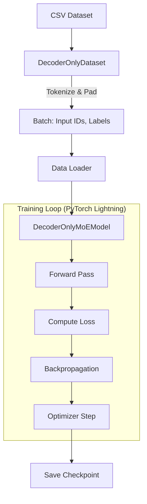

# DecoderMoETrainer.py

## Overview

The `DecoderMoETrainer.py` script orchestration the training process for the **Decoder-Only Mixture of Experts (MoE)** model. It handles data loading, model initialization, and the training loop using PyTorch Lightning.

## Data Pipeline

### `DecoderOnlyDataset`

A custom PyTorch Dataset that prepares data for causal language modeling (GPT-style).

-   **Input Source**: A CSV file (expected to have `text` and `completion` columns).
-   **Preprocessing**:
    1.  Merges `text` and `completion`.
    2.  Adds special tokens: `[BOS]` at the start, `[EOS]` at the end.
    3.  **Input IDs**: `[BOS] + text`.
    4.  **Labels**: `text + [EOS]`.
    5.  **Padding**: Pads sequences to `max_length`. Labels are padded with `-100` to be ignored by the loss function.

### Mermaid Diagram: Training Flow



## Setup & Configuration

-   **Tokenizer**: Uses `gpt2` tokenizer.
-   **Model Hparams**:
    -   `d_model`: 256
    -   `num_layers`: 4
    -   `num_heads`: 4
    -   `num_experts`: 4
    -   `top_k`: 2
-   **Trainer**:
    -   `max_epochs`: 100
    -   `accelerator`: GPU (if available)
    -   `callbacks`: ModelCheckpoint (saves best model based on validation loss).

## Usage

Run the script to start training:

```bash
python DecoderMoETrainer.py
```

Prerequisites:
-   `versatile_dataset_2000.csv` must be present in the directory.
-   `DecoderMoE.py` must be available.
