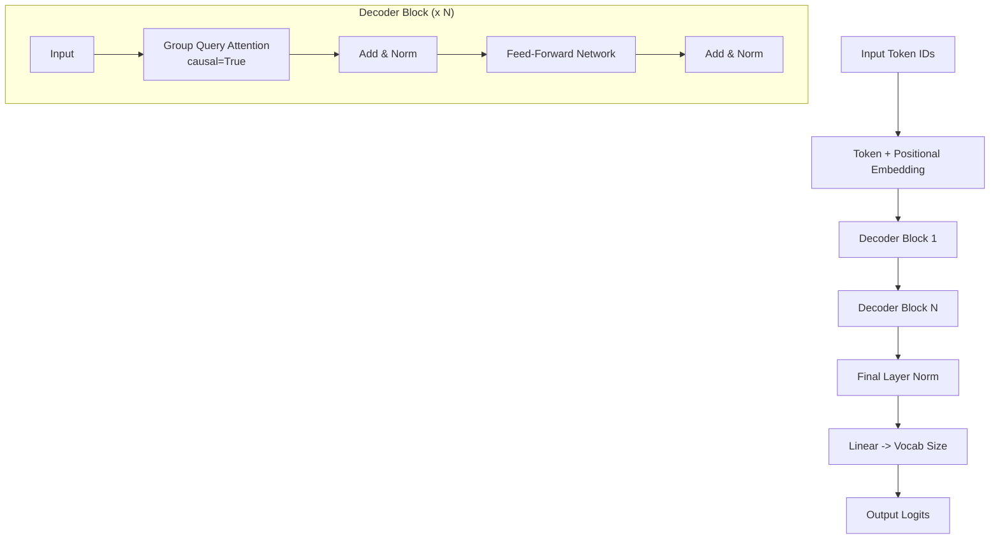

# DecoderOnlyGQAModel.py Module Documentation

## 1. Overview

The `DecoderOnlyGQAModel` module implements a **GPT-style Decoder-Only Transformer with Group Query Attention (GQA)**. Instead of standard Multi-Head Self-Attention where each query head has its own KV head, GQA allows multiple query heads to share a single KV head, reducing memory and compute while retaining most of the representational power.

## 2. Modules Involved

-   **torch**, **torch.nn**: Core PyTorch and neural network layers.
-   **pytorch_lightning**: LightningModule training framework.
-   **Metrics**: `sacrebleu`, `rouge_score`, `nltk`, `bert_score`, Perplexity.

### Dependencies
-   `Embedding.py` -> `TokenEmbeddingModule`: Token and positional embeddings.
-   `GroupQueryAttention.py` -> `GroupQueryAttention`: Group Query Attention (`causal=True`).
-   `AddNorm.py` -> `AddNorm`: Residual connection + normalization.
-   `FFN.py` -> `PositionwiseFeedForward`: Standard feed-forward network.

## 3. Architecture



### Key Difference from Standard MHA
-   **Group Query Attention**: Instead of each query head having its own dedicated K and V head (standard MHA), multiple query heads share a single KV head. For example, with `num_heads=4` and `num_kv_heads=2`, every 2 query heads share 1 KV head.
    -   `num_kv_heads == num_heads` -> standard Multi-Head Attention (MHA).
    -   `num_kv_heads == 1` -> Multi-Query Attention (MQA).
    -   `1 < num_kv_heads < num_heads` -> Group Query Attention (GQA).
-   **Fewer KV Parameters**: K and V projections use `num_kv_heads * d_k` instead of `num_heads * d_k`, reducing parameter count and KV cache size during inference.
-   **Causal Masking**: Position $i$ can only see positions $0, 1, ..., i$.

## 4. Class Definitions

### `class DecoderBlock(nn.Module)`

A single decoder layer with two sub-layers.

-   `self.mhsa`: `GroupQueryAttention(causal=True)` with `num_heads` query heads and `num_kv_heads` KV heads.
-   `self.addnorm1`: After self-attention.
-   `self.ffn`: `PositionwiseFeedForward`.
-   `self.addnorm2`: After FFN.

### `class DecoderOnlyGQAModel(pl.LightningModule)`

The complete model.

-   **Components**: Embedding -> N x DecoderBlock -> LayerNorm -> Linear Classifier.
-   **Loss**: `CrossEntropyLoss(ignore_index=-100)`.
-   **Optimizer**: AdamW.

## 5. Step-by-Step Logic (Forward Pass)

1.  **Embedding**:
    -   `input_ids` `(B, L)` -> `TokenEmbeddingModule` -> `x` `(B, L, d_model)`.
    -   Adds positional encoding.

2.  **Decoder Blocks** (repeated N times):
    -   **Group Query Attention**:
        -   Compute Q from `x` with `num_heads` heads.
        -   Compute K, V from `x` with `num_kv_heads` heads (fewer than Q).
        -   Expand K, V via `repeat_interleave` to match `num_heads`.
        -   Apply causal mask (lower triangular).
        -   Output: attention-weighted values.
    -   **Add & Norm**: `x = LayerNorm(x + Dropout(attn_out))`.
    -   **FFN**: SwiGLU gated FFN (Swish gate).
    -   **Add & Norm**: `x = LayerNorm(x + Dropout(ffn_out))`.

3.  **Final Norm**: `x = LayerNorm(x)`.

4.  **Classifier**: `logits = Linear(x)` -> `(B, L, vocab_size)`.

## 6. Dry Run Trace

**Scenario**: `Batch=1`, `Seq=3`, `d_model=4`, `num_heads=4`, `num_kv_heads=2`, `vocab_size=10`.

Here `d_k = d_model / num_heads = 4 / 4 = 1`, and each KV head is shared by `num_heads / num_kv_heads = 2` query heads.

**Input**: `input_ids = [[5, 12, 8]]`

| Step | Shape | Description |
|------|-------|-------------|
| Embed | `(1, 3, 4)` | Token embed + positional embed for IDs [5, 12, 8] |
| **Block 1 - GQA** | | |
| Q projection | `(1, 3, 4)` | W_q: d_model -> num_heads * d_k = 4 |
| K projection | `(1, 3, 2)` | W_k: d_model -> num_kv_heads * d_k = 2 |
| V projection | `(1, 3, 2)` | W_v: d_model -> num_kv_heads * d_k = 2 |
| Q reshaped | `(1, 4, 3, 1)` | Split into 4 query heads |
| K reshaped | `(1, 2, 3, 1)` | Split into 2 KV heads |
| V reshaped | `(1, 2, 3, 1)` | Split into 2 KV heads |
| K expanded | `(1, 4, 3, 1)` | repeat_interleave(2) -> match 4 query heads |
| V expanded | `(1, 4, 3, 1)` | repeat_interleave(2) -> match 4 query heads |
| Causal Mask | `[[1,0,0],[1,1,0],[1,1,1]]` | Lower triangular |
| Attn Scores | `(1, 4, 3, 3)` | QK^T / sqrt(d_k), masked |
| Attn Output | `(1, 3, 4)` | Weighted V, concatenated heads |
| AddNorm1 | `(1, 3, 4)` | Residual + LayerNorm |
| **Block 1 - FFN** | | |
| Linear1 | `(1, 3, 16)` | d_model -> d_ff |
| SwiGLU/Swish | `(1, 3, 16)` | Activation |
| Linear2 | `(1, 3, 4)` | d_ff -> d_model |
| AddNorm2 | `(1, 3, 4)` | Residual + LayerNorm |
| **Final** | | |
| Norm | `(1, 3, 4)` | Final LayerNorm |
| Classifier | `(1, 3, 10)` | Linear(4 -> 10) |

**Output**: `logits` of shape `(1, 3, 10)`. Each position predicts the next token.

## 7. Code Example

```python
import torch
from DecoderOnlyGQAModel import DecoderOnlyGQAModel
from Embedding import get_tokenizer

tokenizer = get_tokenizer("gpt2", add_pad_token_if_missing=True)

model = DecoderOnlyGQAModel(
    vocab_size=len(tokenizer),
    tokenizer=tokenizer,
    d_model=256,
    num_layers=4,
    num_heads=4,
    num_kv_heads=2
)

input_ids = torch.randint(0, len(tokenizer), (1, 10))
logits, attn_maps = model(input_ids)
print("Logits:", logits.shape)  # (1, 10, vocab_size)
```
