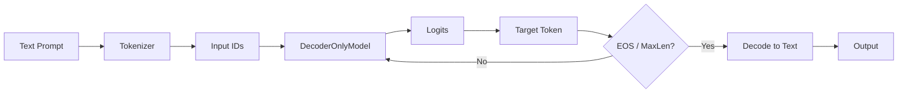

# DecoderOnlyInference.py

## Overview

The `DecoderOnlyInference.py` script performs **inference** using a trained **Decoder-Only Transformer** (GPT-style). It loads a saved checkpoint and generates text continuations from a given prompt using greedy decoding.

## Components

### 1. `greedy_decode`

Performs token-by-token generation.

-   **Process:**
    1.  Encodes the prompt.
    2.  Prepends `[BOS]` token.
    3.  Feeds the sequence to the `DecoderOnlyModel`.
    4.  Selects the token with the highest probability (greedy approach).
    5.  Appends the new token and repeats until `max_len` or `[EOS]` token is reached.
    6.  Decodes the resulting token IDs back to a string.

### Mermaid Diagram: Inference Flow



### 2. `load_latest_checkpoint`

-   Automatically locates the latest `.ckpt` file in the `DecoderOnlyCheckpoints` directory based on file modification timestamps.
-   Initializes the `DecoderOnlyModel` with the loaded state dict.

## Usage

Run the script directly:

```bash
python DecoderOnlyInference.py
```

It defaults to:
-   Loading the latest checkpoint from `DecoderOnlyCheckpoints/`.
-   Generating text for the prompt *"Artificial intelligence is transforming"*.
