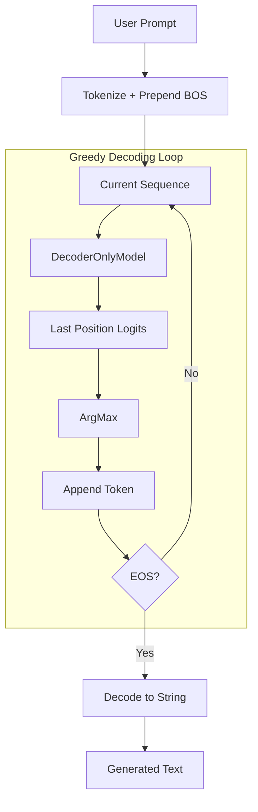

# DecoderOnlyInference.py Module Documentation

## 1. Overview

This script performs **text generation** using a trained standard `DecoderOnlyModel` (non-MoE). It mirrors `DecoderMoEInference.py` in structure but loads a different model class.

## 2. Modules Involved

-   **os, glob**: Filesystem utilities.
-   **torch**: Core PyTorch library.

### Dependencies
-   `DecoderOnlySeq2SeqModel.py` → `DecoderOnlyModel`: The standard decoder-only model.
-   `Embedding.py` → `get_tokenizer`: Tokenizer provider.

## 3. Architecture



## 4. Functions

### `greedy_decode(model, tokenizer, prompt, max_len, device, bos_token_id, eos_token_id)`

Identical logic to `DecoderMoEInference.greedy_decode`, but operates on `DecoderOnlyModel`.

### `load_latest_checkpoint(checkpoint_dir, vocab_size, tokenizer)`

Loads the latest `.ckpt` file from `DecoderOnlyCheckpoints/`.

## 5. Step-by-Step Logic

1.  **Set eval mode**: Disables dropout and batch norm training behavior.
2.  **Tokenize prompt**: Convert text to token IDs.
3.  **Prepend BOS**: Add beginning-of-sequence token.
4.  **Loop**:
    -   Forward pass through entire sequence.
    -   Extract logits at the last position.
    -   Select token with highest probability (`argmax`).
    -   Append to the sequence.
    -   Check for EOS → stop condition.
5.  **Decode**: Convert final token ID sequence to human-readable text.

## 6. Dry Run Trace

**Prompt**: `"The future of"`

| Step | Sequence | Next Token | Notes |
|------|----------|------------|-------|
| Init | `[BOS, 464, 2003, 286]` | — | Tokenized prompt |
| Iter 1 | `[BOS, 464, 2003, 286]` | 9552 | "technology" |
| Iter 2 | `[BOS, 464, 2003, 286, 9552]` | 318 | "is" |
| Iter 3 | `[BOS, 464, 2003, 286, 9552, 318]` | EOS | **STOP** |
| Output | — | — | `"The future of technology is"` |

## 7. Usage

```bash
python DecoderOnlyInference.py
```

Requires a trained checkpoint in `DecoderOnlyCheckpoints/`.
