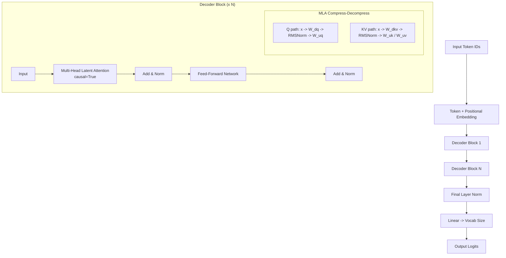

# DecoderOnlyMLAModel.py Module Documentation

## 1. Overview

The `DecoderOnlyMLAModel` module implements a **GPT-style Decoder-Only Transformer with Multi-Head Latent Attention (MLA)**. Unlike the standard Decoder-Only model that uses `MultiHeadSelfAttention`, this architecture replaces it with `MultiHeadLatentAttention`---a low-rank KV compression mechanism from DeepSeek-V2 (2024) that drastically reduces KV cache size during inference while preserving model quality.

## 2. Modules Involved

-   **torch**, **torch.nn**: Core PyTorch and neural network layers.
-   **pytorch_lightning**: LightningModule training framework.
-   **Metrics**: `sacrebleu`, `rouge_score`, `nltk`, `bert_score`, Perplexity.

### Dependencies
-   `Embedding.py` -> `TokenEmbeddingModule`: Token and positional embeddings.
-   `MultiHeadLatentAttention.py` -> `MultiHeadLatentAttention`: Latent-compressed attention (`causal=True`).
-   `AddNorm.py` -> `AddNorm`: Residual connection + normalization.
-   `FFN.py` -> `PositionwiseFeedForward`: Standard feed-forward network.

## 3. Architecture



### Key Difference from Standard Decoder-Only
-   **Multi-Head Latent Attention (MLA)** replaces standard Multi-Head Self-Attention. Instead of projecting directly to Q, K, V, MLA first compresses the input to a low-rank latent space (`d_compress`) and then up-projects back to the full head dimension:
    -   **Q path**: `x -> W_dq (d_model -> d_compress) -> RMSNorm -> W_uq (d_compress -> num_heads * d_k)`
    -   **KV path**: `x -> W_dkv (d_model -> d_compress) -> RMSNorm -> W_uk / W_uv (d_compress -> num_heads * d_k each)`
-   **Smaller KV Cache**: During inference, only the compressed latent `c_kv` (of dimension `d_compress`) needs to be cached per token per layer, instead of the full K and V tensors. When `d_compress << d_model`, this yields significant memory savings.
-   **Additional Parameter**: `d_compress` (default=64) controls the compression bottleneck dimension.
-   **Causal Masking**: Position $i$ can only see positions $0, 1, ..., i$ (same as standard decoder-only).

## 4. Class Definitions

### `class DecoderBlock(nn.Module)`

A single decoder layer with two sub-layers.

-   `self.mhsa`: `MultiHeadLatentAttention(causal=True)` with `d_compress` bottleneck.
-   `self.addnorm1`: After latent attention.
-   `self.ffn`: `PositionwiseFeedForward`.
-   `self.addnorm2`: After FFN.

### `class DecoderOnlyMLAModel(pl.LightningModule)`

The complete model.

-   **Components**: Embedding -> N x DecoderBlock -> LayerNorm -> Linear Classifier.
-   **Loss**: `CrossEntropyLoss(ignore_index=-100)`.
-   **Optimizer**: AdamW.

## 5. Step-by-Step Logic (Forward Pass)

1.  **Embedding**:
    -   `input_ids` `(B, L)` -> `TokenEmbeddingModule` -> `x` `(B, L, d_model)`.
    -   Adds positional encoding.

2.  **Decoder Blocks** (repeated N times):
    -   **Multi-Head Latent Attention**:
        -   **Q path**: Down-project `x` to `(B, L, d_compress)` via `W_dq`, apply `RMSNorm`, up-project to `(B, L, num_heads * d_k)` via `W_uq`.
        -   **KV path**: Down-project `x` to `(B, L, d_compress)` via `W_dkv`, apply `RMSNorm`, up-project to K and V each `(B, L, num_heads * d_k)` via `W_uk` and `W_uv`.
        -   Split into heads, compute scaled dot-product attention with causal mask.
        -   Output: attention-weighted values.
    -   **Add & Norm**: `x = LayerNorm(x + Dropout(attn_out))`.
    -   **FFN**: SwiGLU gated FFN (Swish gate).
    -   **Add & Norm**: `x = LayerNorm(x + Dropout(ffn_out))`.

3.  **Final Norm**: `x = LayerNorm(x)`.

4.  **Classifier**: `logits = Linear(x)` -> `(B, L, vocab_size)`.

## 6. Dry Run Trace

**Scenario**: `Batch=1`, `Seq=3`, `d_model=4`, `num_heads=2`, `d_compress=2`, `vocab_size=10`.

**Input**: `input_ids = [[5, 12, 8]]`

| Step | Shape | Description |
|------|-------|-------------|
| Embed | `(1, 3, 4)` | Token embed + positional embed for IDs [5, 12, 8] |
| **Block 1 - MLA** | | |
| Q down-project (W_dq) | `(1, 3, 2)` | x (d_model=4) -> d_compress=2 |
| Q RMSNorm | `(1, 3, 2)` | Normalize compressed Q |
| Q up-project (W_uq) | `(1, 3, 4)` | d_compress=2 -> num_heads * d_k = 2 * 2 = 4 |
| KV down-project (W_dkv) | `(1, 3, 2)` | x (d_model=4) -> d_compress=2 (cached latent) |
| KV RMSNorm | `(1, 3, 2)` | Normalize compressed KV |
| K up-project (W_uk) | `(1, 3, 4)` | d_compress=2 -> num_heads * d_k = 4 |
| V up-project (W_uv) | `(1, 3, 4)` | d_compress=2 -> num_heads * d_k = 4 |
| Q, K, V (split heads) | `(1, 2, 3, 2)` | Reshaped to (B, num_heads, L, d_k) |
| Causal Mask | `[[1,0,0],[1,1,0],[1,1,1]]` | Lower triangular |
| Attn Scores | `(1, 2, 3, 3)` | QK^T / sqrt(d_k), masked |
| Attn Output | `(1, 3, 4)` | Weighted V, concatenated heads, W_o projection |
| AddNorm1 | `(1, 3, 4)` | Residual + LayerNorm |
| **Block 1 - FFN** | | |
| Linear1 | `(1, 3, 16)` | d_model -> d_ff |
| SwiGLU/Swish | `(1, 3, 16)` | Activation |
| Linear2 | `(1, 3, 4)` | d_ff -> d_model |
| AddNorm2 | `(1, 3, 4)` | Residual + LayerNorm |
| **Final** | | |
| Norm | `(1, 3, 4)` | Final LayerNorm |
| Classifier | `(1, 3, 10)` | Linear(4 -> 10) |

**Output**: `logits` of shape `(1, 3, 10)`. Each position predicts the next token.

## 7. Code Example

```python
import torch
from DecoderOnlyMLAModel import DecoderOnlyMLAModel
from Embedding import get_tokenizer

tokenizer = get_tokenizer("gpt2", add_pad_token_if_missing=True)

model = DecoderOnlyMLAModel(
    vocab_size=len(tokenizer),
    tokenizer=tokenizer,
    d_model=256,
    num_layers=4,
    num_heads=4,
    d_compress=64
)

input_ids = torch.randint(0, len(tokenizer), (1, 10))
logits, attn_maps = model(input_ids)
print("Logits:", logits.shape)  # (1, 10, vocab_size)
```
