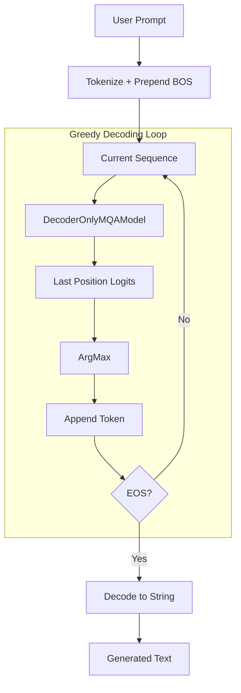

# DecoderOnlyMQAInference.py Module Documentation

## 1. Overview

This script performs **text generation** using a trained `DecoderOnlyMQAModel` (Multi-Query Attention variant). It mirrors `DecoderOnlyInference.py` in structure but loads the MQA model class, benefiting from reduced KV cache during autoregressive decoding.

## 2. Modules Involved

-   **os, glob**: Filesystem utilities.
-   **torch**: Core PyTorch library.

### Dependencies
-   `DecoderOnlyMQAModel.py` → `DecoderOnlyMQAModel`: The MQA decoder-only model.
-   `Embedding.py` → `get_tokenizer`: Tokenizer provider.

## 3. Architecture



## 4. Functions

### `greedy_decode(model, tokenizer, prompt, max_len, device, bos_token_id, eos_token_id)`

Identical logic to `DecoderOnlyInference.greedy_decode`, but operates on `DecoderOnlyMQAModel`.

### `load_latest_checkpoint(checkpoint_dir, vocab_size, tokenizer)`

Loads the latest `.ckpt` file from `MQACheckpoints/`.

## 5. Step-by-Step Logic

1.  **Set eval mode**: Disables dropout and batch norm training behavior.
2.  **Tokenize prompt**: Convert text to token IDs.
3.  **Prepend BOS**: Add beginning-of-sequence token.
4.  **Loop**:
    -   Forward pass through entire sequence.
    -   Extract logits at the last position.
    -   Select token with highest probability (`argmax`).
    -   Append to the sequence.
    -   Check for EOS → stop condition.
5.  **Decode**: Convert final token ID sequence to human-readable text.

## 6. Dry Run Trace

**Prompt**: `"Artificial intelligence is transforming"`

| Step | Sequence | Next Token | Notes |
|------|----------|------------|-------|
| Init | `[BOS, 8001, 9018, 318, 25417]` | — | Tokenized prompt |
| Iter 1 | `[BOS, 8001, 9018, 318, 25417]` | 262 | "the" |
| Iter 2 | `[BOS, 8001, 9018, 318, 25417, 262]` | 835 | "way" |
| Iter 3 | `[BOS, 8001, 9018, 318, 25417, 262, 835]` | EOS | **STOP** |
| Output | — | — | `"Artificial intelligence is transforming the way"` |

## 7. Usage

```bash
cd MQA && python DecoderOnlyMQAInference.py
```

Requires a trained checkpoint in `MQACheckpoints/`.
