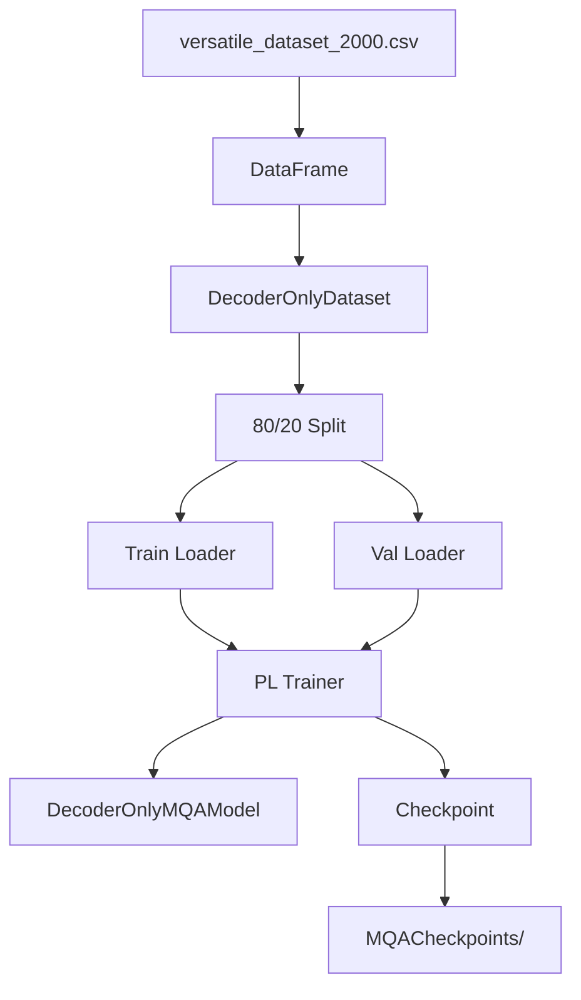

# DecoderOnlyMQATrainer.py Module Documentation

## 1. Overview

This script handles the **training pipeline** for the `DecoderOnlyMQAModel` (Multi-Query Attention variant). It mirrors `DecoderOnlyTrainer.py` but trains a model that uses Multi-Query Attention instead of standard Multi-Head Attention, reducing KV cache overhead during inference.

## 2. Modules Involved

-   **torch**: Tensor operations and data utilities.
-   **torch.utils.data**: `Dataset`, `DataLoader`, `random_split`.
-   **pytorch_lightning**: `Trainer`, `ModelCheckpoint`.
-   **pandas**: Reading CSV data.

### Dependencies
-   `Embedding.py` → `get_tokenizer`: Provides the tokenizer.
-   `DecoderOnlyMQAModel.py` → `DecoderOnlyMQAModel`: The model being trained.

## 3. Architecture



## 4. Class: `DecoderOnlyDataset`

### `__getitem__` Logic Step-by-Step

1.  **Read**: Get `text` and `completion` from row `idx`.
2.  **Combine**: `full_text = text + " " + completion`.
3.  **Tokenize**: `tokenizer(full_text, max_length=max_length - 2)` (reserve BOS + EOS).
4.  **Input IDs**: `[BOS] + tokenized_ids`, padded to `max_length`.
5.  **Labels**: `tokenized_ids + [EOS]`, padded with `-100`.
6.  **Return**: Dict with `input_ids` and `labels`.

## 5. Dry Run Trace (Single Training Step)

**CSV Row**: `text="Hello"`, `completion="world"`.

| Step | Operation | Shape / Value |
|------|-----------|---------------|
| 1 | Combine | `"Hello world"` |
| 2 | Tokenize | `[15496, 995]` (len=2, no special tokens) |
| 3 | Input IDs | `[BOS, 15496, 995, PAD, PAD, ...]` (len=64) |
| 4 | Labels | `[15496, 995, EOS, -100, -100, ...]` (len=64) |
| 5 | Forward | `logits (1, 64, vocab_size)` |
| 6 | Loss | CE between logits and labels (ignoring -100) |
| 7 | Backward | Compute gradients |
| 8 | Update | AdamW step |

## 6. Configuration

| Parameter | Value |
|-----------|-------|
| d_model | 256 |
| num_layers | 4 |
| num_heads | 4 |
| d_ff | 512 |
| max_positions | 64 |
| max_epochs | 100 |
| batch_size (train) | 4 |
| batch_size (val) | 2 |
| Learning Rate | 1e-3 |

## 7. Usage

```bash
cd MQA && python DecoderOnlyMQATrainer.py
```

Requires `versatile_dataset_2000.csv` in the `MQA/` directory.
