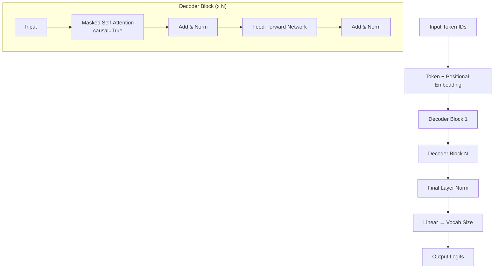

# DecoderOnlySeq2SeqModel.py Module Documentation

## 1. Overview

The `DecoderOnlySeq2SeqModel` module implements a **GPT-style Decoder-Only Transformer**. Unlike the Encoder-Decoder model, this architecture uses only masked self-attention (no cross-attention) and is trained autoregressively—predicting the next token given all previous tokens.

## 2. Modules Involved

-   **torch**, **torch.nn**: Core PyTorch and neural network layers.
-   **pytorch_lightning**: LightningModule training framework.
-   **Metrics**: `sacrebleu`, `rouge_score`, `nltk`, `bert_score`, Perplexity.

### Dependencies
-   `Embedding.py` → `TokenEmbeddingModule`: Token and positional embeddings.
-   `MultiHeadSelfAttention.py` → `MultiHeadSelfAttention`: Masked self-attention (`causal=True`).
-   `AddNorm.py` → `AddNorm`: Residual connection + normalization.
-   `FFN.py` → `PositionwiseFeedForward`: Standard feed-forward network.

## 3. Architecture



### Key Difference from Encoder-Decoder
-   **No Encoder**: Input and output share the same sequence.
-   **No Cross-Attention**: Each block has only 2 sub-layers (Self-Attn + FFN) instead of 3.
-   **Causal Masking**: Position $i$ can only see positions $0, 1, ..., i$.

## 4. Class Definitions

### `class DecoderBlock(nn.Module)`

A single decoder layer with two sub-layers.

-   `self.mhsa`: `MultiHeadSelfAttention(causal=True)`.
-   `self.addnorm1`: After self-attention.
-   `self.ffn`: `PositionwiseFeedForward`.
-   `self.addnorm2`: After FFN.

### `class DecoderOnlyModel(pl.LightningModule)`

The complete model.

-   **Components**: Embedding → N × DecoderBlock → LayerNorm → Linear Classifier.
-   **Loss**: `CrossEntropyLoss(ignore_index=-100)`.
-   **Optimizer**: AdamW.

## 5. Step-by-Step Logic (Forward Pass)

1.  **Embedding**:
    -   `input_ids` `(B, L)` → `TokenEmbeddingModule` → `x` `(B, L, d_model)`.
    -   Adds positional encoding.

2.  **Decoder Blocks** (repeated N times):
    -   **Masked Self-Attention**:
        -   Compute Q, K, V from `x`.
        -   Apply causal mask (lower triangular).
        -   Output: attention-weighted values.
    -   **Add & Norm**: `x = LayerNorm(x + Dropout(attn_out))`.
    -   **FFN**: SwiGLU gated FFN (Swish gate).
    -   **Add & Norm**: `x = LayerNorm(x + Dropout(ffn_out))`.

3.  **Final Norm**: `x = LayerNorm(x)`.

4.  **Classifier**: `logits = Linear(x)` → `(B, L, vocab_size)`.

## 6. Dry Run Trace

**Scenario**: `Batch=1`, `Seq=3`, `d_model=4`, `vocab_size=10`.

**Input**: `input_ids = [[5, 12, 8]]`

| Step | Shape | Description |
|------|-------|-------------|
| Embed | `(1, 3, 4)` | Token embed + positional embed for IDs [5, 12, 8] |
| **Block 1 - Self-Attn** | | |
| Q, K, V | `(1, H, 3, d_k)` | Projected and split into heads |
| Causal Mask | `[[1,0,0],[1,1,0],[1,1,1]]` | Lower triangular |
| Attn Scores | `(1, H, 3, 3)` | QK^T / sqrt(d_k), masked |
| Attn Output | `(1, 3, 4)` | Weighted V, concatenated heads |
| AddNorm1 | `(1, 3, 4)` | Residual + LayerNorm |
| **Block 1 - FFN** | | |
| Linear1 | `(1, 3, 16)` | d_model → d_ff |
| SwiGLU/Swish | `(1, 3, 16)` | Activation |
| Linear2 | `(1, 3, 4)` | d_ff → d_model |
| AddNorm2 | `(1, 3, 4)` | Residual + LayerNorm |
| **Final** | | |
| Norm | `(1, 3, 4)` | Final LayerNorm |
| Classifier | `(1, 3, 10)` | Linear(4 → 10) |

**Output**: `logits` of shape `(1, 3, 10)`. Each position predicts the next token.

## 7. Code Example

```python
import torch
from DecoderOnlySeq2SeqModel import DecoderOnlyModel
from Embedding import get_tokenizer

tokenizer = get_tokenizer("gpt2", add_pad_token_if_missing=True)

model = DecoderOnlyModel(
    vocab_size=len(tokenizer),
    tokenizer=tokenizer,
    d_model=256,
    num_layers=2,
    num_heads=4
)

input_ids = torch.randint(0, len(tokenizer), (1, 10))
logits, attn_maps = model(input_ids)
print("Logits:", logits.shape)  # (1, 10, vocab_size)
```
