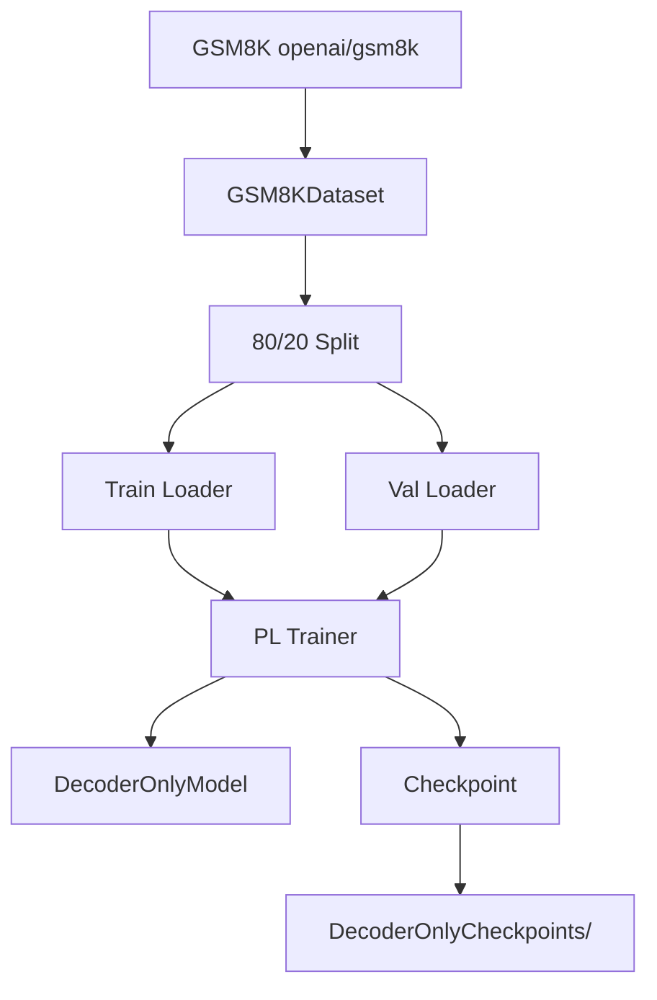

# DecoderOnlyTrainer.py Module Documentation

## 1. Overview

This script handles the **training pipeline** for the standard `DecoderOnlyModel` (non-MoE). It mirrors `DecoderMoETrainer.py` but trains a model with a dense FFN instead of Mixture of Experts.

## 2. Modules Involved

-   **torch**: Tensor operations and data utilities.
-   **torch.utils.data**: `Dataset`, `DataLoader`, `random_split`.
-   **pytorch_lightning**: `Trainer`, `ModelCheckpoint`.
-   **datasets**: Loading GSM8K dataset.

### Dependencies
-   `Embedding.py` → `get_tokenizer`: Provides the tokenizer.
-   `DecoderOnlySeq2SeqModel.py` → `DecoderOnlyModel`: The model being trained.

## 3. Architecture



## 4. Class: `GSM8KDataset`

### `__getitem__` Logic Step-by-Step

1.  **Read**: Get `question` and `answer` from GSM8K row `idx`.
2.  **Combine**: `full_text = question + " " + answer`.
3.  **Tokenize**: `tokenizer(full_text, max_length=256, padding="max_length")`.
4.  **Labels**: Copy `input_ids`, set padded positions to `-100`.
5.  **Return**: Dict with `input_ids` and `labels`.

## 5. Dry Run Trace (Single Training Step)

**GSM8K Row**: `question="What is 2+2?"`, `answer="4"`.

| Step | Operation | Shape / Value |
|------|-----------|---------------|
| 1 | Combine | `"What is 2+2? 4"` |
| 2 | Tokenize | `[2061, 318, 362, 10, 17, 30, 604, PAD, ...]` (len=256) |
| 3 | Labels | `[2061, 318, 362, 10, 17, 30, 604, -100, ...]` |
| 4 | Forward | `logits (1, 256, vocab_size)` |
| 5 | Loss | CE between logits and labels (ignoring -100) |
| 6 | Backward | Compute gradients |
| 7 | Update | AdamW step |

## 6. Configuration

| Parameter | Value |
|-----------|-------|
| d_model | 256 |
| num_layers | 2 |
| num_heads | 4 |
| d_ff | 128 |
| max_epochs | 100 |
| batch_size (train) | 4 |
| Learning Rate | 1e-3 |

## 7. Usage

```bash
python DecoderOnlyTrainer.py
```

Requires the `datasets` library (GSM8K is loaded via `load_dataset("openai/gsm8k")`). Metrics: eval_loss, Perplexity.
