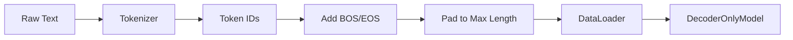

# DecoderOnlyTrainer.py

## Overview

The `DecoderOnlyTrainer.py` script orchestrates the training for the standard **Decoder-Only Transformer** model. It processes the dataset, initializes the model, and utilizes PyTorch Lightning for the training loop.

## Data Pipeline

### `DecoderOnlyDataset`

Prepares the data for causal language modeling.

-   **Input**: CSV file with `text` and `completion`.
-   **Structure**:
    -   Merges `text` and `completion`.
    -   Prepends `[BOS]` (Beginning of Sentence).
    -   Appends `[EOS]` (End of Sentence).
-   **Padding**: Pads sequences to `max_length`. Labels are padded with `-100`.

### Mermaid Diagram: Data Flow



## Training Configuration

-   **Hyperparameters**:
    -   `d_model`: 256
    -   `num_layers`: 4
    -   `num_heads`: 4
    -   `lr`: 1e-3
    -   `max_epochs`: 100
-   **Checkpointing**: Saves the best model (lowest validation loss) to `DecoderOnlyCheckpoints/`.

## Usage

Run the script to start training:

```bash
python DecoderOnlyTrainer.py
```

Prerequisites:
-   `versatile_dataset_2000.csv`
-   `DecoderOnlySeq2SeqModel.py`
