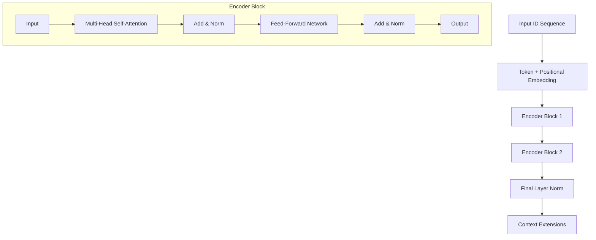

# Encoder.py

## Overview

The `Encoder.py` module implements the **Transformer Encoder**, which processes input sequences into contextualized vector representations. It is capable of bidirectional attention (looking at both past and future tokens), making it suitable for understanding tasks (e.g., classification, translation source capability).

## Architecture

The Encoder consists of a stack of identical **Encoder Blocks**.

### Encoder Block Logic
1.  **Multi-Head Self-Attention**: Allows tokens to attend to all other tokens in the sequence (no causal masking).
2.  **Add & Norm**: Residual connection followed by Layer Normalization.
3.  **Position-wise Feed-Forward Network**: Processes each position independently.
4.  **Add & Norm**: Residual connection followed by Layer Normalization.

### Mermaid Diagram



## Class Definitions

### 1. `EncoderBlock`

A single layer of the Encoder.

-   **Components**:
    -   `self.mhsa`: `MultiHeadSelfAttention` (causal=False).
    -   `self.ffn`: `PositionwiseFeedForward`.
    -   `self.addnorm1`, `self.addnorm2`.

### 2. `Encoder`

The complete PyTorch Lightning module.

-   **Parameters**:
    -   `vocab_size`, `d_model`, `num_layers`, `num_heads`, `d_ff`, etc.
    
-   **Forward Pass**:
    1.  Embed inputs.
    2.  Pass through `self.layers` (ModuleList of `EncoderBlock`).
    3.  Normalize.
    
-   **Returns**:
    -   `x`: Encoded sequence `(Batch, Seq_Len, d_model)`.
    -   `attn_maps`: List of attention weights.

## Usage Example

```python
import torch
from Encoder import Encoder

# 1. Config
vocab_size = 5000
d_model = 256

# 2. Init
encoder = Encoder(
    vocab_size=vocab_size,
    d_model=d_model,
    num_layers=2,
    num_heads=8
)

# 3. Dummy Input
input_ids = torch.randint(0, vocab_size, (2, 10)) # (Batch, Seq)
mask = torch.ones(2, 10) # Attention mask

# 4. Forward
output, attn_maps = encoder(input_ids, attention_mask=mask)
print("Encoder Output:", output.shape) 
# Expected: torch.Size([2, 10, 256])
```
