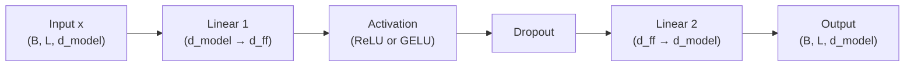

# FFN.py Module Documentation

## 1. Overview

The `FFN` module implements the **Position-wise Feed-Forward Network**, a two-layer MLP applied independently and identically to each position in the sequence. It expands the representation to a higher dimension, applies a non-linearity, and projects it back.

## 2. Modules Involved

-   **torch**, **torch.nn**: Linear layers, dropout, activation functions.
-   **pytorch_lightning**: LightningModule base class.

### Dependencies
This module has **no dependencies** on other custom modules. It is used by:
-   `Encoder.py` (in `EncoderBlock`)
-   `Decoder.py` (in `DecoderBlock`)
-   `DecoderOnlySeq2SeqModel.py` (in `DecoderBlock`)

*Note: `DecoderMoE.py` does NOT use this module — it defines its own `ExpertMLP` and `MoEFeedForward`.*

## 3. Architecture



### Mathematical Formula

$$FFN(x) = W_2 \cdot \text{Dropout}(\text{Activation}(W_1 \cdot x + b_1)) + b_2$$

Where typically $d_{ff} = 4 \times d_{model}$.

## 4. Class: `PositionwiseFeedForward`

### `__init__(self, d_model, d_ff, dropout, activation)`

-   `self.fc1`: `nn.Linear(d_model, d_ff)`.
-   `self.fc2`: `nn.Linear(d_ff, d_model)`.
-   `self.activation`: `nn.ReLU()` or `nn.GELU()`.
-   `self.dropout`: `nn.Dropout(dropout)`.

### `forward(self, x) -> torch.Tensor`

-   Input: `(B, L, d_model)`.
-   Output: `(B, L, d_model)`.
-   One-liner: `return self.fc2(self.dropout(self.activation(self.fc1(x))))`.

## 5. Step-by-Step Logic

1.  **Expand**: `fc1` projects from $d_{model}$ to $d_{ff}$ (e.g., 256 → 1024).
    -   This larger space allows the model to learn more complex representations.
2.  **Activate**: Non-linear activation (GELU is smoother than ReLU and often preferred).
3.  **Dropout**: Randomly zeroes elements during training for regularization.
4.  **Compress**: `fc2` projects back from $d_{ff}$ to $d_{model}$ (1024 → 256).

## 6. Dry Run Trace

**Scenario**: `d_model=4`, `d_ff=8`, activation=GELU, dropout=0.

**Input**: `x = [[1.0, -0.5, 0.3, 0.8]]` (1 token, d_model=4)

| Step | Operation | Result |
|------|-----------|--------|
| 1 | `fc1(x)`: Linear(4→8) | `[0.2, -1.1, 0.5, 0.9, -0.3, 0.7, 1.2, -0.4]` (8 values) |
| 2 | GELU activation | `[0.17, -0.15, 0.35, 0.73, -0.11, 0.56, 1.08, -0.13]` |
| 3 | Dropout (p=0) | No change |
| 4 | `fc2(x)`: Linear(8→4) | `[0.45, -0.22, 0.67, 0.31]` (back to 4 values) |

**Output**: `[0.45, -0.22, 0.67, 0.31]` — transformed representation of the same dimension.

### Why the expansion?
The intermediate expansion to $d_{ff}$ creates a "bottleneck" architecture. The larger hidden space allows the network to learn richer representations before compressing back. This is analogous to how autoencoders work.

## 7. Code Example

```python
import torch
from FFN import PositionwiseFeedForward

ffn = PositionwiseFeedForward(d_model=256, d_ff=1024, activation="gelu")

x = torch.randn(2, 10, 256)  # Batch=2, Seq=10
output = ffn(x)
print("Output:", output.shape)  # (2, 10, 256)
```
