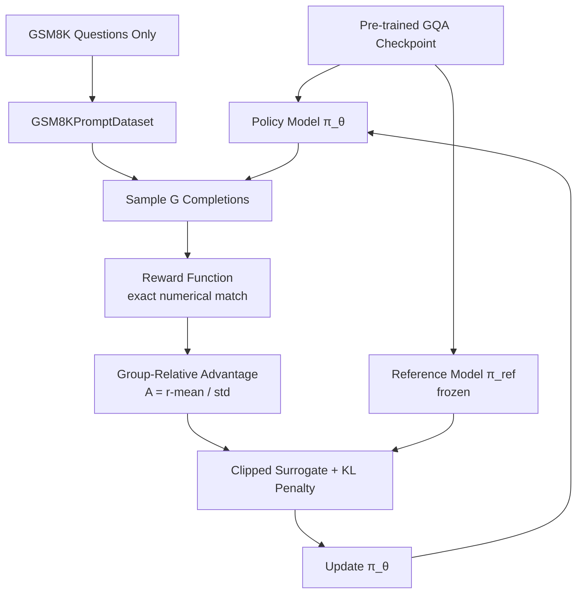

# GQA_SFT_GRPO_Trainer.py (PL) Module Documentation

## 1. Overview

This script implements **GRPO (Group Relative Policy Optimization)** for the `DecoderOnlyGQAModel` on GSM8K using PyTorch Lightning. It loads a pre-trained GQA checkpoint and fine-tunes it with RL — sampling multiple completions per question, scoring them with a reward function, and updating the policy using a clipped surrogate objective with KL penalty against the frozen reference.

**Prerequisite**: Train a GQA model first with `PLTrainerScripts/DecoderOnlyGQATrainer.py`

**Reference**: DeepSeek-R1 (Shao et al., 2025) — "DeepSeek-R1: Incentivizing Reasoning Capability in LLMs via Reinforcement Learning"

## 2. Dependencies
-   `DecoderOnlyGQAModel.py` -> `DecoderOnlyGQAModel`
-   `Embedding.py` -> `get_tokenizer`
-   `config.py` -> Centralized hyperparameters (including GRPO settings)
-   Pre-trained checkpoint in `checkpoints/GQACheckpoints/`

## 3. Architecture



## 4. GRPO Algorithm

For each training step:
1.  **Sample**: For each question, sample `G` completions from current policy `π_θ`.
2.  **Reward**: Score each completion — `1.0` if the final number matches ground truth, `+0.1` bonus for `####` format.
3.  **Advantage**: Normalize rewards within each group: `A_j = (r_j - mean(r)) / (std(r) + ε)`.
4.  **Policy Loss**: Clipped surrogate objective (PPO-style):
    -   `ratio = π_θ(a|s) / π_ref(a|s)`
    -   `loss = -min(ratio * A, clip(ratio, 1-ε, 1+ε) * A)`
5.  **KL Penalty**: `β * KL(π_θ || π_ref)` per token.
6.  **Update**: Backpropagate total loss, clip gradients, optimizer step.

## 5. Reward Function

```python
def compute_reward(generated_text, reference_text):
    # Extract final number from "#### <number>" or last number in text
    gen_num = extract_final_number(generated_text)
    ref_num = extract_final_number(reference_text)
    reward = 1.0 if |gen_num - ref_num| < 1e-3 else 0.0
    reward += 0.1 if "####" in generated_text  # format bonus
    return reward
```

## 6. Configuration

| Parameter | Value | Source |
|-----------|-------|--------|
| GRPO epochs | 10 | `config.GRPO_EPOCHS` |
| Group size (G) | 4 | `config.GRPO_GROUP_SIZE` |
| GRPO LR | 1e-5 | `config.GRPO_LR` |
| KL penalty (β) | 0.04 | `config.GRPO_BETA` |
| Clip epsilon (ε) | 0.2 | `config.GRPO_CLIP_EPS` |
| Max new tokens | 128 | `config.GRPO_MAX_NEW_TOKENS` |

## 7. Usage

```bash
# Step 1: Train base GQA model
python PLTrainerScripts/DecoderOnlyGQATrainer.py

# Step 2: Run GRPO
python PLTrainerScripts/GQA_SFT_GRPO_Trainer.py
```

GRPO checkpoints saved to `checkpoints/GQA_SFT_GRPO_Checkpoints/`.
