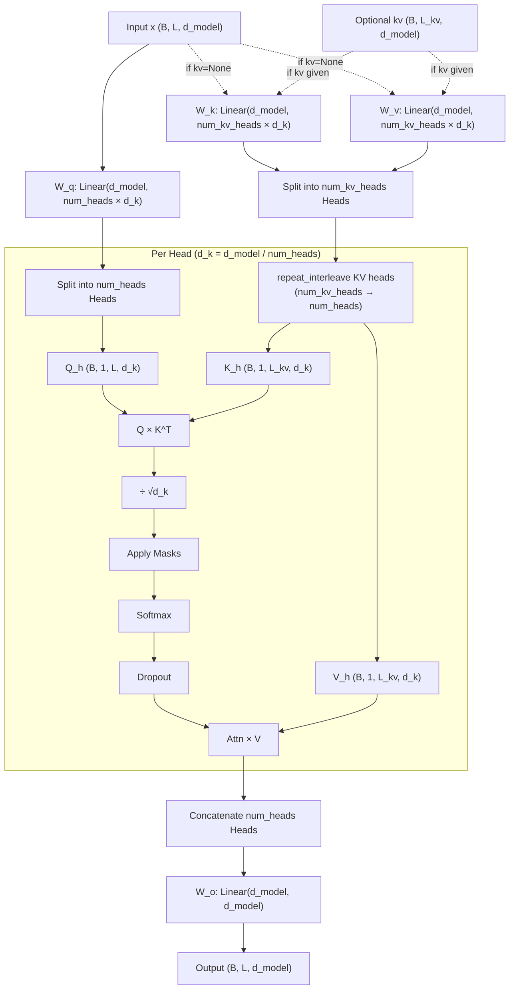

# GroupQueryAttention.py Module Documentation

## 1. Overview

The `GroupQueryAttention` module implements **Group Query Attention (GQA)**, an efficient variant of Multi-Head Attention introduced in the [GQA paper (Ainslie et al., 2023)](https://arxiv.org/abs/2305.13245). It reduces the number of Key and Value heads while keeping the full number of Query heads, so that multiple query heads **share** a single KV head.

This provides a tunable trade-off between standard Multi-Head Attention (MHA) and Multi-Query Attention (MQA):

| `num_kv_heads` | Equivalent To | KV Memory |
|---|---|---|
| `== num_heads` | Standard MHA | Full |
| `== 1` | Multi-Query Attention (MQA) | Minimum |
| `1 < num_kv_heads < num_heads` | **Group Query Attention (GQA)** | In-between |

**Why GQA?** KV projections dominate memory during inference (KV cache). Reducing KV heads cuts KV cache size proportionally with minimal quality loss — used in LLaMA 2 70B, Mistral, Gemma, and others.

## 2. Modules Involved

-   **torch**, **torch.nn**: Linear projections, softmax, dropout.
-   **pytorch_lightning**: LightningModule base class.

### Dependencies
This module has **no dependencies** on other custom modules. It can be used as a drop-in replacement for `MultiHeadSelfAttention` wherever fewer KV heads are desired.

## 3. Architecture



### Key Difference from MHA

In standard MHA, `W_k` and `W_v` project to `num_heads × d_k` dimensions. In GQA, they project to only `num_kv_heads × d_k` dimensions. The KV heads are then expanded via `repeat_interleave` to match the query heads before computing attention.

```
MHA:  Q → (B, 8, L, d_k)    K → (B, 8, L_kv, d_k)    V → (B, 8, L_kv, d_k)
GQA:  Q → (B, 8, L, d_k)    K → (B, 2, L_kv, d_k)    V → (B, 2, L_kv, d_k)
                                     ↓ repeat ×4               ↓ repeat ×4
                              K → (B, 8, L_kv, d_k)    V → (B, 8, L_kv, d_k)
```

## 4. Class Definition

### `class GroupQueryAttention(LightningModule)`

#### `__init__`
-   **d_model**: Total dimension. Must be divisible by `num_heads`.
-   **num_heads**: Number of query heads.
-   **num_kv_heads**: Number of key/value heads. Must divide `num_heads` evenly.
-   **d_k**: Dimension per head = `d_model // num_heads`.
-   **num_queries_per_kv**: How many query heads share one KV head = `num_heads // num_kv_heads`.
-   **causal**: If True, applies a lower-triangular mask (future tokens masked).
-   **Projections**:
    -   `W_q`: `nn.Linear(d_model, num_heads × d_k)` — full size.
    -   `W_k`: `nn.Linear(d_model, num_kv_heads × d_k)` — reduced size.
    -   `W_v`: `nn.Linear(d_model, num_kv_heads × d_k)` — reduced size.
    -   `W_o`: `nn.Linear(d_model, d_model)` — full size.

#### `forward(self, x, mask=None, kv=None)`
-   **x**: Query source `(B, L, d_model)`.
-   **mask**: Padding mask `(B, L_kv)` or pre-broadcast shape.
-   **kv**: Optional Key/Value source `(B, L_kv, d_model)` for cross-attention.
-   **Returns**: `(output, attn_weights)`.

## 5. Step-by-Step Logic

1.  **Resolve KV**: If `kv` is None → Self-Attention (K, V from `x`). Else → Cross-Attention.

2.  **Project**:
    -   `Q = W_q(x)` → `(B, L, num_heads × d_k)`
    -   `K = W_k(kv)` → `(B, L_kv, num_kv_heads × d_k)`
    -   `V = W_v(kv)` → `(B, L_kv, num_kv_heads × d_k)`

3.  **Split Heads**:
    -   Q: `(B, L, num_heads × d_k)` → `(B, num_heads, L, d_k)`
    -   K: `(B, L_kv, num_kv_heads × d_k)` → `(B, num_kv_heads, L_kv, d_k)`
    -   V: `(B, L_kv, num_kv_heads × d_k)` → `(B, num_kv_heads, L_kv, d_k)`

4.  **Expand KV Heads**: Repeat each KV head `num_queries_per_kv` times along the head dimension:
    -   K: `(B, num_kv_heads, L_kv, d_k)` → `(B, num_heads, L_kv, d_k)`
    -   V: `(B, num_kv_heads, L_kv, d_k)` → `(B, num_heads, L_kv, d_k)`

5.  **Scaled Dot-Product**:
    -   $\text{scores} = \frac{Q \cdot K^T}{\sqrt{d_k}}$ → `(B, num_heads, L, L_kv)`

6.  **Apply Masks**:
    -   **Padding Mask**: Sets scores for PAD positions to $-\infty$.
    -   **Causal Mask** (if `causal=True`): Lower-triangular matrix; future positions set to $-\infty$.

7.  **Softmax + Dropout**: `attn_weights = Dropout(Softmax(scores))`.

8.  **Weighted Sum**: `out = attn_weights × V` → `(B, num_heads, L, d_k)`.

9.  **Concat Heads**: `(B, num_heads, L, d_k)` → `(B, L, d_model)`.

10. **Output Projection**: `out = W_o(out)`.

## 6. Dry Run Trace

**Scenario**: `d_model=8`, `num_heads=4`, `num_kv_heads=2`, `d_k=2`, `causal=True`, `Batch=1`, `Seq=3`.

**Input**: `x = [[x0, x1, x2]]` — 3 tokens, each an 8-dim vector.

| Step | Operation | Shape | Notes |
|------|-----------|-------|-------|
| 1 | Q = W_q(x) | `(1, 3, 8)` | 4 query heads × d_k=2 |
| 2 | K = W_k(x) | `(1, 3, 4)` | 2 KV heads × d_k=2 |
| 3 | V = W_v(x) | `(1, 3, 4)` | 2 KV heads × d_k=2 |
| 4 | Split Q | `(1, 4, 3, 2)` | 4 query heads |
| 5 | Split K | `(1, 2, 3, 2)` | 2 KV heads |
| 6 | Split V | `(1, 2, 3, 2)` | 2 KV heads |
| 7 | Expand K | `(1, 4, 3, 2)` | Each KV head repeated ×2 |
| 8 | Expand V | `(1, 4, 3, 2)` | Each KV head repeated ×2 |
| 9 | Q × K^T | `(1, 4, 3, 3)` | Raw attention scores |
| 10 | ÷ √2 | `(1, 4, 3, 3)` | Scaled |
| 11 | Causal mask | | Apply lower-triangular: |
| | | | `[[s00, -inf, -inf],` |
| | | | ` [s10, s11, -inf],` |
| | | | ` [s20, s21, s22]]` |
| 12 | Softmax | `(1, 4, 3, 3)` | Row-wise softmax |
| 13 | Dropout | `(1, 4, 3, 3)` | |
| 14 | Attn × V | `(1, 4, 3, 2)` | Weighted values |
| 15 | Concat | `(1, 3, 8)` | 4 heads merged |
| 16 | W_o | `(1, 3, 8)` | Final projection |

**Key observation**: Query heads 0 & 1 share KV head 0, and query heads 2 & 3 share KV head 1. Each group attends to the same keys/values but with different learned query projections.

## 7. Parameter Comparison

For `d_model=256`:

| Component | MHA (8 heads) | GQA (8 Q, 2 KV) | Savings |
|-----------|---------------|------------------|---------|
| W_q | 256 × 256 = 65,536 | 256 × 256 = 65,536 | 0 |
| W_k | 256 × 256 = 65,536 | 256 × 64 = 16,384 | 75% |
| W_v | 256 × 256 = 65,536 | 256 × 64 = 16,384 | 75% |
| W_o | 256 × 256 = 65,536 | 256 × 256 = 65,536 | 0 |
| **Total** | **263,168** | **164,480** | **37.5%** |

## 8. Code Example

```python
import torch
from GroupQueryAttention import GroupQueryAttention

# GQA: 8 query heads, 2 KV heads (each KV head shared by 4 query heads)
gqa = GroupQueryAttention(d_model=256, num_heads=8, num_kv_heads=2, causal=False)
x = torch.randn(2, 10, 256)
out, attn = gqa(x)
print("GQA Output:", out.shape)    # (2, 10, 256)
print("Attn Weights:", attn.shape) # (2, 8, 10, 10)

# MQA: num_kv_heads=1 (all query heads share a single KV head)
mqa = GroupQueryAttention(d_model=256, num_heads=8, num_kv_heads=1, causal=True)
out, attn = mqa(x)
print("MQA Output:", out.shape)    # (2, 10, 256)

# Standard MHA: num_kv_heads=num_heads (equivalent to MultiHeadSelfAttention)
mha = GroupQueryAttention(d_model=256, num_heads=8, num_kv_heads=8, causal=False)
out, attn = mha(x)
print("MHA Output:", out.shape)    # (2, 10, 256)

# Cross-Attention with GQA
query = torch.randn(2, 5, 256)
kv = torch.randn(2, 10, 256)
out, attn = gqa(query, kv=kv)
print("Cross-Attn Output:", out.shape)  # (2, 5, 256)
print("Attn Weights:", attn.shape)      # (2, 8, 5, 10)
```
