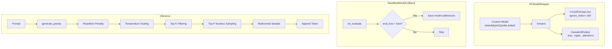

# HFWrapper Module Documentation

## 1. Overview

`hf_wrapper.py` is the shared utility module for all `HFTrainerScripts/`. It bridges the custom decoder-only models (MHA, MQA, GQA, MLA, MoE) with the HuggingFace `Trainer` API, which expects a specific interface (`CausalLMOutput`, config object, etc.).

## 2. Modules Involved

-   **torch**: Tensor operations.
-   **transformers**: `PretrainedConfig`, `TrainerCallback`, `CausalLMOutput`.
-   **safetensors**: Efficient model serialization.

## 3. Architecture



## 4. Class: `CustomModelConfig`

Extends `PretrainedConfig` to satisfy both PEFT (`.get()`) and HF Trainer (`.to_json_string()`).

| Attribute | Value | Purpose |
|-----------|-------|---------|
| `model_type` | `"custom_decoder_only"` | Identifies model family |
| `vocab_size` | From model hparams | Vocabulary size |
| `max_positions` | From model hparams | Max sequence length |
| `is_encoder_decoder` | `False` | Decoder-only architecture |
| `tie_word_embeddings` | `False` | No weight tying |

## 5. Class: `HFModelWrapper`

### `__init__(self, model)`

Wraps any custom decoder-only model. Extracts `vocab_size` and `max_positions` from the model's `hparams`.

### `forward(self, input_ids, labels=None, **kwargs) -> CausalLMOutput`

| Step | Operation | Output |
|------|-----------|--------|
| 1 | `self.model(input_ids)` | `(logits, attn_maps)` |
| 2 | If labels: `CrossEntropyLoss(logits, labels)` | `loss` scalar |
| 3 | Return `CausalLMOutput` | `.loss`, `.logits`, `.attentions` |

**Note**: No extra shift is needed — the dataset already handles `input=[BOS]+tokens`, `labels=tokens+[EOS]`.

### `generate_greedy(self, input_ids, ...) -> Tensor`

Autoregressive decoding with sampling controls:

| Parameter | Default | Description |
|-----------|---------|-------------|
| `max_new_tokens` | 128 | Max tokens to generate |
| `eos_token_id` | None | Stop token |
| `temperature` | 0.8 | <1.0 = more focused, >1.0 = more random |
| `top_k` | 50 | Keep only top-k logits (0 = disabled) |
| `top_p` | 0.9 | Nucleus sampling threshold (1.0 = disabled) |
| `repetition_penalty` | 1.2 | Penalise repeated tokens (1.0 = disabled) |

**Decoding pipeline per step:**
1. Forward pass → logits at last position
2. Apply repetition penalty to already-seen tokens
3. Scale by temperature
4. Top-k filtering (set low-probability tokens to -inf)
5. Top-p nucleus filtering (cumulative probability cutoff)
6. Sample from filtered distribution (or argmax if temperature ≤ 0)
7. Append token, check EOS

## 6. Class: `SaveBestModelCallback`

Custom `TrainerCallback` that saves exactly **one checkpoint** — the model with the lowest `eval_loss`.

### Behavior

| Event | Action |
|-------|--------|
| `on_evaluate` | Compare `eval_loss` to best seen |
| If improved | Delete old `best/`, save `model.safetensors` + `best_metric.txt` |
| If not improved | Print comparison, skip save |

### `best_metric.txt` format
```
eval_loss=0.123456
epoch=15
global_step=6000
```

## 7. Utility Functions

### `find_latest_checkpoint(checkpoint_dir) -> str`

Search priority:
1. `<dir>/best/model.safetensors` (SaveBestModelCallback output)
2. `<dir>/checkpoint-XXXX/model.safetensors` (HF Trainer, latest by mtime)
3. `<dir>/model.safetensors` (directory itself)

### `load_wrapper_from_checkpoint(wrapper, checkpoint_dir) -> HFModelWrapper`

1. Call `find_latest_checkpoint()` to locate weights
2. Load `model.safetensors` (preferred) or `pytorch_model.bin` (fallback)
3. `wrapper.load_state_dict(state_dict)`

## 8. Usage

```python
from HFTrainerScripts.hf_wrapper import (
    HFModelWrapper,
    SaveBestModelCallback,
    load_wrapper_from_checkpoint,
)

# Training
wrapper = HFModelWrapper(my_custom_model)
callback = SaveBestModelCallback(save_dir="checkpoints/best")
trainer = Trainer(model=wrapper, callbacks=[callback], ...)

# Inference
wrapper = HFModelWrapper(my_custom_model)
model = load_wrapper_from_checkpoint(wrapper, "checkpoints/")
output_ids = model.generate_greedy(input_ids, temperature=0.8)
```
