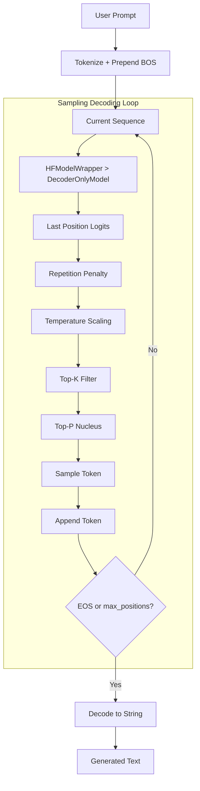

# HF DecoderOnlyInference.py Module Documentation

## 1. Overview

This script performs **text generation** using a `DecoderOnlyModel` trained with the HuggingFace Trainer. It is the HF equivalent of `PLTrainerScripts/DecoderOnlyInference.py`.

## 2. Modules Involved

-   **peft-free**: No PEFT/LoRA — loads full model weights directly.
-   **HFTrainerScripts.hf_wrapper**: `HFModelWrapper`, `load_wrapper_from_checkpoint`.

### Dependencies
-   `DecoderOnlySeq2SeqModel.py` -> `DecoderOnlyModel`: The model architecture.
-   `Embedding.py` -> `get_tokenizer`: Tokenizer provider.

## 3. Architecture



## 4. Key Differences from PL Version

| Aspect | PL Version | HF Version |
|--------|-----------|------------|
| Checkpoint format | `.ckpt` (Lightning) | `model.safetensors` (HF Trainer) |
| Loading method | `Model.load_from_checkpoint()` | `load_wrapper_from_checkpoint()` |
| Decoding | Pure greedy (argmax) | Sampling (temperature, top-k, top-p, repetition penalty) |
| Prompt format | Raw text prompt | GSM8K-style `"Question: ...\nAnswer:"` |
| Max length enforcement | Manual check | Built into `generate_greedy` via `config.max_positions` (256) |

## 5. Functions

### `load_model(checkpoint_dir)`

1. Build base `DecoderOnlyModel` with same hyperparams as training.
2. Wrap in `HFModelWrapper`.
3. Call `load_wrapper_from_checkpoint()` — finds `best/` or latest `checkpoint-XXXX/`.
4. Move to device, set eval mode.

### `greedy_decode(model, tokenizer, question, max_len=256)`

1. Format question as GSM8K-style prompt: `"Question: {question}\nAnswer:"`.
2. Tokenize prompt, prepend BOS if missing.
3. Call `model.generate_greedy()` with sampling parameters (temperature=0.8, top_k=50, top_p=0.9, repetition_penalty=1.2).
4. Decode output token IDs to string.

## 6. Usage

```bash
cd Transformer-from-Scratch
python HFTrainerScripts/DecoderOnlyInference.py
```

Requires a trained checkpoint in `checkpoints/HF_DecoderOnlyCheckpoints/`.
