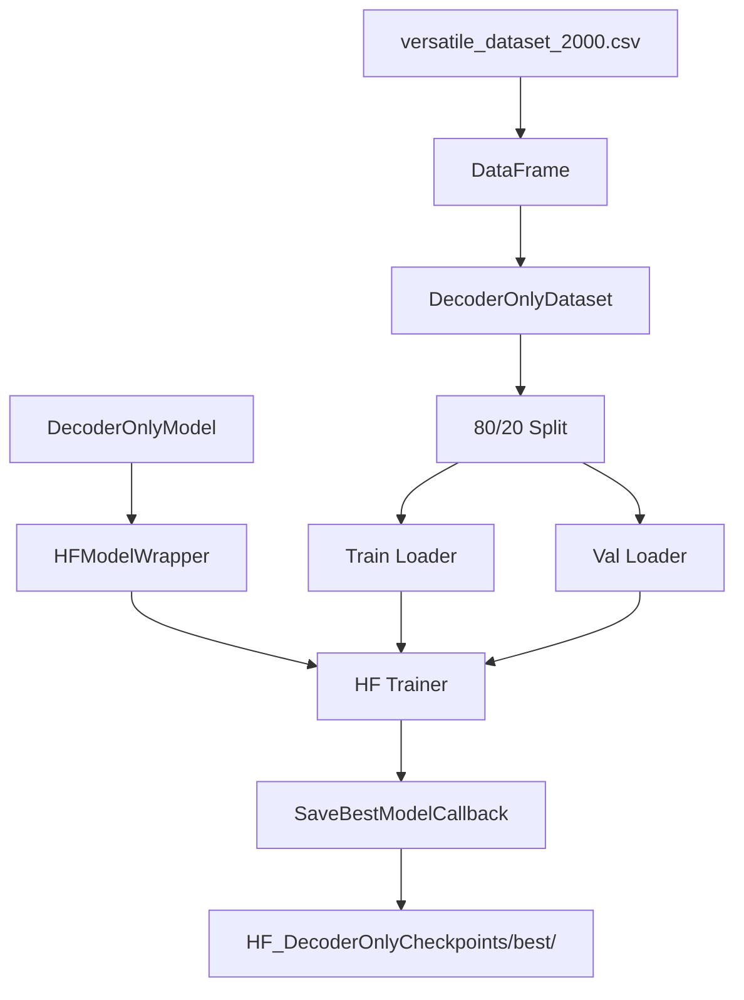

# HF DecoderOnlyTrainer.py Module Documentation

## 1. Overview

This script trains the custom `DecoderOnlyModel` (standard Multi-Head Attention) using the **HuggingFace Trainer** API. It is the HF equivalent of `PLTrainerScripts/DecoderOnlyTrainer.py`.

## 2. Modules Involved

-   **transformers**: `Trainer`, `TrainingArguments`.
-   **HFTrainerScripts.hf_wrapper**: `HFModelWrapper`, `SaveBestModelCallback`.

### Dependencies
-   `Embedding.py` -> `get_tokenizer`: Provides the tokenizer.
-   `DecoderOnlySeq2SeqModel.py` -> `DecoderOnlyModel`: The model being trained.

## 3. Architecture



## 4. Key Differences from PL Version

| Aspect | PL (`PLTrainerScripts/`) | HF (`HFTrainerScripts/`) |
|--------|--------------------------|--------------------------|
| Training loop | `pl.Trainer` | `transformers.Trainer` |
| Model interface | Native `LightningModule` | Wrapped in `HFModelWrapper` |
| Forward output | `(logits, attn_maps)` | `CausalLMOutput(loss, logits, attentions)` |
| Checkpointing | `ModelCheckpoint(save_top_k=1)` | `SaveBestModelCallback` (single best) |
| Validation metrics | BLEU, ROUGE, METEOR, BERTScore | eval_loss only |
| Optimizer | `configure_optimizers()` | HF Trainer's built-in AdamW |

## 5. Configuration

| Parameter | Value |
|-----------|-------|
| d_model | 256 |
| num_layers | 4 |
| num_heads | 4 |
| d_ff | 512 |
| max_positions | 64 |
| num_train_epochs | 100 |
| batch_size (train) | 4 |
| batch_size (val) | 2 |
| learning_rate | 1e-3 |
| save_strategy | `"no"` (callback handles saving) |
| eval_strategy | `"epoch"` |

## 6. Usage

```bash
cd Transformer-from-Scratch
python HFTrainerScripts/DecoderOnlyTrainer.py
```

Requires `versatile_dataset_2000.csv` in `data/`.
