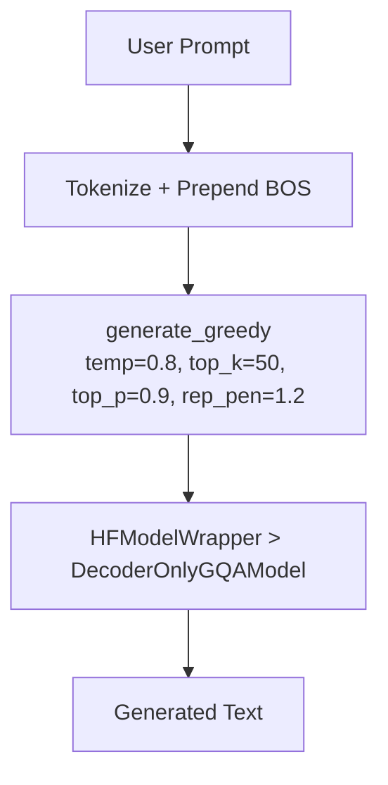

# HF GQAInference.py Module Documentation

## 1. Overview

This script performs **text generation** using a `DecoderOnlyGQAModel` trained with the HuggingFace Trainer. It is the HF equivalent of `PLTrainerScripts/DecoderOnlyGQAInference.py`.

## 2. Dependencies
-   `DecoderOnlyGQAModel.py` -> `DecoderOnlyGQAModel`: The GQA model.
-   `HFTrainerScripts.hf_wrapper` -> `HFModelWrapper`, `load_wrapper_from_checkpoint`.

## 3. Architecture



## 4. Functions

### `load_model(checkpoint_dir)`
Rebuilds `DecoderOnlyGQAModel` (num_heads=4, num_kv_heads=2), wraps in `HFModelWrapper`, loads weights from `HF_GQACheckpoints/best/`.

### `greedy_decode(model, tokenizer, prompt, max_len)`
Tokenizes prompt, prepends BOS, calls `model.generate_greedy()` with sampling controls.

## 5. Usage

```bash
cd Transformer-from-Scratch
python HFTrainerScripts/GQAInference.py
```

Requires a trained checkpoint in `checkpoints/HF_GQACheckpoints/`.
