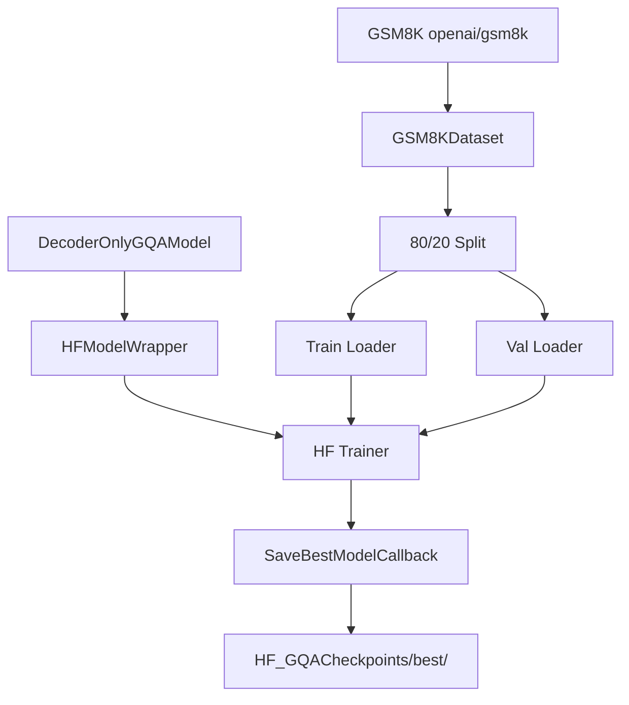

# HF GQATrainer.py Module Documentation

## 1. Overview

This script trains the custom `DecoderOnlyGQAModel` (Group Query Attention) using the **HuggingFace Trainer** API. It is the HF equivalent of `PLTrainerScripts/DecoderOnlyGQATrainer.py`.

## 2. Modules Involved

-   **transformers**: `Trainer`, `TrainingArguments`.
-   **HFTrainerScripts.hf_wrapper**: `HFModelWrapper`, `SaveBestModelCallback`, `make_compute_perplexity`.

### Dependencies
-   `Embedding.py` -> `get_tokenizer`: Provides the tokenizer.
-   `DecoderOnlyGQAModel.py` -> `DecoderOnlyGQAModel`: The GQA model being trained.

## 3. Architecture



## 4. GQA-Specific Details

Group Query Attention shares KV heads across multiple query heads, reducing KV cache size.

| Parameter | Value | Description |
|-----------|-------|-------------|
| `num_heads` | 4 | Number of query heads |
| `num_kv_heads` | 2 | Number of KV heads (shared across query groups) |
| KV cache reduction | 50% | `num_kv_heads / num_heads = 2/4` |

## 5. Configuration

| Parameter | Value |
|-----------|-------|
| d_model | 256 |
| num_layers | 4 |
| num_heads | 4 |
| num_kv_heads | 2 |
| d_ff | 512 |
| max_positions | 256 |
| num_train_epochs | 100 |
| batch_size (train) | 4 |
| batch_size (val) | 2 |
| learning_rate | 1e-3 |

## 6. Usage

```bash
cd Transformer-from-Scratch
python HFTrainerScripts/GQATrainer.py
```

Requires the `datasets` library (GSM8K is loaded via `load_dataset("openai/gsm8k")`).
