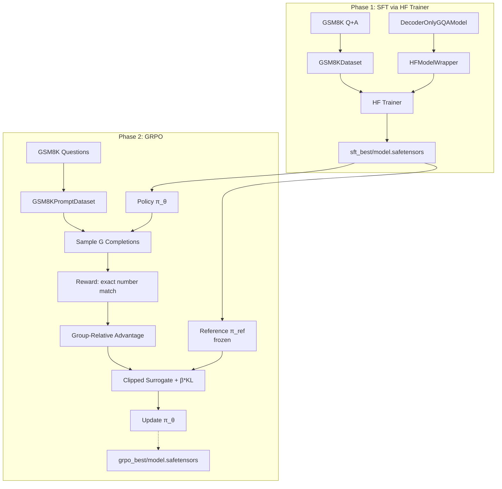

# HF GQA_SFT_GRPO_Trainer.py Module Documentation

## 1. Overview

This script implements a **two-phase training pipeline** for the `DecoderOnlyGQAModel` on GSM8K using the **HuggingFace Trainer** for SFT and a custom GRPO loop for RL:

-   **Phase 1 — SFT**: HF Trainer supervised fine-tuning with `SaveBestModelCallback`, step-based evaluation, BLEU/ROUGE/METEOR/Perplexity metrics.
-   **Phase 2 — GRPO**: Loads best SFT checkpoint, freezes it as reference policy, runs RL with group-relative advantages and clipped surrogate objective.

It is the HF equivalent of `PLTrainerScripts/GQA_SFT_GRPO_Trainer.py`.

**Reference**: DeepSeek-R1 (Shao et al., 2025)

## 2. Dependencies
-   `DecoderOnlyGQAModel.py` -> `DecoderOnlyGQAModel`
-   `HFTrainerScripts.hf_wrapper` -> `HFModelWrapper`, `SaveBestModelCallback`, `load_wrapper_from_checkpoint`
-   `config.py` -> All hyperparameters

## 3. Architecture



## 4. Key Differences from PL Version

| Feature | PL Version | HF Version |
|---------|-----------|------------|
| SFT training | `pl.Trainer` + `ModelCheckpoint` | HF `Trainer` + `SaveBestModelCallback` |
| SFT metrics | BLEU, ROUGE, METEOR, BERTScore, PPL | BLEU, ROUGE, METEOR, PPL |
| SFT eval | Per-epoch | Per-step (`config.EVAL_STEPS`) |
| GRPO checkpoint format | `.ckpt` | `.safetensors` |
| Model wrapper | Native LightningModule | `HFModelWrapper` |

## 5. GRPO Algorithm

Same as PL version — for each batch:
1.  Sample `G=4` completions per question from current policy.
2.  Score with reward function (exact numerical match + format bonus).
3.  Compute group-relative advantages.
4.  Clipped surrogate loss + KL penalty against frozen reference.
5.  Gradient step with max-norm clipping.

## 6. Checkpoints

| Phase | Location | Format |
|-------|----------|--------|
| SFT best | `HF_GQA_SFT_GRPO_Checkpoints/sft_best/` | `model.safetensors` |
| GRPO best | `HF_GQA_SFT_GRPO_Checkpoints/grpo_best/` | `model.safetensors` |

## 7. Usage

```bash
python HFTrainerScripts/GQA_SFT_GRPO_Trainer.py
```
