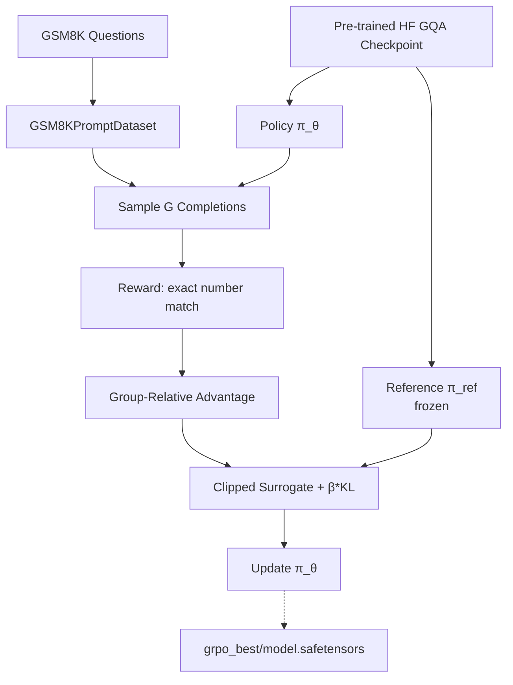

# HF GQA_SFT_GRPO_Trainer.py Module Documentation

## 1. Overview

This script implements **GRPO (Group Relative Policy Optimization)** for the `DecoderOnlyGQAModel` on GSM8K using a custom RL loop. It loads a pre-trained HF GQA checkpoint, freezes it as the reference policy, and runs GRPO with group-relative advantages and a clipped surrogate objective.

**Prerequisite**: Train a GQA model first with `HFTrainerScripts/GQATrainer.py`

It is the HF equivalent of `PLTrainerScripts/GQA_SFT_GRPO_Trainer.py`.

**Reference**: DeepSeek-R1 (Shao et al., 2025)

## 2. Dependencies
-   `DecoderOnlyGQAModel.py` -> `DecoderOnlyGQAModel`
-   `HFTrainerScripts.hf_wrapper` -> `HFModelWrapper`, `load_wrapper_from_checkpoint`
-   `config.py` -> All hyperparameters
-   Pre-trained checkpoint in `checkpoints/HF_GQACheckpoints/`

## 3. Architecture



## 4. GRPO Algorithm

Same as PL version — for each batch:
1.  Sample `G=4` completions per question from current policy.
2.  Score with reward function (exact numerical match + format bonus).
3.  Compute group-relative advantages.
4.  Clipped surrogate loss + KL penalty against frozen reference.
5.  Gradient step with max-norm clipping.

## 5. Checkpoints

| Location | Format |
|----------|--------|
| `HF_GQA_SFT_GRPO_Checkpoints/grpo_best/` | `model.safetensors` |

## 6. Usage

```bash
# Step 1: Train base GQA model
python HFTrainerScripts/GQATrainer.py

# Step 2: Run GRPO
python HFTrainerScripts/GQA_SFT_GRPO_Trainer.py
```
