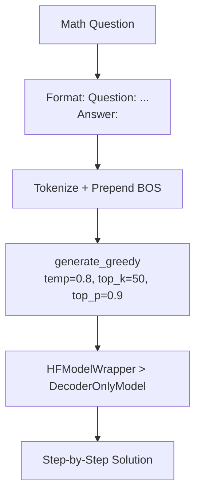

# HF GSM8KInference.py Module Documentation

## 1. Overview

This script performs **math problem solving** using a `DecoderOnlyModel` trained on GSM8K with the HuggingFace Trainer. It is the HF equivalent of `PLTrainerScripts/GSM8KInference.py`.

## 2. Dependencies
-   `DecoderOnlySeq2SeqModel.py` -> `DecoderOnlyModel`: The base decoder-only model.
-   `HFTrainerScripts.hf_wrapper` -> `HFModelWrapper`, `load_wrapper_from_checkpoint`.

## 3. Architecture



## 4. Prompt Format

```
Question: Janet's ducks lay 16 eggs per day. She eats three for breakfast...
Answer:
```

The model generates the step-by-step solution after `Answer:`.

## 5. Functions

### `load_model(checkpoint_dir)`
Rebuilds `DecoderOnlyModel` (max_positions=256), wraps in `HFModelWrapper`, loads weights from `HF_GSM8KCheckpoints/best/`.

### `greedy_decode(model, tokenizer, question, max_len)`
Formats question as `"Question: {q}\nAnswer:"`, tokenizes, prepends BOS, calls `model.generate_greedy()` with sampling controls.

## 6. Sample Questions

The script tests on 3 GSM8K-style problems:
1. Janet's duck eggs (arithmetic: 16 - 3 - 4 = 9, then 9 * $2 = $18)
2. Robe fiber bolts (fractions: 2 + 1 = 3)
3. House flipping profit (percentages: $80K * 150% - $80K - $50K = $70K)

## 7. Usage

```bash
cd Transformer-from-Scratch
python HFTrainerScripts/GSM8KInference.py
```

Requires a trained checkpoint in `checkpoints/HF_GSM8KCheckpoints/`.
