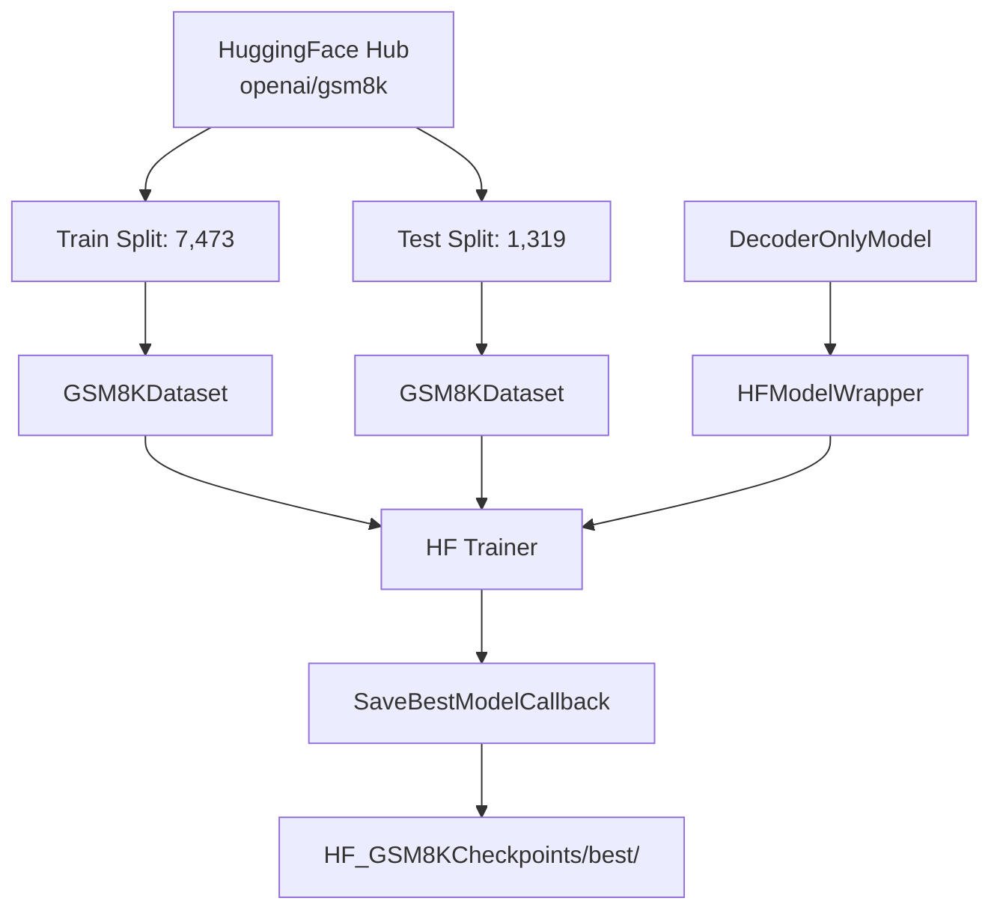

# HF GSM8KTrainer.py Module Documentation

## 1. Overview

This script trains the custom `DecoderOnlyModel` on the **GSM8K** (Grade School Math 8K) dataset using the **HuggingFace Trainer** API. It is the HF equivalent of `PLTrainerScripts/GSM8KTrainer.py`.

## 2. Dependencies
-   `DecoderOnlySeq2SeqModel.py` -> `DecoderOnlyModel`: The base decoder-only model.
-   `HFTrainerScripts.hf_wrapper` -> `HFModelWrapper`, `SaveBestModelCallback`.
-   `datasets` (HuggingFace): Loads GSM8K from the Hub.

## 3. Architecture



## 4. Dataset Format

Each sample is formatted as:
```
Question: {question}
Answer: {step-by-step answer}
```

| Field | Role |
|-------|------|
| `input_ids` | `[BOS] Question: ... Answer: ...` |
| `labels` | `Question: ... Answer: ... [EOS]` (padded with -100) |

## 5. Key Differences from PL Version

| Aspect | PL Version | HF Version |
|--------|-----------|------------|
| Model class | `GSM8KModel` (subclass, no BERTScore) | `DecoderOnlyModel` (base, wrapped in `HFModelWrapper`) |
| Validation | Loss only (avoids RoBERTa loading) | eval_loss via HF Trainer |
| Checkpointing | `ModelCheckpoint` | `SaveBestModelCallback` (single best) |

## 6. Configuration

| Parameter | Value |
|-----------|-------|
| d_model | 256 |
| num_layers | 4 |
| num_heads | 4 |
| d_ff | 512 |
| max_positions | 256 |
| num_train_epochs | 100 |
| batch_size (train) | 4 |
| batch_size (val) | 2 |
| learning_rate | 1e-3 |
| dataloader_num_workers | 2 |

## 7. Usage

```bash
cd Transformer-from-Scratch
python HFTrainerScripts/GSM8KTrainer.py
```

The GSM8K dataset is automatically downloaded from HuggingFace Hub on first run.
