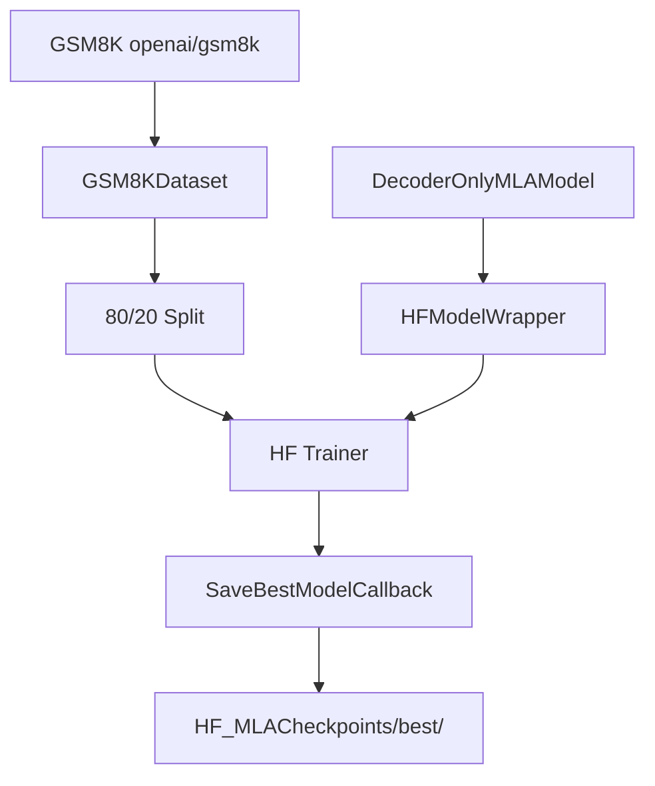

# HF MLATrainer.py Module Documentation

## 1. Overview

This script trains the custom `DecoderOnlyMLAModel` (Multi-Head Latent Attention) using the **HuggingFace Trainer** API. It is the HF equivalent of `PLTrainerScripts/DecoderOnlyMLATrainer.py`.

## 2. Dependencies
-   `DecoderOnlyMLAModel.py` -> `DecoderOnlyMLAModel`: The MLA model.
-   `HFTrainerScripts.hf_wrapper` -> `HFModelWrapper`, `SaveBestModelCallback`, `make_compute_perplexity`.

## 3. Architecture



## 4. MLA-Specific Details

Multi-Head Latent Attention compresses KV into a low-rank latent space before projecting back, reducing KV cache memory. Inspired by DeepSeek-V2.

| Parameter | Value | Description |
|-----------|-------|-------------|
| `num_heads` | 4 | Number of attention heads |
| `d_compress` | 64 | Latent compression dimension |
| Compression ratio | 25% | `d_compress / d_model = 64/256` |

### MLA Projection Layers
| Layer | Dimension | Purpose |
|-------|-----------|---------|
| `W_dq` | d_model -> d_compress | Down-project query |
| `W_uq` | d_compress -> d_model | Up-project query |
| `W_dkv` | d_model -> d_compress | Down-project key+value |
| `W_uk` | d_compress -> d_model | Up-project key |
| `W_uv` | d_compress -> d_model | Up-project value |
| `W_o` | d_model -> d_model | Output projection |

## 5. Configuration

| Parameter | Value |
|-----------|-------|
| d_model | 256 |
| num_layers | 4 |
| num_heads | 4 |
| d_compress | 64 |
| d_ff | 512 |
| max_positions | 256 |
| num_train_epochs | 100 |
| learning_rate | 1e-3 |

## 6. Usage

```bash
cd Transformer-from-Scratch
python HFTrainerScripts/MLATrainer.py
```
