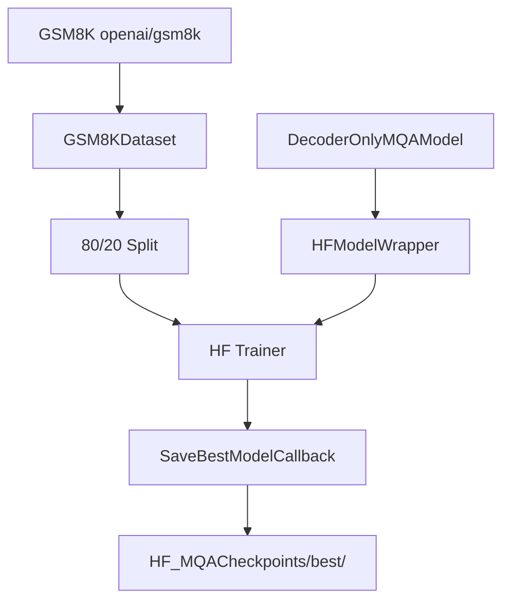

# HF MQATrainer.py Module Documentation

## 1. Overview

This script trains the custom `DecoderOnlyMQAModel` (Multi-Query Attention) using the **HuggingFace Trainer** API. It is the HF equivalent of `PLTrainerScripts/DecoderOnlyMQATrainer.py`.

## 2. Dependencies
-   `DecoderOnlyMQAModel.py` -> `DecoderOnlyMQAModel`: The MQA model.
-   `HFTrainerScripts.hf_wrapper` -> `HFModelWrapper`, `SaveBestModelCallback`, `make_compute_perplexity`.

## 3. Architecture



## 4. MQA-Specific Details

Multi-Query Attention uses a **single shared KV head** across all query heads, providing maximum KV cache reduction.

| Parameter | Value | Description |
|-----------|-------|-------------|
| `num_heads` | 4 | Number of query heads |
| KV heads | 1 | Single shared K and V projection |
| KV cache reduction | 75% | Compared to standard MHA |

## 5. Configuration

| Parameter | Value |
|-----------|-------|
| d_model | 256 |
| num_layers | 4 |
| num_heads | 4 |
| d_ff | 512 |
| max_positions | 256 |
| num_train_epochs | 100 |
| learning_rate | 1e-3 |

## 6. Usage

```bash
cd Transformer-from-Scratch
python HFTrainerScripts/MQATrainer.py
```
