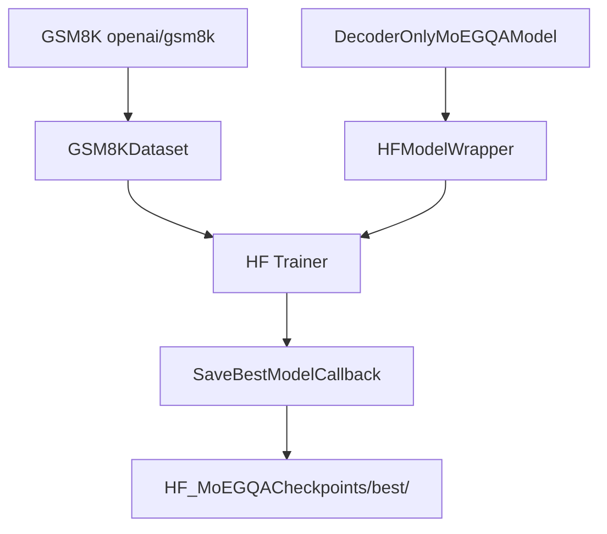

# HF MoEGQATrainer.py Module Documentation

## 1. Overview

This script trains the `DecoderOnlyMoEGQAModel` (MoE + GQA) using the **HuggingFace Trainer** API. It is the HF equivalent of `PLTrainerScripts/DecoderMoEGQATrainer.py`.

## 2. Dependencies
-   `DecoderMoEGQA.py` -> `DecoderOnlyMoEGQAModel`
-   `HFTrainerScripts.hf_wrapper` -> `HFModelWrapper`, `SaveBestModelCallback`, `make_compute_perplexity`

## 3. Architecture



## 4. MoE + GQA Details

| Parameter | Value | Description |
|-----------|-------|-------------|
| `num_heads` | 8 | Query heads |
| `num_kv_heads` | 2 | Shared KV heads (GQA) |
| `num_experts` | 4 | Expert MLPs |
| `top_k` | 2 | Experts activated per token |
| KV reduction | 75% | Only 2/8 KV heads |
| Sparsity | 50% | Only 2/4 experts active |

## 5. Usage

```bash
python HFTrainerScripts/MoEGQATrainer.py
```
