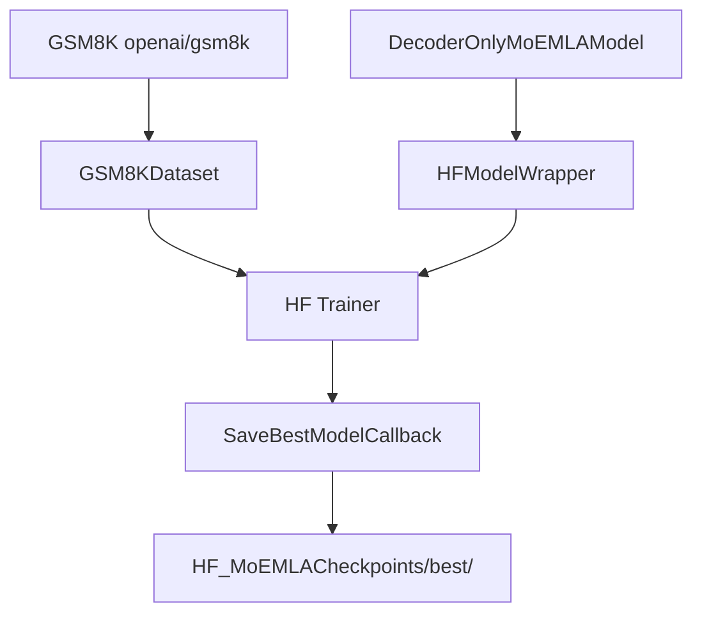

# HF MoEMLATrainer.py Module Documentation

## 1. Overview

This script trains the `DecoderOnlyMoEMLAModel` (MoE + MLA) using the **HuggingFace Trainer** API. It is the HF equivalent of `PLTrainerScripts/DecoderMoEMLATrainer.py`.

## 2. Dependencies
-   `DecoderMoEMLA.py` -> `DecoderOnlyMoEMLAModel`
-   `HFTrainerScripts.hf_wrapper` -> `HFModelWrapper`, `SaveBestModelCallback`, `make_compute_perplexity`

## 3. Architecture



## 4. MoE + MLA Details

| Parameter | Value | Description |
|-----------|-------|-------------|
| `num_heads` | 8 | Attention heads |
| `d_compress` | 64 | Latent KV compression dimension |
| `num_experts` | 4 | Expert MLPs |
| `top_k` | 2 | Experts activated per token |
| KV cache | ~8x smaller | Only `d_compress` cached vs full KV |
| Sparsity | 50% | Only 2/4 experts active |

## 5. Usage

```bash
python HFTrainerScripts/MoEMLATrainer.py
```
