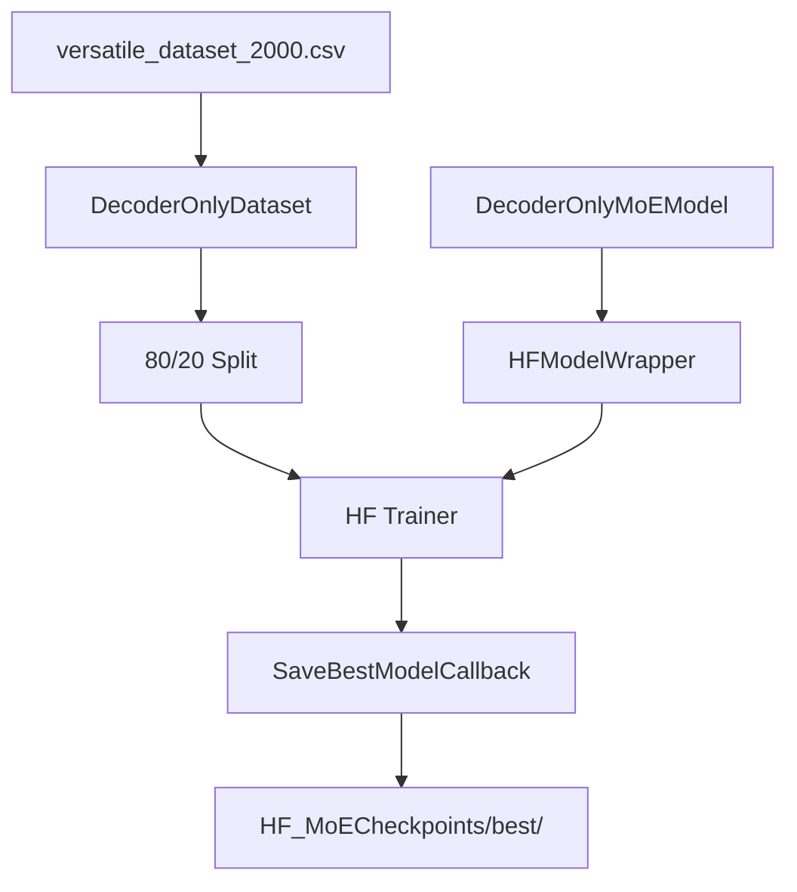

# HF MoETrainer.py Module Documentation

## 1. Overview

This script trains the custom `DecoderOnlyMoEModel` (Mixture of Experts) using the **HuggingFace Trainer** API. It is the HF equivalent of `PLTrainerScripts/DecoderMoETrainer.py`.

## 2. Dependencies
-   `DecoderMoE.py` -> `DecoderOnlyMoEModel`: The MoE model.
-   `HFTrainerScripts.hf_wrapper` -> `HFModelWrapper`, `SaveBestModelCallback`.

## 3. Architecture



## 4. MoE-Specific Details

The Mixture of Experts model replaces the standard FFN with a set of expert MLPs and a learned router that selects the top-k experts for each token.

| Parameter | Value | Description |
|-----------|-------|-------------|
| `num_experts` | 4 | Total expert MLPs |
| `top_k` | 2 | Experts activated per token |
| Sparsity | 50% | Only 2/4 experts active per token |

### MoE Components
| Component | Description |
|-----------|-------------|
| `ExpertMLP` | `Linear -> GELU -> Dropout -> Linear -> Dropout` |
| `TopKRouter` | `Linear(d_model, num_experts) -> Softmax -> TopK` |
| `MoEFeedForward` | Routes tokens to selected experts, weighted combination |

## 5. Configuration

| Parameter | Value |
|-----------|-------|
| d_model | 256 |
| num_layers | 4 |
| num_heads | 4 |
| d_ff | 512 |
| num_experts | 4 |
| top_k | 2 |
| max_positions | 64 |
| num_train_epochs | 100 |
| learning_rate | 1e-3 |

## 6. Usage

```bash
cd Transformer-from-Scratch
python HFTrainerScripts/MoETrainer.py
```
