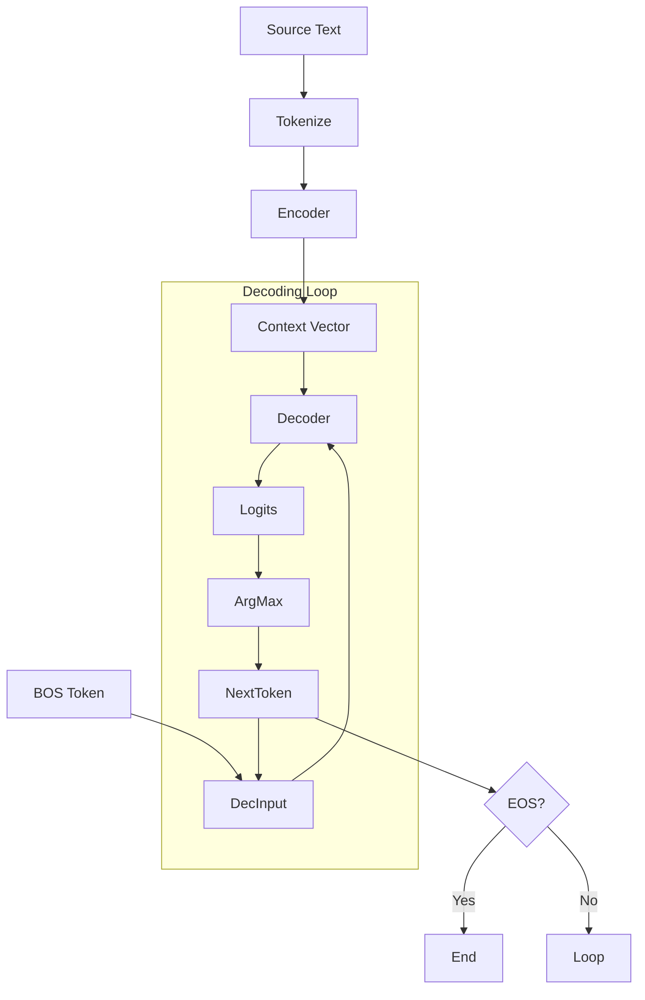

# Inference.py

## Overview

The `Inference.py` script performs **Greedy Decoding** for a sequence-to-sequence model (likely an Encoder-Decoder architecture). It loads a trained model checkpoint and translates or processes input text.

## Functions

### 1. `greedy_decode`

Generates the target sequence token-by-token.

-   **Parameters**:
    -   `model`: The trained Seq2Seq model.
    -   `tokenizer`: The tokenizer.
    -   `src_text`: Input source text.
    -   `max_len`: Maximum length of generation.
    -   `device`: 'cuda' or 'cpu'.

-   **Logic**:
    1.  **Encode**: Tokenize source text and pass through the **Encoder**.
    2.  **Initialize**: Start decoder input with `[BOS]`.
    3.  **Loop**:
        -   Pass current target sequence and encoder output to the **Decoder**.
        -   Project to logits using the Classifier.
        -   Select highest probability token (`argmax`).
        -   Append to target sequence.
        -   Stop if `[EOS]` is generated.
    4.  **Decode**: Convert IDs to string.

### Mermaid Diagram: Inference Flow



### 2. `load_latest_checkpoint`

-   Finds the latest checkpoint in `Seq2SeqCheckpoints/`.
-   Loads the model.

## Usage

```bash
python Inference.py
```
*Note: This script attempts to import `Seq2SeqModel`, which usually corresponds to the Encoder-Decoder implementation.*
