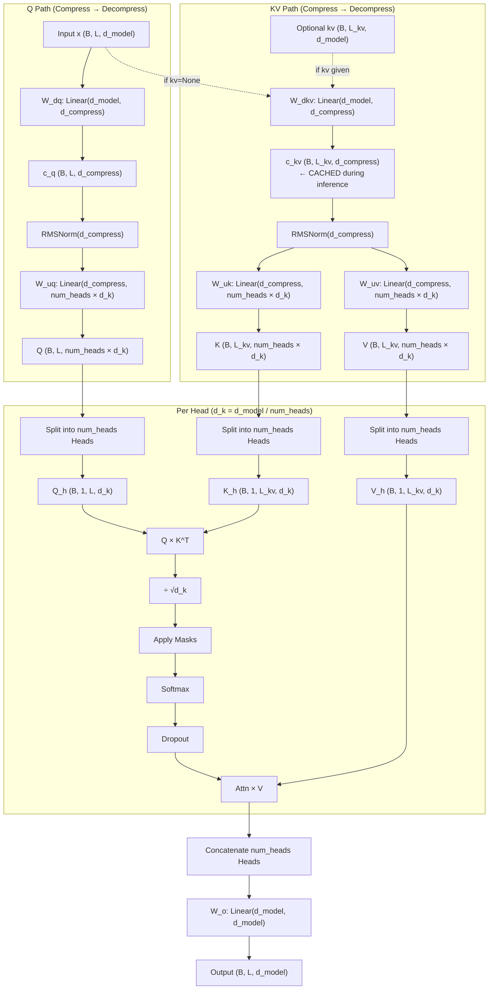

# MultiHeadLatentAttention.py Module Documentation

## 1. Overview

The `MultiHeadLatentAttention` module implements **Multi-Head Latent Attention (MLA)**, an efficient attention variant introduced in [DeepSeek-V2 (2024)](https://arxiv.org/abs/2405.04434). The core idea is to **compress Key and Value representations into a low-rank latent space** before projecting them back up to the full attention dimension.

Instead of caching the full K and V tensors during autoregressive inference, MLA caches only the compressed latent `c_kv` (of dimension `d_compress`), which can be orders of magnitude smaller than the standard KV cache.

| `d_compress` | Behavior | KV Cache Size |
|---|---|---|
| `== d_model` | No compression (similar to MHA) | Full |
| `< d_model` | Low-rank compression | Reduced proportionally |
| `<< d_model` | Aggressive compression | **Minimal** |

**Why MLA?** During autoregressive generation, the KV cache grows linearly with sequence length and dominates GPU memory. MLA compresses KV into a small latent vector per token, cutting cache size by `d_model / d_compress` times with minimal quality loss. Used in DeepSeek-V2 and DeepSeek-V3.

## 2. Modules Involved

-   **torch**, **torch.nn**: Linear projections, softmax, dropout.
-   **pytorch_lightning**: LightningModule base class.
-   **RMSNorm**: A simple Root Mean Square Layer Normalization class defined in the same file, applied after each down-projection to stabilize the compressed representations.

### Dependencies
This module has **no dependencies** on other custom modules. It can be used as a drop-in replacement for `MultiHeadSelfAttention` wherever KV cache reduction is desired.

## 3. Architecture



### Key Difference from MHA

In standard MHA, K and V are projected directly from `d_model` to `num_heads × d_k`. In MLA, both Q and KV go through a **bottleneck**: down-project to a small `d_compress` dimension, normalize, then up-project back. The compressed KV latent `c_kv` is the only thing that needs to be cached during inference.

```
MHA:  x → W_k(d_model → d_model) → K        Cache: K (d_model per token)
      x → W_v(d_model → d_model) → V        Cache: V (d_model per token)
      Total KV cache per token: 2 × d_model

MLA:  x → W_dkv(d_model → d_compress) → c_kv  Cache: c_kv (d_compress per token)
      c_kv → RMSNorm → W_uk → K
      c_kv → RMSNorm → W_uv → V
      Total KV cache per token: d_compress    (much smaller!)
```

## 4. Class Definition

### `class RMSNorm(nn.Module)`

#### `__init__`
-   **d**: Dimension to normalize over.
-   **eps**: Small constant for numerical stability (default `1e-6`).
-   **weight**: Learnable scale parameter of shape `(d,)`.

#### `forward(self, x)`
-   Computes $\hat{x} = \frac{x}{\text{RMS}(x)} \cdot \gamma$ where $\text{RMS}(x) = \sqrt{\frac{1}{d}\sum x_i^2 + \epsilon}$.

### `class MultiHeadLatentAttention(LightningModule)`

#### `__init__`
-   **d_model**: Total dimension. Must be divisible by `num_heads`.
-   **num_heads**: Number of attention heads.
-   **d_compress**: Latent/compressed dimension for the bottleneck (e.g., 64).
-   **d_k**: Dimension per head = `d_model // num_heads`.
-   **causal**: If True, applies a lower-triangular mask (future tokens masked).
-   **Projections**:
    -   Q path: `W_dq`: `nn.Linear(d_model, d_compress)`, `q_norm`: `RMSNorm(d_compress)`, `W_uq`: `nn.Linear(d_compress, num_heads × d_k)`.
    -   KV path: `W_dkv`: `nn.Linear(d_model, d_compress)`, `kv_norm`: `RMSNorm(d_compress)`, `W_uk`: `nn.Linear(d_compress, num_heads × d_k)`, `W_uv`: `nn.Linear(d_compress, num_heads × d_k)`.
    -   Output: `W_o`: `nn.Linear(d_model, d_model)`.

#### `forward(self, x, mask=None, kv=None)`
-   **x**: Query source `(B, L, d_model)`.
-   **mask**: Padding mask `(B, L_kv)` or pre-broadcast shape.
-   **kv**: Optional Key/Value source `(B, L_kv, d_model)` for cross-attention.
-   **Returns**: `(output, attn_weights)`.

## 5. Step-by-Step Logic

1.  **Resolve KV**: If `kv` is None, use `x` as the KV source (self-attention). Otherwise use `kv` (cross-attention).

2.  **Q Down-Projection**: `c_q = W_dq(x)` compresses the query from `d_model` to `d_compress`.

3.  **Q Normalization**: `c_q = RMSNorm(c_q)` stabilizes the compressed query representation.

4.  **Q Up-Projection**: `Q = W_uq(c_q)` decompresses back to `num_heads × d_k`.

5.  **KV Down-Projection**: `c_kv = W_dkv(kv_input)` compresses key/value into the latent space. This `c_kv` is the compressed representation that would be cached during inference.

6.  **KV Normalization**: `c_kv = RMSNorm(c_kv)` stabilizes the compressed KV representation.

7.  **KV Up-Projection**: `K = W_uk(c_kv)` and `V = W_uv(c_kv)` decompress to full `num_heads × d_k` each.

8.  **Split Heads**:
    -   Q: `(B, L, num_heads × d_k)` → `(B, num_heads, L, d_k)`
    -   K: `(B, L_kv, num_heads × d_k)` → `(B, num_heads, L_kv, d_k)`
    -   V: `(B, L_kv, num_heads × d_k)` → `(B, num_heads, L_kv, d_k)`

9.  **Scaled Dot-Product**:
    -   $\text{scores} = \frac{Q \cdot K^T}{\sqrt{d_k}}$ → `(B, num_heads, L, L_kv)`

10. **Apply Masks**:
    -   **Padding Mask**: Sets scores for PAD positions to $-\infty$.
    -   **Causal Mask** (if `causal=True`): Lower-triangular matrix; future positions set to $-\infty$.

11. **Softmax + Dropout**: `attn_weights = Dropout(Softmax(scores))`.

12. **Weighted Sum**: `out = attn_weights × V` → `(B, num_heads, L, d_k)`.

13. **Concat Heads**: `(B, num_heads, L, d_k)` → `(B, L, d_model)`.

14. **Output Projection**: `out = W_o(out)`.

## 6. Dry Run Trace

**Scenario**: `d_model=8`, `num_heads=2`, `d_compress=4`, `d_k=4`, `causal=True`, `Batch=1`, `Seq=3`.

**Input**: `x = [[x0, x1, x2]]` — 3 tokens, each an 8-dim vector.

| Step | Operation | Shape | Notes |
|------|-----------|-------|-------|
| 1 | c_q = W_dq(x) | `(1, 3, 4)` | Down-project query: 8 → 4 |
| 2 | c_q = RMSNorm(c_q) | `(1, 3, 4)` | Normalize compressed query |
| 3 | Q = W_uq(c_q) | `(1, 3, 8)` | Up-project query: 4 → 2×4=8 |
| 4 | c_kv = W_dkv(x) | `(1, 3, 4)` | Down-project KV: 8 → 4 (cached!) |
| 5 | c_kv = RMSNorm(c_kv) | `(1, 3, 4)` | Normalize compressed KV |
| 6 | K = W_uk(c_kv) | `(1, 3, 8)` | Up-project key: 4 → 2×4=8 |
| 7 | V = W_uv(c_kv) | `(1, 3, 8)` | Up-project value: 4 → 2×4=8 |
| 8 | Split Q | `(1, 2, 3, 4)` | 2 heads, each d_k=4 |
| 9 | Split K | `(1, 2, 3, 4)` | 2 heads, each d_k=4 |
| 10 | Split V | `(1, 2, 3, 4)` | 2 heads, each d_k=4 |
| 11 | Q × K^T | `(1, 2, 3, 3)` | Raw attention scores |
| 12 | ÷ √4 = ÷ 2 | `(1, 2, 3, 3)` | Scaled |
| 13 | Causal mask | | Apply lower-triangular: |
| | | | `[[s00, -inf, -inf],` |
| | | | ` [s10, s11, -inf],` |
| | | | ` [s20, s21, s22]]` |
| 14 | Softmax | `(1, 2, 3, 3)` | Row-wise softmax |
| 15 | Dropout | `(1, 2, 3, 3)` | |
| 16 | Attn × V | `(1, 2, 3, 4)` | Weighted values |
| 17 | Concat | `(1, 3, 8)` | 2 heads merged |
| 18 | W_o | `(1, 3, 8)` | Final projection |

**Key observation**: The bottleneck at step 4 compresses the full 8-dim input to a 4-dim latent `c_kv`. During inference, only this 4-dim vector per token needs to be cached, not the full 8-dim K and V tensors.

## 7. Parameter Comparison

For `d_model=256`, `num_heads=8`, `d_compress=64`:

| Component | MHA (8 heads) | MLA (d_compress=64) | Notes |
|-----------|---------------|---------------------|-------|
| W_q / W_dq | 256 × 256 = 65,536 | 256 × 64 = 16,384 | MLA down-projects |
| — / q_norm | — | 64 | RMSNorm weight |
| — / W_uq | — | 64 × 256 = 16,384 | MLA up-projects |
| W_k / W_dkv | 256 × 256 = 65,536 | 256 × 64 = 16,384 | MLA down-projects |
| — / kv_norm | — | 64 | RMSNorm weight |
| — / W_uk | — | 64 × 256 = 16,384 | MLA up-projects |
| W_v / W_uv | 256 × 256 = 65,536 | 64 × 256 = 16,384 | MLA up-projects |
| W_o | 256 × 256 = 65,536 | 256 × 256 = 65,536 | Same |
| **Total (weights)** | **262,144** | **147,648** | |
| **Total (+ biases)** | **263,168** | **148,480** | **43.6% reduction** |

### KV Cache Comparison

The real advantage of MLA is in inference KV cache, not parameter count:

| | MHA | MLA (d_compress=64) | Reduction |
|---|---|---|---|
| Cached per token | K + V = 2 × d_model = 512 floats | c_kv = d_compress = 64 floats | **8x smaller** |
| Cache for 4096 tokens | 2,097,152 floats | 262,144 floats | **8x smaller** |
| Cache for 128K tokens | 67,108,864 floats | 8,388,608 floats | **8x smaller** |

The compression ratio equals `2 × d_model / d_compress`. With `d_model=256` and `d_compress=64`, that is `512 / 64 = 8x`.

## 8. Code Example

```python
import torch
from MultiHeadLatentAttention import MultiHeadLatentAttention

# MLA: 8 heads, d_compress=64 (low-rank latent bottleneck)
mla = MultiHeadLatentAttention(d_model=256, num_heads=8, d_compress=64, causal=False)
x = torch.randn(2, 10, 256)
out, attn = mla(x)
print("MLA Output:", out.shape)    # (2, 10, 256)
print("Attn Weights:", attn.shape) # (2, 8, 10, 10)

# Causal MLA (for decoder / autoregressive generation)
mla_causal = MultiHeadLatentAttention(d_model=256, num_heads=8, d_compress=64, causal=True)
out, attn = mla_causal(x)
print("Causal MLA Output:", out.shape)  # (2, 10, 256)

# Aggressive compression (d_compress=32 → 16x KV cache reduction)
mla_small = MultiHeadLatentAttention(d_model=256, num_heads=8, d_compress=32, causal=True)
out, attn = mla_small(x)
print("Small Latent MLA Output:", out.shape)  # (2, 10, 256)

# Cross-Attention with MLA
query = torch.randn(2, 5, 256)
kv = torch.randn(2, 10, 256)
out, attn = mla(query, kv=kv)
print("Cross-Attn Output:", out.shape)  # (2, 5, 256)
print("Attn Weights:", attn.shape)      # (2, 8, 5, 10)
```
