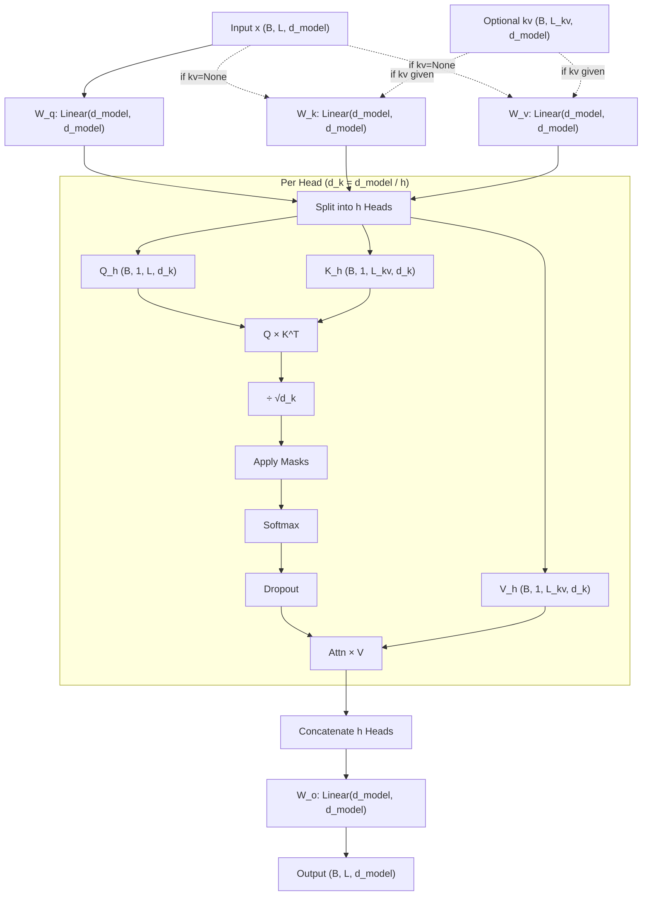

# MultiHeadSelfAttention.py Module Documentation

## 1. Overview

The `MultiHeadSelfAttention` module is the **core computation engine** of the Transformer. It implements **Scaled Dot-Product Attention** split across multiple parallel "heads," allowing the model to jointly attend to information from different representation subspaces.

This single module serves dual purpose:
-   **Self-Attention** (Encoder & Decoder): Q, K, V all come from the same input.
-   **Cross-Attention** (Decoder): Q comes from the Decoder, K and V come from the Encoder (via the `kv` parameter).

## 2. Modules Involved

-   **torch**, **torch.nn**: Linear projections, softmax, dropout.
-   **pytorch_lightning**: LightningModule base class.

### Dependencies
This module has **no dependencies** on other custom modules. It is used by:
-   `Encoder.py` → `EncoderBlock` (causal=False)
-   `Decoder.py` → `DecoderBlock` (causal=True for self-attn, causal=False for cross-attn)
-   `DecoderMoE.py` → `DecoderBlockMoE` (causal=True)
-   `DecoderOnlySeq2SeqModel.py` → `DecoderBlock` (causal=True)

## 3. Architecture



## 4. Class Definition

### `class MultiHeadSelfAttention(LightningModule)`

#### `__init__`
-   **d_model**: Total dimension. Must be divisible by `num_heads`.
-   **num_heads**: Number of parallel attention heads.
-   **d_k**: Dimension per head = `d_model // num_heads`.
-   **causal**: If True, applies a lower-triangular mask (future tokens masked).
-   **Projections**: `W_q`, `W_k`, `W_v`, `W_o` — all `nn.Linear(d_model, d_model)`.

#### `forward(self, x, mask=None, kv=None)`
-   **x**: Query source `(B, L, d_model)`.
-   **mask**: Padding mask `(B, L)` or pre-broadcast shape.
-   **kv**: Optional Key/Value source `(B, L_kv, d_model)` for cross-attention.
-   **Returns**: `(output, attn_weights)`.

## 5. Step-by-Step Logic

1.  **Resolve KV**: If `kv` is None → Self-Attention (K, V from `x`). Else → Cross-Attention.

2.  **Project**:
    -   `Q = W_q(x)` → `(B, L, d_model)`
    -   `K = W_k(kv)` → `(B, L_kv, d_model)`
    -   `V = W_v(kv)` → `(B, L_kv, d_model)`

3.  **Split Heads**: Reshape from `(B, L, d_model)` → `(B, num_heads, L, d_k)`.
    ```
    (B, L, d_model) → view(B, L, H, d_k) → transpose(1,2) → (B, H, L, d_k)
    ```

4.  **Scaled Dot-Product**:
    -   $\text{scores} = \frac{Q \cdot K^T}{\sqrt{d_k}}$ → `(B, H, L, L_kv)`.

5.  **Apply Masks**:
    -   **Padding Mask**: Sets scores for PAD positions to $-\infty$.
    -   **Causal Mask** (if `causal=True`): Lower-triangular matrix; future positions set to $-\infty$.

6.  **Softmax + Dropout**: `attn_weights = Dropout(Softmax(scores))`.

7.  **Weighted Sum**: `out = attn_weights × V` → `(B, H, L, d_k)`.

8.  **Concat Heads**: `(B, H, L, d_k)` → `(B, L, d_model)`.

9.  **Output Projection**: `out = W_o(out)`.

## 6. Dry Run Trace

**Scenario**: `d_model=4`, `num_heads=2`, `d_k=2`, `causal=True`, `Batch=1`, `Seq=3`.

**Input**: `x = [[x0, x1, x2]]` — 3 tokens, each a 4-dim vector.

| Step | Operation | Shape | Notes |
|------|-----------|-------|-------|
| 1 | Q = W_q(x) | `(1, 3, 4)` | |
| 2 | K = W_k(x) | `(1, 3, 4)` | Self-attn: K from x |
| 3 | V = W_v(x) | `(1, 3, 4)` | Self-attn: V from x |
| 4 | Split Q | `(1, 2, 3, 2)` | 2 heads, d_k=2 |
| 5 | Split K | `(1, 2, 3, 2)` | |
| 6 | Split V | `(1, 2, 3, 2)` | |
| 7 | Q × K^T | `(1, 2, 3, 3)` | Raw attention scores |
| 8 | ÷ √2 | `(1, 2, 3, 3)` | Scaled |
| 9 | Causal mask | | Apply lower-triangular: |
| | | | `[[s00, -inf, -inf],` |
| | | | ` [s10, s11, -inf],` |
| | | | ` [s20, s21, s22]]` |
| 10 | Softmax | `(1, 2, 3, 3)` | Row-wise softmax |
| 11 | Dropout | `(1, 2, 3, 3)` | |
| 12 | Attn × V | `(1, 2, 3, 2)` | Weighted values |
| 13 | Concat | `(1, 3, 4)` | Heads merged |
| 14 | W_o | `(1, 3, 4)` | Final projection |

**Token 0 (pos 0)**: Can only attend to itself → output is purely a function of `x0`.
**Token 2 (pos 2)**: Can attend to `x0`, `x1`, `x2` → output integrates all context.

## 7. Code Example

```python
import torch
from MultiHeadSelfAttention import MultiHeadSelfAttention

# Self-Attention (Encoder-style)
mhsa = MultiHeadSelfAttention(d_model=256, num_heads=8, causal=False)
x = torch.randn(2, 10, 256)
out, attn = mhsa(x)
print("Self-Attn Output:", out.shape)   # (2, 10, 256)
print("Attn Weights:", attn.shape)      # (2, 8, 10, 10)

# Cross-Attention (Decoder-style)
cross_attn = MultiHeadSelfAttention(d_model=256, num_heads=8, causal=False)
query = torch.randn(2, 5, 256)   # Decoder queries
kv = torch.randn(2, 10, 256)     # Encoder output
out, attn = cross_attn(query, kv=kv)
print("Cross-Attn Output:", out.shape)  # (2, 5, 256)
print("Attn Weights:", attn.shape)      # (2, 8, 5, 10)
```
