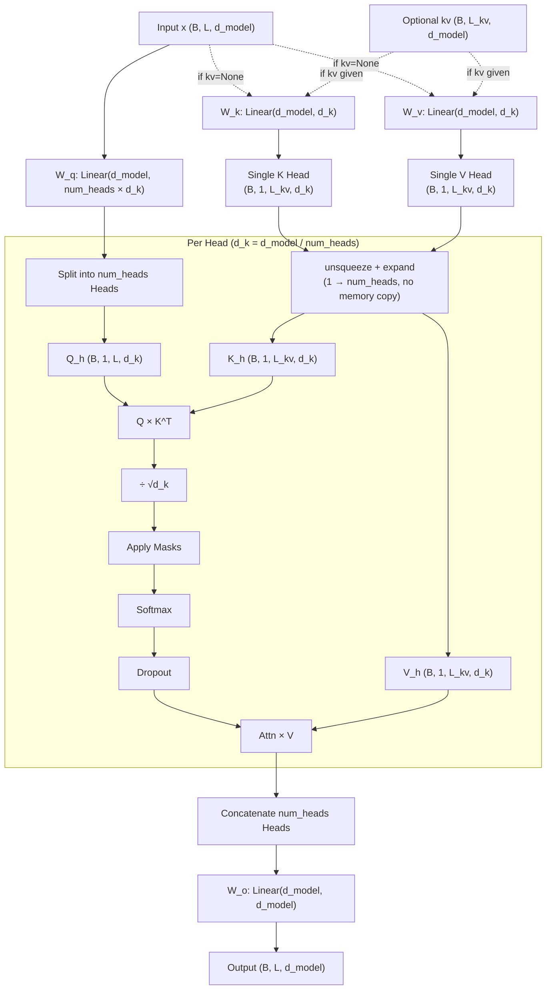

# MultiQueryAttention.py Module Documentation

## 1. Overview

The `MultiQueryAttention` module implements **Multi-Query Attention (MQA)**, an efficient attention variant introduced in ["Fast Transformer Decoding: One Write-Head is All You Need" (Shazeer, 2019)](https://arxiv.org/abs/1911.02150). In MQA, all query heads share a **single** Key head and a **single** Value head, drastically reducing the KV cache memory footprint during autoregressive inference.

| Variant | KV Heads | KV Cache Size | Quality |
|---|---|---|---|
| Standard MHA | `num_heads` | Full | Baseline |
| **Multi-Query Attention (MQA)** | **1** | **Minimum** | Slight degradation |
| Group Query Attention (GQA) | `num_kv_heads` | In-between | In-between |

**Why MQA?** During autoregressive decoding, the KV cache grows linearly with sequence length and batch size. MQA reduces the KV cache by a factor of `num_heads` (e.g., 8x for 8 heads), enabling significantly larger batch sizes and longer sequences within the same memory budget. This technique is used in PaLM, StarCoder, Falcon, and other large-scale models.

## 2. Modules Involved

-   **torch**, **torch.nn**: Linear projections, softmax, dropout.
-   **pytorch_lightning**: LightningModule base class.

### Dependencies
This module has **no dependencies** on other custom modules. It can be used as a drop-in replacement for `MultiHeadSelfAttention` wherever maximum KV cache savings are desired.

## 3. Architecture



### Key Difference from MHA and GQA

In standard MHA, `W_k` and `W_v` each project to `num_heads × d_k` dimensions. In MQA, they project to just `d_k` (a single head). The single KV head is then expanded via `unsqueeze + expand` (zero-copy) to match all query heads.

```
MHA:  Q → (B, 8, L, d_k)    K → (B, 8, L_kv, d_k)    V → (B, 8, L_kv, d_k)
GQA:  Q → (B, 8, L, d_k)    K → (B, 2, L_kv, d_k)    V → (B, 2, L_kv, d_k)
MQA:  Q → (B, 8, L, d_k)    K → (B, 1, L_kv, d_k)    V → (B, 1, L_kv, d_k)
                                     ↓ expand ×8               ↓ expand ×8
                              K → (B, 8, L_kv, d_k)    V → (B, 8, L_kv, d_k)
```

## 4. Class Definition

### `class MultiQueryAttention(LightningModule)`

#### `__init__`
-   **d_model**: Total dimension. Must be divisible by `num_heads`.
-   **num_heads**: Number of query heads.
-   **d_k**: Dimension per head = `d_model // num_heads`.
-   **causal**: If True, applies a lower-triangular mask (future tokens masked).
-   **Projections**:
    -   `W_q`: `nn.Linear(d_model, num_heads × d_k)` — full size.
    -   `W_k`: `nn.Linear(d_model, d_k)` — single head.
    -   `W_v`: `nn.Linear(d_model, d_k)` — single head.
    -   `W_o`: `nn.Linear(d_model, d_model)` — full size.

#### `forward(self, x, mask=None, kv=None)`
-   **x**: Query source `(B, L, d_model)`.
-   **mask**: Padding mask `(B, L_kv)` or pre-broadcast shape.
-   **kv**: Optional Key/Value source `(B, L_kv, d_model)` for cross-attention.
-   **Returns**: `(output, attn_weights)`.

## 5. Step-by-Step Logic

1.  **Resolve KV**: If `kv` is None → Self-Attention (K, V from `x`). Else → Cross-Attention.

2.  **Project**:
    -   `Q = W_q(x)` → `(B, L, num_heads × d_k)`
    -   `K = W_k(kv)` → `(B, L_kv, d_k)`
    -   `V = W_v(kv)` → `(B, L_kv, d_k)`

3.  **Reshape Q into Heads**:
    -   Q: `(B, L, num_heads × d_k)` → `(B, num_heads, L, d_k)`

4.  **Unsqueeze K and V** (add head dimension):
    -   K: `(B, L_kv, d_k)` → `(B, 1, L_kv, d_k)`
    -   V: `(B, L_kv, d_k)` → `(B, 1, L_kv, d_k)`

5.  **Expand KV** to match query heads (zero-copy, no additional memory):
    -   K: `(B, 1, L_kv, d_k)` → `(B, num_heads, L_kv, d_k)`
    -   V: `(B, 1, L_kv, d_k)` → `(B, num_heads, L_kv, d_k)`

6.  **Scaled Dot-Product**:
    -   $\text{scores} = \frac{Q \cdot K^T}{\sqrt{d_k}}$ → `(B, num_heads, L, L_kv)`

7.  **Apply Masks**:
    -   **Padding Mask**: Sets scores for PAD positions to $-\infty$.
    -   **Causal Mask** (if `causal=True`): Lower-triangular matrix; future positions set to $-\infty$.

8.  **Softmax + Dropout**: `attn_weights = Dropout(Softmax(scores))`.

9.  **Weighted Sum**: `out = attn_weights × V` → `(B, num_heads, L, d_k)`.

10. **Concat Heads**: `(B, num_heads, L, d_k)` → `(B, L, d_model)`.

11. **Output Projection**: `out = W_o(out)`.

## 6. Dry Run Trace

**Scenario**: `d_model=8`, `num_heads=4`, `d_k=2`, `causal=True`, `Batch=1`, `Seq=3`.

**Input**: `x = [[x0, x1, x2]]` — 3 tokens, each an 8-dim vector.

| Step | Operation | Shape | Notes |
|------|-----------|-------|-------|
| 1 | Q = W_q(x) | `(1, 3, 8)` | 4 query heads × d_k=2 |
| 2 | K = W_k(x) | `(1, 3, 2)` | 1 KV head × d_k=2 |
| 3 | V = W_v(x) | `(1, 3, 2)` | 1 KV head × d_k=2 |
| 4 | Split Q | `(1, 4, 3, 2)` | 4 query heads |
| 5 | Unsqueeze K | `(1, 1, 3, 2)` | Add head dim |
| 6 | Unsqueeze V | `(1, 1, 3, 2)` | Add head dim |
| 7 | Expand K | `(1, 4, 3, 2)` | Single head broadcast to 4 (no copy) |
| 8 | Expand V | `(1, 4, 3, 2)` | Single head broadcast to 4 (no copy) |
| 9 | Q × K^T | `(1, 4, 3, 3)` | Raw attention scores |
| 10 | ÷ √2 | `(1, 4, 3, 3)` | Scaled |
| 11 | Causal mask | | Apply lower-triangular: |
| | | | `[[s00, -inf, -inf],` |
| | | | ` [s10, s11, -inf],` |
| | | | ` [s20, s21, s22]]` |
| 12 | Softmax | `(1, 4, 3, 3)` | Row-wise softmax |
| 13 | Dropout | `(1, 4, 3, 3)` | |
| 14 | Attn × V | `(1, 4, 3, 2)` | Weighted values |
| 15 | Concat | `(1, 3, 8)` | 4 heads merged |
| 16 | W_o | `(1, 3, 8)` | Final projection |

**Key observation**: All 4 query heads attend over the **same** keys and values. The only source of per-head diversity comes from the different learned query projections in `W_q`. Despite this, each head can still learn to attend to different positions because each query head produces different attention scores.

## 7. Parameter Comparison

For `d_model=256`, `num_heads=8`:

| Component | MHA (8 KV heads) | GQA (2 KV heads) | MQA (1 KV head) |
|-----------|-------------------|-------------------|------------------|
| W_q | 256 × 256 = 65,536 | 256 × 256 = 65,536 | 256 × 256 = 65,536 |
| W_k | 256 × 256 = 65,536 | 256 × 64 = 16,384 | 256 × 32 = 8,192 |
| W_v | 256 × 256 = 65,536 | 256 × 64 = 16,384 | 256 × 32 = 8,192 |
| W_o | 256 × 256 = 65,536 | 256 × 256 = 65,536 | 256 × 256 = 65,536 |
| Biases | 4 × 256 = 1,024 | 256+64+64+256 = 640 | 256+32+32+256 = 576 |
| **Total** | **263,168** | **164,480** | **147,712** |
| **KV param savings vs MHA** | — | 75% | **87.5%** |
| **KV cache savings vs MHA** | — | 75% | **87.5%** |

## 8. Code Example

```python
import torch
from MultiQueryAttention import MultiQueryAttention

# MQA: 8 query heads, 1 shared KV head
mqa = MultiQueryAttention(d_model=256, num_heads=8, causal=False)
x = torch.randn(2, 10, 256)
out, attn = mqa(x)
print("MQA Output:", out.shape)    # (2, 10, 256)
print("Attn Weights:", attn.shape) # (2, 8, 10, 10)

# MQA with causal masking (decoder)
mqa_causal = MultiQueryAttention(d_model=256, num_heads=8, causal=True)
out, attn = mqa_causal(x)
print("Causal MQA Output:", out.shape)  # (2, 10, 256)

# Cross-Attention with MQA
query = torch.randn(2, 5, 256)
kv = torch.randn(2, 10, 256)
out, attn = mqa(query, kv=kv)
print("Cross-Attn Output:", out.shape)  # (2, 5, 256)
print("Attn Weights:", attn.shape)      # (2, 8, 5, 10)

# Compare param counts
from MultiHeadSelfAttention import MultiHeadSelfAttention
mha = MultiHeadSelfAttention(d_model=256, num_heads=8)
mha_params = sum(p.numel() for p in mha.parameters())
mqa_params = sum(p.numel() for p in mqa.parameters())
print(f"MHA params: {mha_params:,}")    # 263,168
print(f"MQA params: {mqa_params:,}")    # 147,712
```
