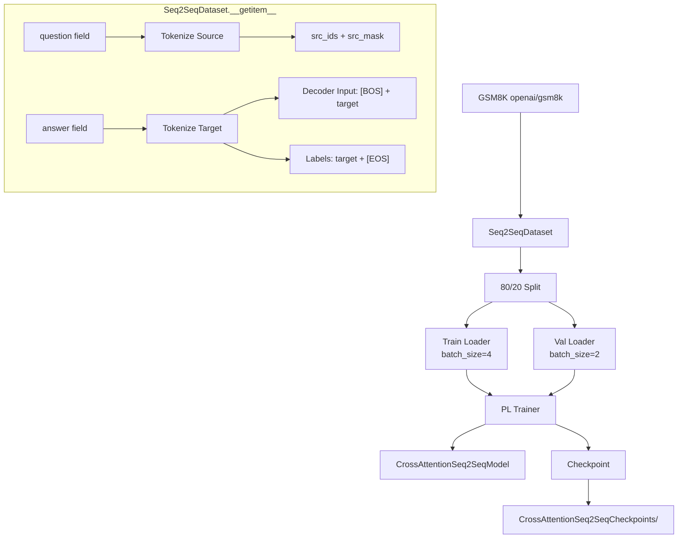

# Trainer.py Module Documentation

## 1. Overview

This script orchestrates the **training pipeline** for the **Encoder-Decoder (Seq2Seq) Transformer** model (`CrossAttentionSeq2SeqModel`). Unlike the Decoder-Only trainers, this prepares separate source and target sequences.

## 2. Modules Involved

-   **torch**: Tensor operations and data utilities.
-   **torch.utils.data**: `Dataset`, `DataLoader`, `random_split`.
-   **pytorch_lightning**: `Trainer`, `ModelCheckpoint`, `seed_everything`.
-   **datasets**: Loading GSM8K dataset.

### Dependencies
-   `Embedding.py` → `get_tokenizer`: Provides the tokenizer.
-   `CrossAttentionSeq2SeqModel.py` → `CrossAttentionSeq2SeqModel`: The model being trained.

## 3. Architecture



## 4. Class: `Seq2SeqDataset`

Prepares paired source-target data for encoder-decoder training.

### `__getitem__` Step-by-Step

1.  **Read row**: Get `question` (source) and `answer` (target) from GSM8K.

2.  **Encode Source** (for Encoder):
    -   Tokenize with padding to `max_length`.
    -   Result: `src_ids` `(max_length)` and `src_mask`.

3.  **Encode Target** (for Decoder):
    -   Tokenize **without** special tokens, truncate to `max_length - 2`.
    -   **Decoder Input**: Prepend `[BOS]` → `[BOS, t1, t2, ...]`.
    -   **Labels**: Append `[EOS]` → `[t1, t2, ..., EOS]`.
    -   Pad both to `max_length`:
        -   Decoder Input padded with `pad_token_id`.
        -   Labels padded with `-100` (ignored by loss).

4.  **Create tgt_mask**: `(tgt_ids != pad_id).long()`.

5.  **Return**: `{src_ids, src_mask, tgt_ids, tgt_mask, labels}`.

### Why BOS/EOS Separation?

The decoder input is **shifted right** relative to the labels:

```
Decoder Input:  [BOS]  t1   t2   t3   [PAD]
Labels:          t1    t2   t3  [EOS]  -100
```

At each position, the model predicts the **next** token. This is the standard teacher-forcing paradigm.

## 5. Dry Run Trace

**GSM8K Row**: `question="Hello"`, `answer="World is great"`.

| Step | Operation | Result |
|------|-----------|--------|
| 1 | Tokenize Source | `src_ids = [15496, PAD, PAD, ...]` (padded to 256) |
| | | `src_mask = [1, 0, 0, ...]` |
| 2 | Tokenize Target | `raw = [10603, 318, 1049]` ("World is great") |
| 3 | Decoder Input | `tgt_ids = [BOS, 10603, 318, 1049, PAD, ...]` |
| 4 | Labels | `labels = [10603, 318, 1049, EOS, -100, ...]` |
| 5 | tgt_mask | `[1, 1, 1, 1, 0, ...]` |
| 6 | Forward | Encoder processes `src_ids` → `enc_out` |
| | | Decoder processes `tgt_ids` with cross-attn to `enc_out` → `logits` |
| 7 | Loss | CrossEntropy(`logits`, `labels`), ignoring -100 positions |

## 6. Configuration

| Parameter | Value |
|-----------|-------|
| d_model | 256 |
| num_encoder_layers | 2 |
| num_decoder_layers | 2 |
| num_heads | 4 |
| d_ff | 128 |
| max_epochs | 100 |
| batch_size (train) | 4 |
| Learning Rate | 1e-3 |
| Checkpoint metric | val_loss_epoch (min) |

## 7. Usage

```bash
python Trainer.py
```

Requires the `datasets` library (GSM8K is loaded via `load_dataset("openai/gsm8k")`). Metrics: eval_loss, Perplexity. Best model saved to `CrossAttentionSeq2SeqCheckpoints/`.
